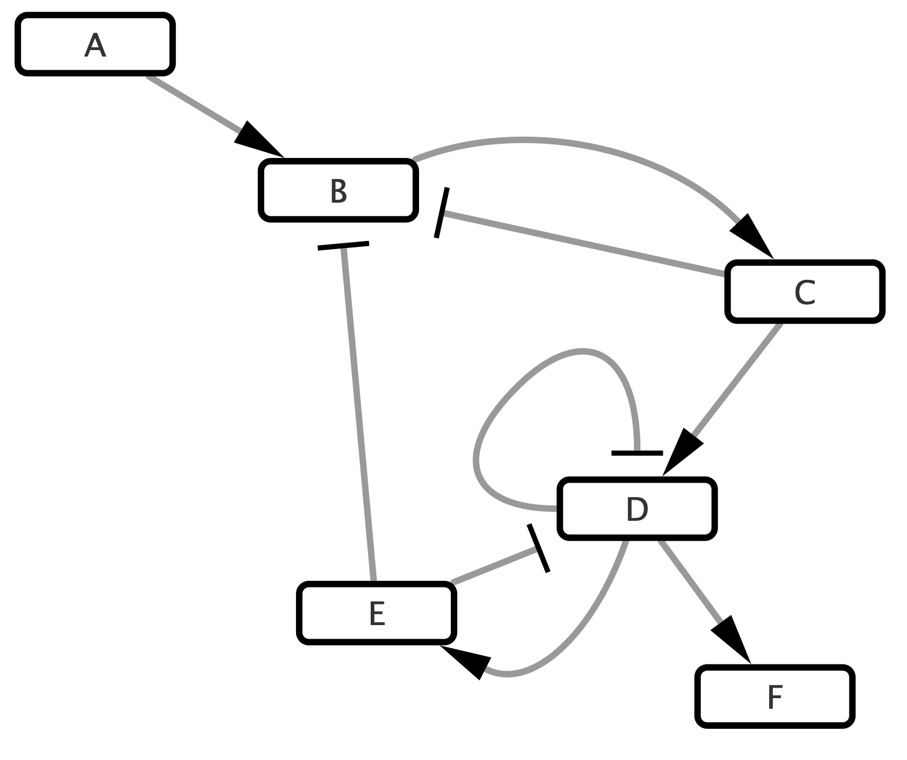
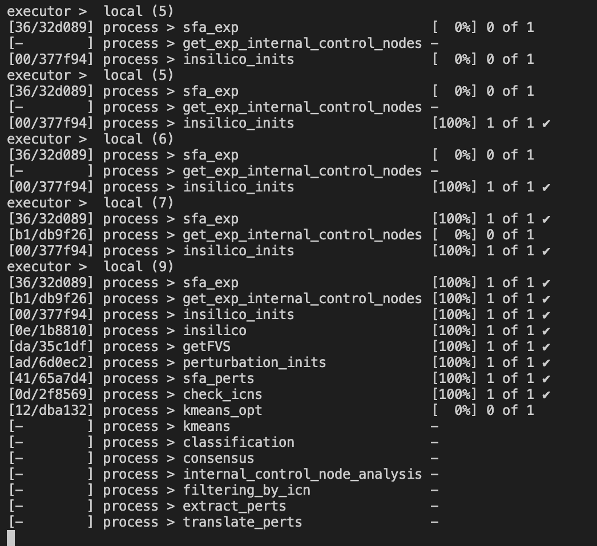
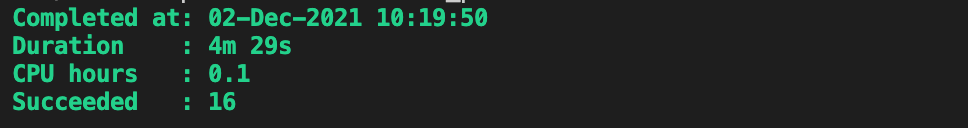
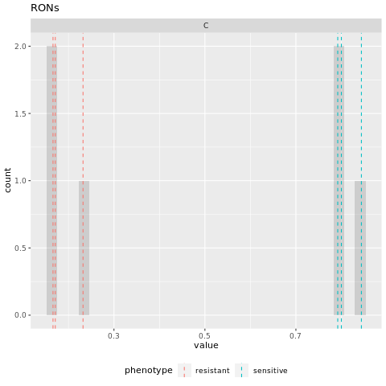
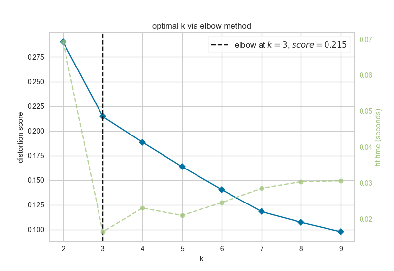
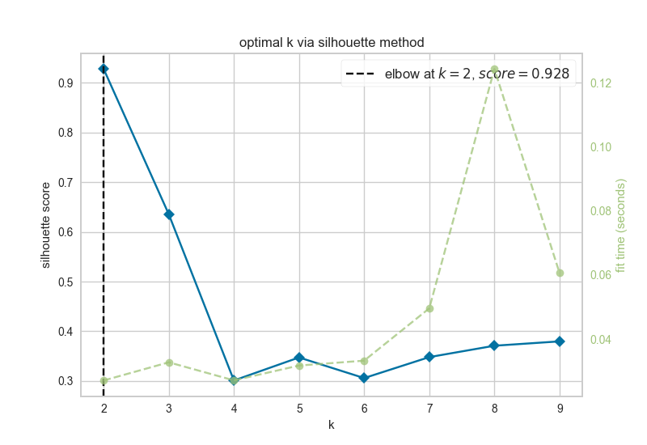

# Toy Network Examples {#toy}

Here, we will walk through a brief tutorial of a NETISCE run. The files necessary to complete the tutorial are within the `input data` folder of both [`NETISCE_local`](https://github.com/VeraLiconaResearchGroup/Netisce/tree/main/NETISCE_local) and [`NETISCE_hpc`](https://github.com/VeraLiconaResearchGroup/Netisce/tree/main/NETISCE_hpc).
The results from these Toy examples can be found in the [toy_example_results](https://github.com/VeraLiconaResearchGroup/Netisce/tree/main/toy_example_results) folder of the main github repository.

## Overview

We will use a simple toy network of 6 nodes and 9 edges.
```{r, out.width='50%', fig.align='center',echo = FALSE, fig.cap = 'Simple Toy Network'}

```
## Data
You can find the relevant data files in the `input_data` folder.

In this example, we have 2 samples, A and B, with three replicates each (A_1,A_2,A_3, etc).
The normalized expression data is housed in `expressions.csv`, and contains normalized expression values for  the network nodes. Note that the value of F has been initialized to zero. A feature of NETISCE is that it does not require non-zero values for all network nodes, which is useful if the data is unavailable for a node. Such values can either be entered in the `expressions.csv` file as 0s, or the node can be excluded entirely from this file, depending on user preference (in this case, the values will automatically be initialized to 0).
```{r echo=FALSE, message=FALSE, warning=FALSE}
exp<-read.csv('input_data/expressions.csv')
knitr::kable(exp)
```

The `samples.txt` file specifies that A is associated to a treatment sensitive phenotype, while B is associated to a resistance phenotype. 
```{r echo=FALSE, message=FALSE, warning=FALSE}
samples<-read.delim('input_data/samples.txt')
knitr::kable(samples)
```

Note that you can use any term to describe the phenotypes. Just be sure to be consistent with the `param.desried` and `param.undesired` variables within the Nextflow `.nf` file. 

Lastly, we need to include a list of internal marker nodes. This list is in `internal_marker.txt`. For our small network, the internal-marker node is `C`. 
```{r echo=FALSE, message=FALSE, warning=FALSE}
marker<-read.delim('input_data/internal_marker.txt')
knitr::kable(marker)
```

## NETISCE run configuration

With all your input data files loaded, next we configure the nextflow run in either `NETISCE_local` or `NETSICE_hpc` (**Note: while we do recommend you run NETISCE on a hpc, this example is small enough to run locally**). 

Open up `NETISCE.nf`. Here, you need to specify the parameters for the Nextflow run on lines 3-19. Please refer to [section 2.5](#params) for parameter definitions. 

For this example, your parameters should look like:
```
params.expressions = "$baseDir/input_data/expressions.csv"
params.network = "$baseDir/input_data/network.sif"
params.samples = "$baseDir/input_data/samples.txt"
params.internal_control="$baseDir/input_data/internal_marker.txt"
// params.mutations="$baseDir/input_data/mutations.csv"
params.alpha = 0.9
params.undesired = 'resistant'
params.desired = 'sensitive'
params.filter ="strict"


params.kmeans_min_val = 2
params.kmeans_max_val = 10


params.num_nodes = 6 // that have expression data
params.num_states = 100000

params.randseed=4
```
**Some Notes: ** make sure to include `$baseDir` before pointing to the folder containing your input data. Also, be sure that `params.num_nodes` is the number of nodes where there exists data within `expressions.csv`. Finally, by adjusting the `params.randseed` you can identify alternate FVSes within the nextwork.

## Run NETISCE
In your terminal/command prompt, navigate to the appropriate NETISCE folder (`_hpc` or `local`). To start your run, enter `./nextflow run NETISCE.nf -resume`.
While NETISCE is running, your terminal should look like this, where you can see the progress on each step of the pipeline:
```{r, out.width='50%', fig.align='center',echo = FALSE, fig.cap = 'Terminal when running NETISCE'}

```
The first column contains the location (folder and subfolder) that is running that step of NETISCE within the `work` folder.


Once the run has successfully completed, the process will end and the following will be displayed:
```{r, out.width='50%', fig.align='center',echo = FALSE, fig.cap = 'Terminal when running NETISCE'}

```


## NETSICE Results
Let's take a look at the results of our NETISCE run, where the goal was to shift the system from the undesired state B, and towards the desired state A. These results can be found in the toy_example_1 subfolder of the [toy_example_results](https://github.com/VeraLiconaResearchGroup/Netisce/tree/main/toy_example_results) folder of the main github repository.

#### exp_internalmarkers.txt {-#section-id}
Our internal marker node was node C. In this file we see the steady state values of node see in the A sample replicates A_1, A_2 and A_3 and B sample replicates B_1, B_2, and B_3 (as computed by SFA).
```{r echo=FALSE, message=FALSE, warning=FALSE}
expmarker<-read.delim('results/exp_internalmarkers.txt',sep=" ")
knitr::kable(expmarker)
```


#### experimental_internalmarkers.pdf {-#section-id}
The above numbers may be a little challenging to read! So, we have included a plot of the values in the`experimental_internalmarkers.pdf`:
```{r, out.width='50%', fig.align='center',echo = FALSE, fig.cap = 'experimental marker node steady state values'}

```
On this histogram, we see bars for each of the samples and their replicates. The A (sensitive) samples are marked by a blue vertical line at their steady state value, while the B (resistant) samples are marked by a red vertical line at their steady state value. The grey bars can be aggregated to show the number of attractors with values for C that are binned together (for example, in the above table we see that the steady state value of C in replicate B_2=0.171 and replicate B_3=0.166. These values are binned together on the histogram to show that two replicates had similar values.)

Here, we see that the values of node C are well separated between the two phenotypes (all of the A values are greater than all of the B values). We will assume that this also aligns with the biological knowledge of the system.

In this example, since there are only 4 network nodes that have normalized expression values, NETISCE generates the maximum number of random initial states, \(3^4\), or 81.


After estimating attractors for the experimental and randomly generated initial states, the resultant attractors were clustered using k-means clustering. The elbow and silhouette metrics are used to determine the optimal number k.

#### elbow.png  {-#section-id}
```{r, out.width='50%', fig.align='center',echo = FALSE, fig.cap = 'elbow metric for optimal k'}

```
The elbow metric found the optimal number of k clusters to be k=3.

#### silhouette.png {-#section-id}
```{r,out.width='50%', fig.align='center',echo = FALSE, fig.cap = 'silhouette metric for optimal k'}

```
The silhouette metric found the optimal number of k clusters to be k=2.

Since the optimal ks identified by the silhouette metric and the elbow metric do not match, NETISCE chooses the smaller k, as long as the phenotypes remain separate (NETISCE checks to make sure this is true). 

#### kmeans.txt {-#section-id}
The `kmeans.txt` file contains the clustering results for each attractor generated from the experimental data and the randomly generated initial states. The first column contains the sample name, and the second column contains the ID of which cluster it is assigned to. Since k=2 in this case, one cluster is named 
"0" and the other cluster is named "1"
```{r,out.width='50%', fig.align='center',echo = FALSE, fig.cap = 'silhouette metric for optimal k'}
kmeans<-read.delim('results/kmeans.txt',header = T,sep=" ")
knitr::kable(kmeans[1:6,])
```

And we see in the `kmeans.txt` file, that the A samples are clustered in cluster 0, while the B samples are grouped in cluster 1. 


#### fvs.txt  {-#section-id}
This file contains the node names that were identified by the FVS finding algorithm when the random seed was set to 4 (i.e. FVS4).
```{r echo=FALSE, message=FALSE, warning=FALSE}
fvs<-read.delim('results/fvs.txt')
knitr::kable(fvs)
```
The FVS finding algorithm identified nodes B and E to be a minimal FVS control nodes in the toy network. Since the FVS control node set contained 2 nodes, 9 combinations of perturbations were performed on the control node sets.


**Note: ** this network contains 4 unique minimal Feedback Verex Sets (FVS_1: {D, B}, FVS_2:{D,C}	, FVS_3:{E,C}	, FVS_4: {E,B}).By adjusting the `params.randseed` parameter in the `NETISCE.nf` file, the other FVSes can be identified and perturbations can be computed with them.

#### crit1perts.txt  {-#section-id}
This file contains a list of IDs for the perturbations to FVS control nodes that passed criterion 1.
```{r echo=FALSE, message=FALSE, warning=FALSE}
crit1<-read.delim('results/crit1perts.txt',header = F)
knitr::kable(crit1)
```
3 out of the 9 pertrubations passed the machine learning filtering criterion.


#### pert_replicate_1_internal_markers.txt  {-#section-id}
NETISCE calculated perturbations on FVS control nodes when the system was initialized from the three undesired B replicates (B_1,B_2,B_3). The steady state values of the internal marker node C was extracted from each of these replicate perturbations that passed filtering criterion 1 (i.e., the steady state value of C in pert_3,pert_6, and pert_8). Here we will show the steady state values of C under FVS perturbations when the system was initialized with the normalized expression values of B_1 (contained in the file `pert_replicate_1_internal_markers.txt`; the values of C for the system under perturbations when initialized from B_2 are found in `pert_replicate_2_internal_markers.txt`, the values of C for the system under perturbations when initialized from B_3 are found in `pert_replicate_3_internal_markers.txt` )

```{r echo=FALSE, message=FALSE, warning=FALSE}
marker<-read.delim('results/pert_replicate_1_internal_markers.txt',sep=" ")
knitr::kable(marker)
```

#### successful_controlnode_perturbations.txt  {-#section-id}
This file contains a table of the perturbations on FVS control nodes that passed both the 1st and 2nd filtering criteria. it also contains the number of upregulation,downregulations, and total number of nodes perturbed for each perturbation set. 
```{r echo=FALSE, message=FALSE, warning=FALSE}
success<-read.delim('results/successful_controlnode_perturbations.txt',sep=" ")
knitr::kable(success)
```
Here, we see that four perturbations that passed both filtering criteria.

Let's take a quick look at the steady state values for these perturbations, and the attractors generated from the experimental data:
```{r echo=FALSE, message=FALSE, warning=FALSE}
marker<-marker[marker$name %in% rownames(success),]
allmarkers<-rbind(expmarker,marker)
knitr::kable(allmarkers)
```

Indeed, we see that the steady-state expression values of node C in the attractors generated by peturbations to the FVS control nodes are all are greater than the steady-state expression values of node C in the attractors generated from the sensitive A sample. A successful reprogramming from resistant (B) to sensitive (A) cells has occurred!

## Toy Example with mutations
Let's say that in our system, gene D exhibits a gain of function mutation in the sensitive phenotype (A samples). If we want to include this in our simulations, we will use the `NETISCE_mutations.nf` pipeline.

First, we must add to our `input_data` folder a `.csv` file containing the mutational profile. Let's call this file `mutations.csv`:
```{r echo=FALSE, message=FALSE, warning=FALSE}
knitr::kable(read.csv('input_data/mutations.csv'))

```

The gain of function mutation is encoded with 1 (loss-of-function mutations can be encoded with "0").

Next, we make sure that the parameters in `NETISCE_mutations.nf` on lines 3-19 are set correctly for the conditions

For this example, your parameters should look like:
```
params.expressions = "$baseDir/input_data/expressions.csv"
params.network = "$baseDir/input_data/network.sif"
params.samples = "$baseDir/input_data/samples.txt"
params.internal_control="$baseDir/input_data/internal_marker.txt"
params.mutations="$baseDir/input_data/mutations.csv"
params.alpha = 0.9
params.undesired = 'resistant'
params.desired = 'sensitive'
params.filter ="strict"


params.kmeans_min_val = 2
params.kmeans_max_val = 10


params.num_nodes = 4 // that have expression data
params.num_states = 1000
```
Note, the additional parameter `params.mutations` that points to the `mutations.csv.`

As above, to run Netisce, enter `./nextflow run NETISCE.nf -resume`.

#### Results {-#section-id}
By including mutational information, the results of NETISCE have changed.These results can be found in the toy_example_2 subfolder of the [toy_example_results](https://github.com/VeraLiconaResearchGroup/Netisce/tree/main/toy_example_results) folder of the main github repository.
Now, our `successful_controlnode_perturbations.txt` file contains pert_7 in addition to perturbations pert_3, pert_6, and pert_8

```{r echo=FALSE, message=FALSE, warning=FALSE}
knitr::kable(read.delim('results/successful_controlnode_perturbations_mutations.txt',sep=" "))

```

Let's take a look at the steady-state expression values of node C in the attractors generated from the successful perturbations and the experimental initial states when mutational information is included.
```{r echo=FALSE, message=FALSE, warning=FALSE}
knitr::kable(read.delim('results/markers_mutations.txt',sep=" "))

```

Though the values are different in this system with mutations, we still see that the steady-state expression values of node C in the attractors generated by peturbations to the FVS control nodes are all are greater than the steady-state expression values of node C in the attractors generated from the sensitive A sample. A successful reprogramming from resistant (B) to sensitive (A) cells has occurred!