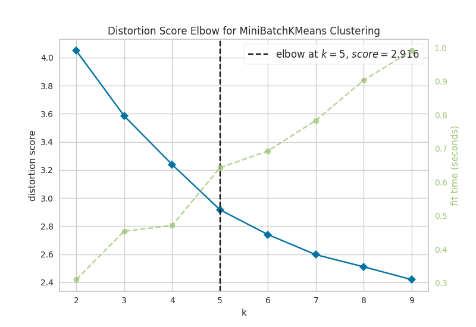
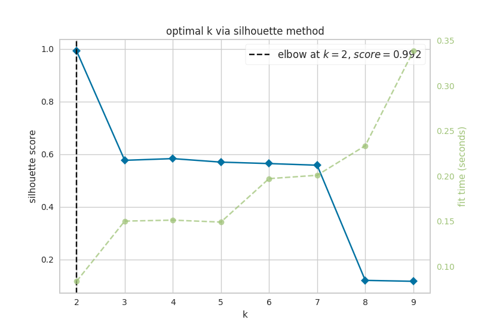

# Pluripotent Stem Cell Example

This section contains instructions to reproduce the results of simulating perturbations on FVS control nodes in a pluripotent stem cell signaling. The goal of these simulations is to identify targets that can reprogram cells from the Epiblast stem cell (EpiSC) fate towards the Embryonic Stem Cell (ESC) fate. You can read the original report here: link

The original study of reversion of primed pluripotency in mouse epiblast stem cells was performed by Yachie-Kinoshita et al. in "[Modeling signaling-dependent pluripotency with Boolean logic to predict cell fate transitions (Molecular Systems Biology (2018)14:e7952)](https://www.embopress.org/doi/full/10.15252/msb.20177952)". The network and internal-marker nodes were extracted from the publication and its supplementary material. The normalized expression data used for initial activities in NETISCE can be found at [GSE62155](https://www.ncbi.nlm.nih.gov/geo/query/acc.cgi?acc=GSE62155).

The input data, nextflow pipeline, and results of this simulation can be found in the [ipsc folder](https://github.com/VeraLiconaResearchGroup/Netisce/tree/main/ipsc_validation) in the NETISCE github repository


## Input Data
[`network.sif`](https://github.com/VeraLiconaResearchGroup/Netisce/blob/main/ipsc_validation/input_data/network.sif) contains the network structure for pluripotent stem cell signaling

[`expression.csv`](https://github.com/VeraLiconaResearchGroup/Netisce/blob/main/ipsc_validation/input_data/expression.csv) contains the initial activities for ESC cells (3 replicates), and EpiSC cells (3 replicates)

[`internal-marker-kinoshita.txt`](https://github.com/VeraLiconaResearchGroup/Netisce/blob/main/ipsc_validation/input_data/internal-marker-kinoshita.txt) contains the 4 internal marker nodes that were originally used in Yachie-Kinoshita et al., to evaluate simulations.

[`internal-marker-kinoshita-expanded.txt`](https://github.com/VeraLiconaResearchGroup/Netisce/blob/main/ipsc_validation/input_data/internal-marker-kinoshita-expanded.txt) contains the 4 internal marker nodes that were originally used in Yachie-Kinoshita et al., plus the additional marker ndoes identified from the data used to evaluate simulations.

[`samples.txt`](https://github.com/VeraLiconaResearchGroup/Netisce/blob/main/ipsc_validation/input_data/samples.txt) contains they key for NETISCE to associate certain samples to the phenotypes of Embryonic Stem Cells (ESCs) or Epiblast Stem Cells (EpiSCs)

## Run the simulation

These simulations were run on a high performance cluster that uses a SLURM executor. If your hpc uses a different executor, please update those specifications in the `nextflow.config` file in the directory. Please see <https://www.nextflow.io/docs/latest/config.html> for more information regarding your executor.


For ease of reproduction, we have included all files necessary to reproduce the reported results directly in the [directory](https://github.com/VeraLiconaResearchGroup/Netisce/tree/main/ipsc_validation). We do recommend you run this simulation on an hpc. We have included the [bash file](https://github.com/VeraLiconaResearchGroup/Netisce/blob/main/ipsc_validation/run.sh) we used on our SLURM executor.

**Note: ** within the [`NETISCE.nf`](https://github.com/VeraLiconaResearchGroup/Netisce/blob/main/ipsc_validation/NETISCE.nf) configuration file, we have included two lines for specifying the internal-marker nodes:

```
#!/usr/bin/env nextflow

params.expressions = "$baseDir/input_data/expression.csv"
params.network = "$baseDir/input_data/network.sif"
params.samples = "$baseDir/input_data/samples.txt"
params.internal_control="$baseDir/input_data/internal-marker-kinoshita.txt"
// params.internal_control="$baseDir/input_data/internal-marker-kinoshita-expanded.txt"
params.alpha = 0.9
params.undesired = 'EpiSC'
params.desired = 'ESC'
params.filter ="strict"
```

As discussed in our paper, we filtered the perturbations using the original 4 internal-marker nodes for pluripotency (Oct4, Sox2, Nanog, EpiTFs), and then again using 3 additional internal-marker nodes. Therefore, to run either analysis, comment/uncomment the internal-marker node file you are interested in. If you want to run NETISCE first with the original internal-marker nodes, make sure to change the results file names for `exp_internalmarkers.txt`,`successful_controlnode_perturubations.txt`, and `original-experimental_internalmarkers.pdf` as to not overwrite them (or move them into a separate folder). Additionally, when you run the nextflow command, **please be sure to use the `-resume` flag so that you use the cached computations that do not need to be re-computed**

You can also run NETISCE directly using the following command: `./nextflow run NETISCE.nf -resume`


## Results
Herein, we will focus on the results that are deposited in the [`results`](https://github.com/VeraLiconaResearchGroup/Netisce/tree/main/ipsc_validation/results) folder by NETISCE. However, each step of the nextflow pipeline produces its corresponding raw results (for example, the entire attractor state for network simulations initialized with experimental data). If you are interested in looking at those raw results, they can be found within the [`work`](https://github.com/VeraLiconaResearchGroup/Netisce/tree/main/ipsc_validation/work) folder. We provide [`workfiles.txt`](https://github.com/VeraLiconaResearchGroup/Netisce/blob/main/ipsc_validation/workfiles.txt) which is a guide to which folders/subfolders contain the relevant results of each step. 


### General Results 
First, let's take a look at the results that do not depend on the internal-marker node set. 

#### FVS finding {-#section-id}

The FVS solving algorithm identified one FVS, containing 6 nodes.
```{r echo=FALSE, message=FALSE, warning=FALSE}
fvs<-read.delim('ipsc/results/fvs.txt',sep=" ")
knitr::kable(fvs)
```


#### Attractor landscape estimation via k-means analysis {-#section-id}
Now, let's look at the results of k-means analysis. First, NETISCE determines the optimal number of k clusters by computing the elbow and silhouette metrics. 

```{r, out.width='50%', fig.show="hold",echo = FALSE, fig.cap = 'optimal k as identified by a) the elbow and b) silhouette metrics'}


```

We see that the optimal k assessed by the elbow metric was k=4, while the optimal k identified by the silhouette metric was k=2. NETISCE automatically chooses the smaller k value, after checking that the attractors generated from the ESC samples and EpiSC samples do not appear in the same cluster.

k=2 was selected for k-means optimal k, and we can see that the attractors generated from the ESC samples and EpiSC samples do not appear in separate clusters.

```{r echo=FALSE, message=FALSE, warning=FALSE}
kmeans<-read.delim('ipsc/results/kmeans.txt',sep=" ",nrows=6)
knitr::kable(kmeans)
```

#### Pertrubations on FVS control nodes that pass criterion 1 {-#section-id}

With 6 FVS control nodes, NETISCE performed 729 simulations of combinations of perturbations on the FVS control nodes. The resulting attractors were classified to the clusters produced from the k-means analysis using Naive Bayes, Support Vector Machine, and Random Forest Machine Learning classification algorithms. Then, the perturbations are filtered by which of their corresponding attractors were classified to the ESC cluster by at least 2 of the 3 methods. These results can be found in [`crit1_perts.txt`](https://github.com/VeraLiconaResearchGroup/Netisce/blob/main/ipsc_validation/results/crit1perts.txt). Here we show the first 10 rows.

```{r echo=FALSE, message=FALSE, warning=FALSE, paged.print=TRUE}
crit1<-read.delim('ipsc/results/crit1perts.txt',sep=" ",header=F)
print(paste0('number of perturbations that pass filtering criteria 1: ',nrow(crit1)))
knitr::kable(crit1[1:10,])
```


### Results using 4 internal-marker nodes
**The relevant files have the prefix 'original' in the github repository**

Our second perturbation filtering criterion identifies perturbations where, in their corresponding attractors, 90% of the steady state values for internal-marker nodes that are within the steady state expression ranges in the attractors generated from the ESC experimental data. 

First, let's take a  look at the steady state values of the internal-marker nodes Oct4, Sox2, and Nanog in the attractors generated from the ESC and EpiSC experimental data. The values can be found in the [`original-exp_internalmarkers.txt`](https://github.com/VeraLiconaResearchGroup/Netisce/blob/main/ipsc_validation/results/original-exp_internalmarkers.txt) and are plotted in [`original-experimental_internalmarkers.pdf`](https://github.com/VeraLiconaResearchGroup/Netisce/blob/main/ipsc_validation/results/original-experimental_internalmarkers.pdf):


```{r, echo = FALSE, message=FALSE, include=TRUE,out.width = '460pt',out.height= '700pt',fig.align='center',fig.cap = "histograms of 4 internal-marker node values",fig.pos='H'}

knitr::include_graphics("ipsc/results/original-experimental_internalmarkers.pdf")

```

We see that the values of the internal-markers for the pluripotent state (Oct4, Sox2, Nanog) are higher in the attractors generated from the experimental data of the ESCs than the  attractors generated from the experimental data of the EpiSCs, and the makrer of the epiblast stem state is higher in the  attractors generated from the experimental data of the EpiSCs than in the attractors generated from the experimental data of the ESC.

Now, we can take a look at the attractors that passed filtering criterion 2. We show the first 10 rows here, but you can view the entire set in [`original-successful_controlnode_perturbations.txt`](https://github.com/VeraLiconaResearchGroup/Netisce/blob/main/ipsc_validation/results/original-successful_controlnode_perturbations.txt)

```{r echo=TRUE, message=FALSE, warning=FALSE}
crit2_4<-read.delim('ipsc/results/original-successful_controlnode_perturbations.txt',sep=" ",as.is = T)
print(paste0('number of perturbations that pass filtering criteria 2: ',nrow(crit2_4)))
knitr::kable(crit2_4[1:10,])  %>% column_spec(8, bold = F, border_left = T) %>% scroll_box(width = "100%", box_css = "border: 0px;") 
```

We can look to see if there are any trends in the orientation of the perturbations on FVS control nodes across the perturbations that passed both filtering criteria.

```{r echo=TRUE, message=FALSE, warning=FALSE, fig.align='center'}
library(data.table)
library(ggplot2)
d3<-crit2_4 [,c(1:6)] %>% transpose() %>% as.matrix()
row.names(d3)<-colnames(crit2_4[1:6])
colnames(d3)<-row.names(crit2_4)
d3r<-reshape2::melt(d3) %>% select(-Var2)

#From Paul Tol: https://personal.sron.nl/~pault/
Tol_muted <- c('#88CCEE', '#44AA99', '#117733', '#332288', '#DDCC77', '#999933','#CC6677', '#882255', '#AA4499', '#DDDDDD')

ggplot(d3r, aes(x=value)) +
  facet_wrap(~Var1,scales = "free_x",shrink=FALSE) +
  geom_bar(aes(y = (..count..)/ncol(d3),fill=value))  + scale_y_continuous(labels=scales::percent) + scale_fill_manual(values=Tol_muted)+ ylab("% of specified perturbation to an FVS control node across all \n combinations of perturbations that passed filtering criteria ") + xlab("node perturbation")
```
Here, we see that in the majority of perturbations, there is overexpression of the FVS nodes Sox2, Nanog and Oct4. This aligns with their role as maintainers of pluripotency. 

The steady-state values of the internal-marker nodes for these perturbations can be found in [`pert1_internal_markers.txt`](https://github.com/VeraLiconaResearchGroup/Netisce/blob/main/ipsc_validation/results/pert1_internal_markers.txt).


A perturbation on the FVS control node, Nanog overexpression (pert_445),  was also identified in Yachie-Kinoshita et al. and experimentally verified to shift cells from the EpiSC state towards the ESC state. We can plot the internal-marker node values using a radar plot.

We can also plot Klf4 overexpression. This was a perturbation identified by Yachie-Kinoshita et al. to shift cells from the EpiSC state towards the ESC state. However, in our analyses, this perturbation (pert_365), did pass filtering criterion 1, but did not pass filtering criterion 2.


```{r ipsc-charts, out.width='50%',echo = TRUE,fig.show='hold',fig.cap = "radar charts of the steady-state values of 4 internal-marker nodes for Nanog overexpression and Klf4 overexpression perturbation"}
library(fmsb)
attr_pert<-read.delim("ipsc/results/pert1_internal_markers.txt",sep=" ",row.names = 1)
attr_pert <-attr_pert[c('pert_445','pert_365'),c('Oct4',"Sox2","Nanog","EpiTFs")]
exp<-read.delim("ipsc/results/original-exp_internalmarkers.txt",sep=" ",row.names = 1)
EpiSC_avg<-colMeans(exp[4:6,])
ESC_avg<-colMeans(exp[1:3,])

d1<-rbind(EpiSC_avg,ESC_avg,attr_pert)
rownames(d1)[1:4]<- c("EpiSC", "ESC","Nanog overexpression","Klf4 overexpression")
maxcol<-apply(d1, 2, max)
mincol<-apply(d1, 2, min)

d2<-rbind(maxcol,mincol, d1)
rownames(d2)[1:2]<- c("Max", "Min")

par(mar = c(4, 0.1, 4, 0.1))


for (i in 5:nrow(d2)) {
  create_beautiful_radarchart(d2[c(1:4, i), ],color = c("#00AFBB", "#E7B800","#FC4E07"),caxislabels = seq(round(min(d2[c(1:4, i),]),1),round(max(d2[c(1:4, i),]),1),.2),title =row.names(d2)[i]);legend(x=0.4, y=1.4, legend =c("average EpiSC","average ESC",row.names(d2)[i]) , bty = "n", pch=20 , col=c("#00AFBB", "#E7B800","#FC4E07") , text.col = "black", cex=1, pt.cex=2)
}

```


We see here, indeed that the values for Oct4, Sox2, Nanog, (when considered these three genes as internal-marker nodes) and EpiTFs are within the expected range for Nanog overexpression, but the values of Oct4, Sox2, Nanog in the attractor generated from Klf4 overexpression do not reach the values of the ESC state.

### Results using 7 internal-marker nodes
*The relevant files have the prefix 'expanded' in the github repository.*

We explored filtering the 132 perturbations that passed the second filtering criterion by adding additional internal-marker nodes associated with pluripotency. We added 3 nodes, Lefty1, Pitx2 (transcription factors active in EpiSCs), and Esrrb (transcription factor active in ESCs) to the 4 previously used internal-marker nodes.

Let's look at the steady state values of the internal-marker nodes  in the attractors generated from the ESC and EpiSC experimental data. The values can be found in the [`expanded-exp_internalmarkers.txt`](https://github.com/VeraLiconaResearchGroup/Netisce/blob/main/ipsc_validation/results/expanded-exp_internalmarkers.txt) and are plotted in [`expanded-experimental_internalmarkers.pdf`](https://github.com/VeraLiconaResearchGroup/Netisce/blob/main/ipsc_validation/results/expanded-experimental_internalmarkers.pdf):

```{r, echo = FALSE, message=FALSE, include=TRUE,out.width = '460pt',out.height= '700pt',fig.align='center',fig.cap = "histograms of 7 internal-marker node values",fig.pos='H'}

knitr::include_graphics("ipsc/results/expanded-experimental_internalmarkers.pdf")

```

Again, the internal-marker nodes have the correct expression patterns within the attractors generated from the ESC and EpiSC states.

Now, we can take a look at the attractors that passed filtering criterion 2. These are in file [`expanded-successful_controlnode_perturbations.txt`](https://github.com/VeraLiconaResearchGroup/Netisce/blob/main/ipsc_validation/results/expanded-successful_controlnode_perturbations.txt)

```{r echo=TRUE, message=FALSE, warning=FALSE}
crit2_7<-read.delim('ipsc/results/expanded-successful_controlnode_perturbations.txt',sep=" ")
print(paste0('number of perturbations that pass filtering criteria 2: ',nrow(crit2_7)))
knitr::kable(crit2_7)  %>% column_spec(8, bold = F, border_left = T) %>% scroll_box(width = "100%", box_css = "border: 0px;")
```

We can plot the trends of the orientation of perturbations for each FVS control node across the 15 perturbations. 

```{r echo=TRUE, message=FALSE, warning=FALSE,fig.align='center'}

d4<-crit2_7 [,c(1:6)] %>% transpose() %>% as.matrix()
row.names(d4)<-colnames(crit2_7[1:6])
colnames(d4)<-row.names(crit2_7)
d4r<-reshape2::melt(d4) %>% select(-Var2)


ggplot(d4r, aes(x=value)) +
  facet_wrap(~Var1,scales = "free_x",shrink=FALSE) +
  geom_bar(aes(y = (..count..)/ncol(d4),fill=value))  + scale_y_continuous(labels=scales::percent) + scale_fill_manual(values=Tol_muted) + ylab("% of specified perturbation to an FVS control node across all \n combinations of perturbations that passed filtering criteria ") + xlab("node perturbation")
```
Interestingly, we see among these 15 perturbations, Nanog overexpression, but no change to Oct4 or Sox2, is indicated. We also see that Klf4 is overexpressed in the majority of these 15 perturbations. 

The steady-state values of the internal-marker nodes for these perturbations can be found in [`pert1_internal_markers.txt`](https://github.com/VeraLiconaResearchGroup/Netisce/blob/main/ipsc_validation/results/pert1_internal_markers.txt).

We can also generate radar plots for these 15 perturbations.

```{r ipsc-charts2, out.width='50%',echo = TRUE,fig.show='hold',fig.cap = "radar charts of the steady-state values of 7 internal-marker nodes perturbation"}
library(fmsb)
attr_pert<-read.delim("ipsc/results/pert1_internal_markers.txt",sep=" ",row.names = 1)
attr_pert <-attr_pert[row.names(crit2_7),]
exp<-read.delim("ipsc/results/expanded-exp_internalmarkers.txt",sep=" ",row.names = 1)
EpiSC_avg<-colMeans(exp[4:6,])
ESC_avg<-colMeans(exp[1:3,])

d1<-rbind(EpiSC_avg,ESC_avg,attr_pert)
rownames(d1)[1:2]<- c("EpiSC", "ESC")
maxcol<-apply(d1, 2, max)
mincol<-apply(d1, 2, min)

d2<-rbind(maxcol,mincol, d1)
rownames(d2)[1:2]<- c("Max", "Min")

par(mar = c(4, 0.1, 4, 0.1))

for (i in 5:nrow(d2)) {
  create_beautiful_radarchart(d2[c(1:4, i), ],color = c("#00AFBB", "#E7B800","#FC4E07"),caxislabels = seq(round(min(d2[c(1:4, i),]),1),round(max(d2[c(1:4, i),]),1),.2),title =row.names(d2)[i]);legend(x=0.4, y=1.4, legend =c("average EpiSC","average ESC",row.names(d2)[i]) , bty = "n", pch=20 , col=c("#00AFBB", "#E7B800","#FC4E07") , text.col = "black", cex=1, pt.cex=2)
}

```
These radar plots show that for all 15 perturbations on FVS control nodes, the steady-state values of the internal-marker nodes are within the expression range of the attractors generated from the ESC experimental data.  


<!-- ```{r radar-plots-for-paper, echo=FALSE,  fig.show='hold', out.width='50%'} -->


<!-- attr_pert<-read.delim("ipsc/results/pert1_internal_markers.txt",sep=" ",row.names = 1) -->
<!-- attr_pert <-attr_pert[c('pert_445','pert_365'),c('Oct4',"Sox2","Nanog","EpiTFs")] -->
<!-- exp<-read.delim("ipsc/results/original-exp_internalmarkers.txt",sep=" ",row.names = 1) -->
<!-- EpiSC_avg<-colMeans(exp[4:6,]) -->
<!-- ESC_avg<-colMeans(exp[1:3,]) -->

<!-- d1<-rbind(EpiSC_avg,ESC_avg,attr_pert) -->
<!-- rownames(d1)[1:4]<- c("EpiSC", "ESC","Nanog overexpression","Klf4 overexpression") -->
<!-- maxcol<-apply(d1, 2, max) -->
<!-- mincol<-apply(d1, 2, min) -->

<!-- d2<-rbind(maxcol,mincol, d1) -->
<!-- rownames(d2)[1:2]<- c("Max", "Min") -->

<!-- par(mar = c(4, 0.1, 4, 0.1)) -->


<!-- for (i in 5:nrow(d2)) { -->
<!--   create_beautiful_radarchart(d2[c(1:4, i), ],color = c("#00AFBB", "#E7B800","#FC4E07"),caxislabels = seq(round(min(d2[c(1:4, i),]),1),round(max(d2[c(1:4, i),]),1),.2),title =row.names(d2)[i]);legend(x=0.4, y=1.4, legend =c("average EpiSC","average ESC",row.names(d2)[i]) , bty = "n", pch=20 , col=c("#00AFBB", "#E7B800","#FC4E07") , text.col = "black", cex=1, pt.cex=2) -->
<!-- } -->
<!-- ``` -->


<!-- ```{r radar-plots-for-paper2, echo=FALSE,  fig.show='hold', out.width='33%'} -->


<!-- attr_pert<-read.delim("ipsc/results/pert1_internal_markers.txt",sep=" ",row.names = 1) -->
<!-- attr_pert <-attr_pert[c('pert_445','pert_365','pert_446'),] -->
<!-- exp<-read.delim("ipsc/results/expanded-exp_internalmarkers.txt",sep=" ",row.names = 1) -->
<!-- EpiSC_avg<-colMeans(exp[4:6,]) -->
<!-- ESC_avg<-colMeans(exp[1:3,]) -->

<!-- d1<-rbind(EpiSC_avg,ESC_avg,attr_pert) -->
<!-- rownames(d1)[1:5]<- c("EpiSC", "ESC","Nanog overexpression","Klf4 overexpression","Nanog+Klf4 overexpression") -->
<!-- maxcol<-apply(d1, 2, max) -->
<!-- mincol<-apply(d1, 2, min) -->

<!-- d2<-rbind(maxcol,mincol, d1) -->
<!-- rownames(d2)[1:2]<- c("Max", "Min") -->

<!-- par(mar = c(4, 0.1, 4, 0.1)) -->


<!-- for (i in 5:nrow(d2)) { -->
<!--   create_beautiful_radarchart(d2[c(1:4, i), ],color = c("#00AFBB", "#E7B800","#FC4E07"),caxislabels = seq(round(min(d2[c(1:4, i),]),1),round(max(d2[c(1:4, i),]),1),.2),title =row.names(d2)[i]);legend(x=0.4, y=1.4, legend =c("average EpiSC","average ESC",row.names(d2)[i]) , bty = "n", pch=20 , col=c("#00AFBB", "#E7B800","#FC4E07") , text.col = "black", cex=.8, pt.cex=1.8) -->
<!-- } -->
<!-- ``` -->
