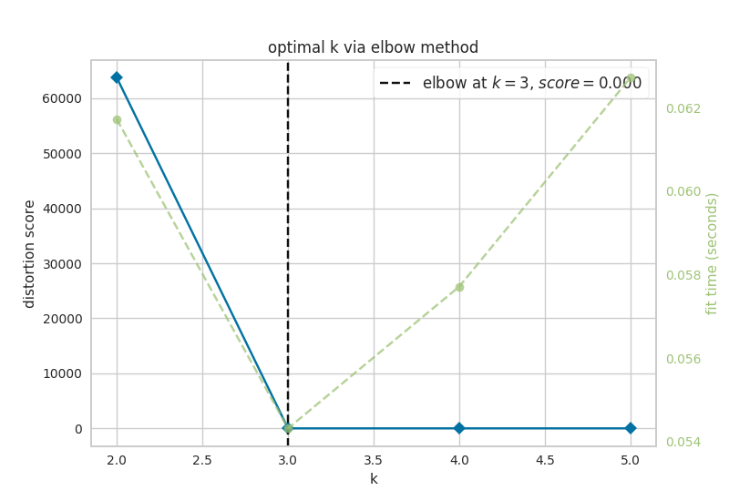
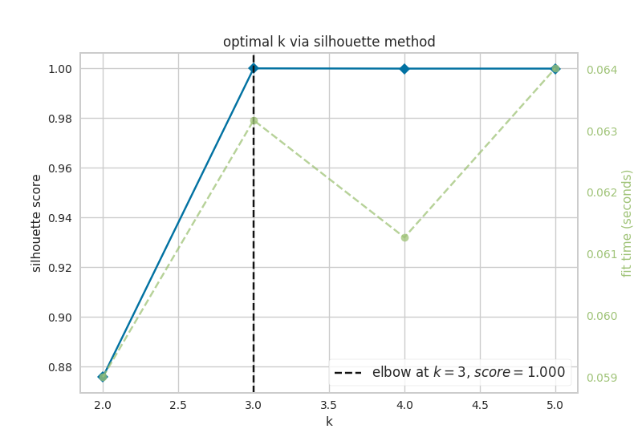
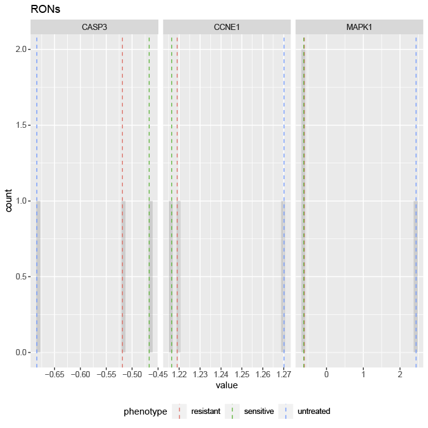

# Adaptive Resistance in Colorectal Cancer Example

This section contains instructions to reproduce the results of simulating perturbations on FVS control nodes in a network of colorectal cancer (CRC) signaling pathways. The goal of these simulations is to identify targets that can reprogram cells from a MAPK inhibitor therapy resistant phenotype to the MAPK inhibitor therapy sensitive fate. You can read the original report here: link

The input data, nextflow pipeline, and results of this simulation can be found in the [colorectal_cancer_validation folder](https://github.com/VeraLiconaResearchGroup/Netisce/tree/main/colorectal_cancer_validation) in the NETISCE github repository


## Input Data
[`network.sif`](https://github.com/VeraLiconaResearchGroup/Netisce/blob/main/colorectal_cancer_validation/input_data/network.sif) contains the network structure for CRC signaling

[`expression.csv`](https://github.com/VeraLiconaResearchGroup/Netisce/blob/main/colorectal_cancer_validation/input_data/expression.csv) contains the initial activities for HT29 untreated cells. The columns for H29_BRAFi (MAPK inhibitor therapy resistant state) and H29_BRAFi+EGRFi (MAPK inhibitor therapy sensitive state) are copies of the HT29 column 

[`internal-marker-1.txt`](https://github.com/VeraLiconaResearchGroup/Netisce/blob/main/colorectal_cancer_validation/input_data/internal-marker-1.txt) contains the 3 internal marker nodes that were originally used in Park et al., to evaluate simulations.

[`internal-marker-apoptosis.txt`](https://github.com/VeraLiconaResearchGroup/Netisce/blob/main/colorectal_cancer_validation/input_data/internal-marker-apoptosis.txt) contains the internal marker nodes related to apoptosis used to evaluate simulations.

[`internal-marker-mapk.txt`](https://github.com/VeraLiconaResearchGroup/Netisce/blob/main/colorectal_cancer_validation/input_data/internal-marker-mapk.txt) contains the internal marker nodes related to mapk used to evaluate simulations.


[`internal-marker-proliferation.txt`](https://github.com/VeraLiconaResearchGroup/Netisce/blob/main/colorectal_cancer_validation/input_data/internal-marker-proliferation.txt) contains the internal marker nodes related to proliferation used to evaluate simulations.

[`samples.txt`](https://github.com/VeraLiconaResearchGroup/Netisce/blob/main/colorectal_cancer_validation/input_data/samples.txt) contains they key for NETISCE to associate certain samples to the phenotypes of untreated (HT29), resistant (HT29_BRAFi), and sensitive (HT29_BRAFiEGFRi)

[`mutations.csv`](https://github.com/VeraLiconaResearchGroup/Netisce/blob/main/colorectal_cancer_validation/input_data/mutations.csv) mutational profile of HT29 cells, as well as the overrides for simulating BRAFi and EGRFi.

## Run the simulation

These simulations were run on a high performance cluster that uses a SLURM executor. If your hpc uses a different executor, please update those specifications in the `nextflow.config` file in the directory. Please see <https://www.nextflow.io/docs/latest/config.html> for more information regarding your executor.


For ease of reproduction, we have included all files necessary to reproduce the reported results directly in the [directory](https://github.com/VeraLiconaResearchGroup/Netisce/tree/main/colorectal_cancer_validation). We highly recommend you run this simulation on an hpc, as you will be generating files of 3Gb+. We have included the [bash file](https://github.com/VeraLiconaResearchGroup/Netisce/blob/main/colorectal_cancer_validation/run.sh) we used on our SLURM executor.

**Note: ** within the [`NETISCE_mutations.nf`](https://github.com/VeraLiconaResearchGroup/Netisce/blob/main/colorectal_cancer_validation/NETISCE_mutations.nf) configuration file, you will want to change the params.internal_control line if you want to use a different set of internal-marker nodes. 

```
#!/usr/bin/env nextflow

params.expressions = "$baseDir/input_data/expression.csv"
params.network = "$baseDir/input_data/network.sif"
params.samples = "$baseDir/input_data/samples.txt"
params.internal_control="$baseDir/input_data/internal-marker-1.txt"
params.mutations="$baseDir/input_data/mutations.csv"
params.alpha = 0.9
params.undesired = 'resistant'
params.desired = 'sensitive'
params.filter ="strict"

```

As discussed in our paper, we filtered the perturbations using the original 3 internal-marker nodes for apoptosis, proliferation, and MAPK signaling. We further filtered perturbations on the FVS control nodes using 17 addition internal-marker nodes, related to the phenotypes of apoptosis, proliferation, and MAPK signaling. Therefore, to use a set of internal-marker nodes, please point to the correct input-data file. We created folders within the `results` folder to house the relevant internal-marker node files for each set. You may  want to do the same as to not overwrite them (or move them into a separate folder). Additionally, when you run the nextflow command, **please be sure to use the `-resume` flag so that you use the cached computations that do not need to be re-computed**

You can run NETISCE directly from this folder using the following command: `./nextflow run NETISC_mutations.nf -resume`


## Results
Herein, we will focus on the results that are deposited in the [`results`](https://github.com/VeraLiconaResearchGroup/Netisce/tree/main/colorectal_cancer_validation/results) folder by NETISCE. However, each step of the nextflow pipeline produces its corresponding raw results (for example, the entire attractor state for network simulations initialized with experimental data). If you are interested in looking at those raw results, they can be found within the [`work`](https://github.com/VeraLiconaResearchGroup/Netisce/tree/main/colorectal_cancer_validation/work) folder. We provide [`workfiles.txt`](https://github.com/VeraLiconaResearchGroup/Netisce/blob/main/colorectal_cancer_validation/work/workfiles.txt) which is a guide to which folders/subfolders contain the relevant results of each step. 


### General Results 
First, let's take a look at the results that do not depend on the internal-marker node set. 

#### FVS finding {-#section-id}

Here we focus on one of the FVSes in the network, which we call, Set 1.
```{r echo=FALSE, message=FALSE, warning=FALSE}
fvs<-read.delim('crc/results/fvs.txt',sep=" ")
knitr::kable(fvs)
```


Set 1 contains 14 nodes. Notice that TP53 is included in the FVS. This is a mutant gene in HT29 cells. NETISCE_mutations automatically filters out mutated genes, and places the FVS without mutated genes in the `fvs-no-mutated-genes.txt` file.

and we remove mutated genes!
```{r echo=FALSE, message=FALSE, warning=FALSE}
fvs_nomut<-read.delim('crc/results/fvs-no-mutated-genes.txt',sep=" ")
knitr::kable(fvs_nomut)
```


#### Attractor landscape estimation via k-means analysis {-#section-id}
Now, let's look at the results of k-means analysis. First, NETISCE determines the optimal number of k clusters by computing the elbow and silhouette metrics. 

```{r, out.width='50%', fig.show="hold",echo = FALSE, fig.cap = 'optimal k as identified by a) the elbow and b) silhouette metrics'}


```

We see that the optimal k assessed by both the elbow metric and silhouette metric was k=3. NETISCE checkes to make sure that the untreated, MAPK inihibitor therapy resistant, and MAPK inhibitor therapy sensitive attractors are all separate. 

We can look at those results in the `kmeans.txt` file. 

```{r echo=FALSE, message=FALSE, warning=FALSE}
kmeans<-read.delim('crc/results/kmeans.txt',sep=" ",nrows=3)
knitr::kable(kmeans)
```

#### Pertrubations on FVS control nodes that pass criterion 1 {-#section-id}

With 13 FVS control nodes, NETISCE performed 1,594,323 simulations of combinations of perturbations on the FVS control nodes. The resulting attractors were classified to the clusters produced from the k-means analysis using Naive Bayes, Support Vector Machine, and Random Forest Machine Learning classification algorithms. Then, the perturbations are filtered by which of their corresponding attractors were classified to the  MAPK inhibitor therapy sensitive cluster by at least 2 of the 3 methods. These results can be found in [`crit1_perts.txt`](https://github.com/VeraLiconaResearchGroup/Netisce/blob/main/colorectal_cancer_validation/results/crit1perts.txt). Here we show the first 10 rows.

```{r echo=FALSE, message=FALSE, warning=FALSE, paged.print=TRUE}
crit1<-read.delim('crc/results/crit1perts.txt',sep=" ",header=F)
print(paste0('number of perturbations that pass filtering criteria 1: ',nrow(crit1)))
knitr::kable(crit1[1:10,])
```


### Results using 3 internal-marker nodes
**The relevant files have the prefix 'original' in the github repository**

Our second perturbation filtering criterion identifies perturbations where, in their corresponding attractors, 90% of the steady state values for internal-marker nodes that are within the steady state expression ranges in the attractor representing MAPK inhibitor therapy sensitivity. 

First, let's take a  look at the steady state values of the internal-marker nodes CASP3, CCNE1, and MAPK1 in the attractors generated from the untreated HT29 with simulated BRAFi (resistant) and BRAFi+EGFRi (sensitive). The values can be found in the [`exp_internalmarkers.txt`](https://github.com/VeraLiconaResearchGroup/Netisce/blob/main/colorectal_cancer_validation/results/3-marker-nodes/exp_internalmarkers.txt) and are plotted in [`-experimental_internalmarkers.pdf`](https://github.com/VeraLiconaResearchGroup/Netisce/blob/main/colorectal_cancer_validation/results/3-marker-nodes/experimental_internalmarkers.pdf):


```{r, echo = FALSE, message=FALSE, include=TRUE, fig.align='center',fig.cap = "histograms of 3 internal-marker node values",fig.pos='H'}



```

We see that the value of the internal-marker for the apoptosis (CASP3) is higher and the steady-state values of the internal-marker nodes for proliferation (CCNE1) and MAPK signaling (MAPK1) are lower in the MAPK inhibitor therapy sensitive associated attractor than the MAPK inhibitor therapy resistance and untreated associated attractors. 

Now, we can take a look at the attractors that passed filtering criterion 2. We show the first 10 rows here, but you can view the entire set in [`successful_controlnode_perturbations.txt`](https://github.com/VeraLiconaResearchGroup/Netisce/blob/main/colorectal_cancer_validation/results/3-marker-nodes/successful_controlnode_perturbations.txt)

```{r echo=TRUE, message=FALSE, warning=FALSE}

crit2_3<-read.delim('crc/results/3-marker-nodes/successful_controlnode_perturbations.txt',sep=" ",as.is = T)
print(paste0('number of perturbations that pass filtering criteria 2: ',nrow(crit2_3)))
knitr::kable(crit2_3[1:10,])  %>% column_spec(15, bold = F, border_left = T) %>% scroll_box(width = "100%", box_css = "border: 0px;") 
```

We can look to see if there are any trends in the orientation of the perturbations on FVS control nodes across the perturbations that passed both filtering criteria.

```{r echo=TRUE, message=FALSE, warning=FALSE, fig.align='center',fig.width=12, fig.cap="the precentage of specific perturbations on FVS control nodes in the perturbations that passed the filtering criteria"}
library(data.table)
library(ggplot2)
d3<-crit2_3[,c(1:13)] %>% transpose() %>% as.matrix()
row.names(d3)<-colnames(crit2_3[1:13])
colnames(d3)<-row.names(crit2_3)
d3r<-reshape2::melt(d3) %>% select(-Var2)

#From Paul Tol: https://personal.sron.nl/~pault/
Tol_muted <- c('#88CCEE', '#44AA99', '#117733', '#332288', '#DDCC77', '#999933','#CC6677', '#882255', '#AA4499', '#DDDDDD')

ggplot(d3r, aes(x=value)) +
  facet_wrap(~Var1,scales = "free_x",shrink=FALSE) +
  geom_bar(aes(y = (..count..)/ncol(d3),fill=value))  + scale_y_continuous(labels=scales::percent) + scale_fill_manual(values=Tol_muted)+ ylab("% of specified perturbation to an FVS control node across all \n combinations of perturbations that passed filtering criteria ") + xlab("node perturbation")
```
Here, we see that in the majority of perturbations, SRC is knocked-out.

The steady-state values of the internal-marker nodes for these perturbations can be found in [`pert1_internal_markers.txt`](https://github.com/VeraLiconaResearchGroup/Netisce/blob/main/colorectal_cancer_validation/results/3-marker-nodes/pert_internal_markers.txt).

The combination BRAFi+SRCi treatment was identified and experimentally validated by Park et al., to overcome adaptive resistance to MAPK inhibitor therapy in HT29 cells. This perturbation, pert_797158, passed both of our filtering criteria. We can plot the  steady-state values of the internal-marker nodes for HT29_BRAFi, H29_BRAFi+EGFRi, and HT29_BRAFi+SRCi using a radar plot.

```{r crc-charts, out.width='50%',echo = TRUE,fig.show='hold',fig.cap = "radar charts of the steady-state values of 3 internal-marker nodes for HT29_BRAFi+SRCi"}
library(fmsb)
attr_pert<-read.delim("crc/results/3-marker-nodes/pert_internal_markers.txt",sep=" ",row.names = 1)
attr_pert <-attr_pert[c('pert_797158'),]
exp<-read.delim("crc/results/3-marker-nodes/exp_internalmarkers.txt",sep=" ",row.names = 1)
exp<-exp[c(2,3),]

d1<-rbind(exp,attr_pert)
rownames(d1)[3]<- c("HT29_BRAFi+SRCi")
maxcol<-apply(d1, 2, max)
mincol<-apply(d1, 2, min)

d2<-rbind(maxcol,mincol, d1)
rownames(d2)[1:2]<- c("Max", "Min")

par(mar = c(4, 0.1, 4, 0.1))


for (i in 5:nrow(d2)) {
  create_beautiful_radarchart(d2[c(1:4, i), ],color = c("#00AFBB", "#E7B800","#FC4E07"),caxislabels = seq(round(min(d2[c(1:4, i),]),1),round(max(d2[c(1:4, i),]),1),.2),title =row.names(d2)[i]);legend(x=0.4, y=1.4, legend =c(row.names(d2)[3:nrow(d2)]) , bty = "n", pch=20 , col=c("#00AFBB", "#E7B800","#FC4E07") , text.col = "black", cex=1, pt.cex=2)
}

```


We see here that the steady state value of CASP3 in the attractor produced from the HT29_BRAFi+SRCi perturbation is within the range of attractor produced from the HT29_BRAFi+EGFRi perturbation. 

### Results using apoptosis, proliferation, and MAPK signaling internal-marker nodes

We filtered the 52,703 perturbations using an additional 17 internal-marker nodes for the phenotypes of apoptosis, proliferation, and mapk signaling. 

The individual results for all three sets can be found in their respective folders on github:
[`apoptosis-marker-nodes`](https://github.com/VeraLiconaResearchGroup/Netisce/tree/main/colorectal_cancer_validation/results/apoptosis-marker-nodes)
[`mapk-marker-nodes`](https://github.com/VeraLiconaResearchGroup/Netisce/tree/main/colorectal_cancer_validation/results/mapk-marker-nodes)
[`proliferation-marker-nodes`](https://github.com/VeraLiconaResearchGroup/Netisce/tree/main/colorectal_cancer_validation/results/proliferation-marker-nodes)

```{r message=FALSE, warning=FALSE, include=FALSE}
crit2_apop<-read.delim('crc/results/apoptosis-marker-nodes/successful_controlnode_perturbations.txt',sep=" ")

crit2_prolif<-read.delim('crc/results/proliferation-marker-nodes/successful_controlnode_perturbations.txt',sep=" ")

crit2_mapk<-read.delim('crc/results/mapk-marker-nodes/successful_controlnode_perturbations.txt',sep=" ")
print(paste0('number of perturbations that pass filtering criteria 2: ',nrow(crit2_mapk)))
# knitr::kable(crit2_mapk[1:10,])  %>% column_spec(15, bold = F, border_left = T) %>% scroll_box(width = "100%", box_css = "border: 0px;")
```

We are interested in perturbations on FVS control nodes that pass the filtering criterion for each of the three phenotypes (i.e., the 90% threshold for steady-state values is met separately for each of the sets of apoptosis, MAPK signaling, and proliferation nodes). We can plot the node perturbation trends for these perturbations.
```{r all-three,fig.cap="the precentage of specific perturbations on FVS control nodes in the perturbations that passed the filtering criteria"}
allthree<-crit2_3[c(Reduce(intersect, list(row.names(crit2_3),row.names(crit2_apop),row.names(crit2_prolif),row.names(crit2_mapk)))),]
print(paste0('number of perturbations that pass filtering criteria 2: ',nrow(allthree)))
d4<-allthree[,c(1:13)] %>% transpose() %>% as.matrix()
row.names(d4)<-colnames(allthree[1:13])
colnames(d4)<-row.names(allthree)
d4r<-reshape2::melt(d4) %>% select(-Var2)


ggplot(d4r, aes(x=value)) +
  facet_wrap(~Var1,scales = "free_x",shrink=FALSE) +
  geom_bar(aes(y = (..count..)/ncol(d4),fill=value))  + scale_y_continuous(labels=scales::percent)+
  theme(panel.spacing.x = unit(4, "mm")) + scale_fill_manual(values=Tol_muted) + ylab("% of specified perturbation to an FVS control node across all \n combinations of perturbations that passed filtering criteria ") + xlab("node perturbation")

```

For perturbations that pass the 2nd filtering criterion using internal-marker nodes for apoptosis, MAPK sigaling and proliferation, we see that in 100% of the perturbations SRC is downregulated. In the majority of of perturbations, TSC1 is upregulated, and GRB2 is downregulated.


The two smallest sets of perturbations that passed the filtering criteria were BRAFi+SRCi+TSC1overexpression (pert_797159) and BRAFi+SRCi+GRB2i (pert_790597). We can make radar charts for each phenotype's internal marker nodes to show that the steady-state values for the internal marker-nodes produced from these perturbations are within the gene expression range of the MAPK inhibitor therapy sensitivty assocaited attractor (HT29_BRAFi+EGFRi).


```{r crc-chartsapop, out.width='50%',echo = TRUE,fig.show='hold',fig.cap = "radar charts of the steady-state values of apoptosis internal-marker nodes for HT29_BRAFi+SRCi_TSCovr and HT29_BRAFi+SRCi_GRB2i"}

attr_pert<-read.delim("crc/results/apoptosis-marker-nodes/pert_internal_markers.txt",sep=" ",row.names = 1)
attr_pert <-attr_pert[c('pert_797159','pert_790597'),]
exp<-read.delim("crc/results/apoptosis-marker-nodes/exp_internalmarkers.txt",sep=" ",row.names = 1)
exp<-exp[c(2,3),]

d1<-rbind(exp,attr_pert)
rownames(d1)[3:4]<- c("HT29_BRAFi+SRCi+TSCovr","HT29_BRAFi+SRCi+GRB2i")
maxcol<-apply(d1, 2, max)
mincol<-apply(d1, 2, min)

d2<-rbind(maxcol,mincol, d1)
rownames(d2)[1:2]<- c("Max", "Min")

par(mar = c(4, 0.1, 4, 0.1))
for (i in 5:nrow(d2)) {
  create_beautiful_radarchart(d2[c(1:4, i), ],color = c("#00AFBB", "#E7B800","#FC4E07"),caxislabels = seq(round(min(d2[c(1:4, i),]),1),round(max(d2[c(1:4, i),]),1),.2),title =row.names(d2)[i]);legend(x=0.4, y=1.4, legend =c(row.names(d2)[c(3,4,i)]) , bty = "n", pch=20 , col=c("#00AFBB", "#E7B800","#FC4E07") , text.col = "black", cex=1, pt.cex=2)
}

```

```{r crc-chartsprolif, out.width='50%',echo = TRUE,fig.show='hold',fig.cap = "radar charts of the steady-state values of proliferation internal-marker nodes for HT29_BRAFi+SRCi_TSCovr and HT29_BRAFi+SRCi_GRB2i"}
attr_pert<-read.delim("crc/results/proliferation-marker-nodes/pert_internal_markers.txt",sep=" ",row.names = 1)
attr_pert <-attr_pert[c('pert_797159','pert_790597'),]
exp<-read.delim("crc/results/proliferation-marker-nodes/exp_internalmarkers.txt",sep=" ",row.names = 1)
exp<-exp[c(2,3),]

d1<-rbind(exp,attr_pert)
rownames(d1)[3:4]<- c("HT29_BRAFi+SRCi+TSCovr","HT29_BRAFi+SRCi+GRB2i")
maxcol<-apply(d1, 2, max)
mincol<-apply(d1, 2, min)

d2<-rbind(maxcol,mincol, d1)
rownames(d2)[1:2]<- c("Max", "Min")

par(mar = c(4, 0.1, 4, 0.1))
for (i in 5:nrow(d2)) {
  create_beautiful_radarchart(d2[c(1:4, i), ],color = c("#00AFBB", "#E7B800","#FC4E07"),caxislabels = seq(round(min(d2[c(1:4, i),]),1),round(max(d2[c(1:4, i),]),1),.2),title =row.names(d2)[i]);#legend(x=0.4, y=1.4, legend =c(row.names(d2)[c(3,4,i)]) , bty = "n", pch=20 , col=c("#00AFBB", "#E7B800","#FC4E07") , text.col = "black", cex=1, pt.cex=2)
}

```

```{r crc-chartsmapk, out.width='50%',echo = TRUE,fig.show='hold',fig.cap = "radar charts of the steady-state values of MAPK signaling internal-marker nodes for HT29_BRAFi+SRCi_TSCovr and HT29_BRAFi+SRCi_GRB2i"}

attr_pert<-read.delim("crc/results/mapk-marker-nodes/pert_internal_markers.txt",sep=" ",row.names = 1)
attr_pert <-attr_pert[c('pert_797159','pert_790597'),]
exp<-read.delim("crc/results/mapk-marker-nodes/exp_internalmarkers.txt",sep=" ",row.names = 1)
exp<-exp[c(2,3),]

d1<-rbind(exp,attr_pert)
rownames(d1)[3:4]<- c("HT29_BRAFi+SRCi+TSCovr","HT29_BRAFi+SRCi+GRB2i")
maxcol<-apply(d1, 2, max)
mincol<-apply(d1, 2, min)

d2<-rbind(maxcol,mincol, d1)
rownames(d2)[1:2]<- c("Max", "Min")

par(mar = c(4, 0.1, 4, 0.1))
for (i in 5:nrow(d2)) {
  create_beautiful_radarchart(d2[c(1:4, i), ],color = c("#00AFBB", "#E7B800","#FC4E07"),caxislabels = seq(round(min(d2[c(1:4, i),]),1),round(max(d2[c(1:4, i),]),1),.2),title =row.names(d2)[i]);#legend(x=0.4, y=1.4, legend =c(row.names(d2)[c(3,4,i)]) , bty = "n", pch=20 , col=c("#00AFBB", "#E7B800","#FC4E07") , text.col = "black", cex=1, pt.cex=2)
}

```
<!-- # ```{r radar-plots-for-paper, out.width='50%',echo = TRUE,fig.show='hold',fig.cap = "radar charts of the steady-state values of 7 internal-marker nodes perturbation"} -->
<!-- #  -->
<!-- #  -->
<!-- # attr_pert<-read.delim("ipsc/results/pert1_internal_markers.txt",sep=" ",row.names = 1) -->
<!-- # attr_pert <-attr_pert[c('pert_445','pert_365'),c('Oct4',"Sox2","Nanog","EpiTFs")] -->
<!-- # exp<-read.delim("ipsc/results/original-exp_internalmarkers.txt",sep=" ",row.names = 1) -->
<!-- # EpiSC_avg<-colMeans(exp[4:6,]) -->
<!-- # ESC_avg<-colMeans(exp[1:3,]) -->
<!-- #  -->
<!-- # d1<-rbind(EpiSC_avg,ESC_avg,attr_pert) -->
<!-- # rownames(d1)[1:4]<- c("EpiSC", "ESC","Nanog overexpression","Klf4 overexpression") -->
<!-- # maxcol<-apply(d1, 2, max) -->
<!-- # mincol<-apply(d1, 2, min) -->
<!-- #  -->
<!-- # d2<-rbind(maxcol,mincol, d1) -->
<!-- # rownames(d2)[1:2]<- c("Max", "Min") -->
<!-- #  -->
<!-- # par(mar = c(4, 0.1, 4, 0.1)) -->
<!-- #  -->
<!-- #  -->
<!-- # for (i in 5:nrow(d2)) { -->
<!-- #   create_beautiful_radarchart(d2[c(1:4, i), ],color = c("#00AFBB", "#E7B800","#FC4E07"),caxislabels = seq(round(min(d2[c(1:4, i),]),1),round(max(d2[c(1:4, i),]),1),.2),title =row.names(d2)[i]);legend(x=0.4, y=1.4, legend =c("average EpiSC","average ESC",row.names(d2)[i]) , bty = "n", pch=20 , col=c("#00AFBB", "#E7B800","#FC4E07") , text.col = "black", cex=1, pt.cex=2) -->
<!-- # } -->
<!-- # ``` -->
<!-- #  -->
<!-- #  -->
<!-- # ```{r radar-plots-for-paper2, out.width='33%',echo = TRUE,fig.show='hold',fig.cap = "radar charts of the steady-state values of 7 internal-marker nodes perturbation"} -->
<!-- #  -->
<!-- #  -->
<!-- # attr_pert<-read.delim("ipsc/results/pert1_internal_markers.txt",sep=" ",row.names = 1) -->
<!-- # attr_pert <-attr_pert[c('pert_445','pert_365','pert_446'),] -->
<!-- # exp<-read.delim("ipsc/results/original-exp_internalmarkers.txt",sep=" ",row.names = 1) -->
<!-- # EpiSC_avg<-colMeans(exp[4:6,]) -->
<!-- # ESC_avg<-colMeans(exp[1:3,]) -->
<!-- #  -->
<!-- # d1<-rbind(EpiSC_avg,ESC_avg,attr_pert) -->
<!-- # rownames(d1)[1:5]<- c("EpiSC", "ESC","Nanog overexpression","Klf4 overexpression","Nanog+Klf4 overexpression") -->
<!-- # maxcol<-apply(d1, 2, max) -->
<!-- # mincol<-apply(d1, 2, min) -->
<!-- #  -->
<!-- # d2<-rbind(maxcol,mincol, d1) -->
<!-- # rownames(d2)[1:2]<- c("Max", "Min") -->
<!-- #  -->
<!-- # par(mar = c(4, 0.1, 4, 0.1)) -->
<!-- #  -->
<!-- #  -->
<!-- # for (i in 5:nrow(d2)) { -->
<!-- #   create_beautiful_radarchart(d2[c(1:4, i), ],color = c("#00AFBB", "#E7B800","#FC4E07"),caxislabels = seq(round(min(d2[c(1:4, i),]),1),round(max(d2[c(1:4, i),]),1),.2),title =row.names(d2)[i]);legend(x=0.4, y=1.4, legend =c("average EpiSC","average ESC",row.names(d2)[i]) , bty = "n", pch=20 , col=c("#00AFBB", "#E7B800","#FC4E07") , text.col = "black", cex=.8, pt.cex=1.8) -->
<!-- # } -->
<!-- # ``` -->


