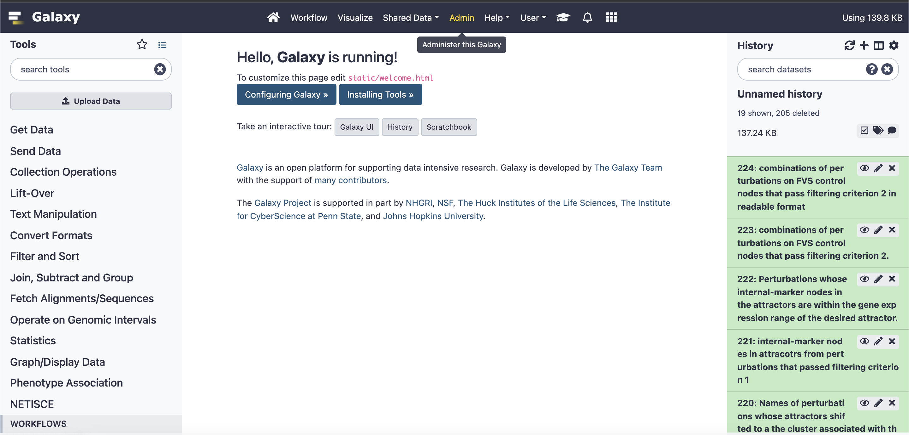
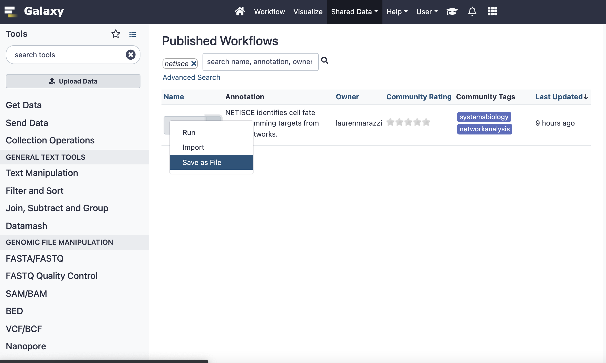
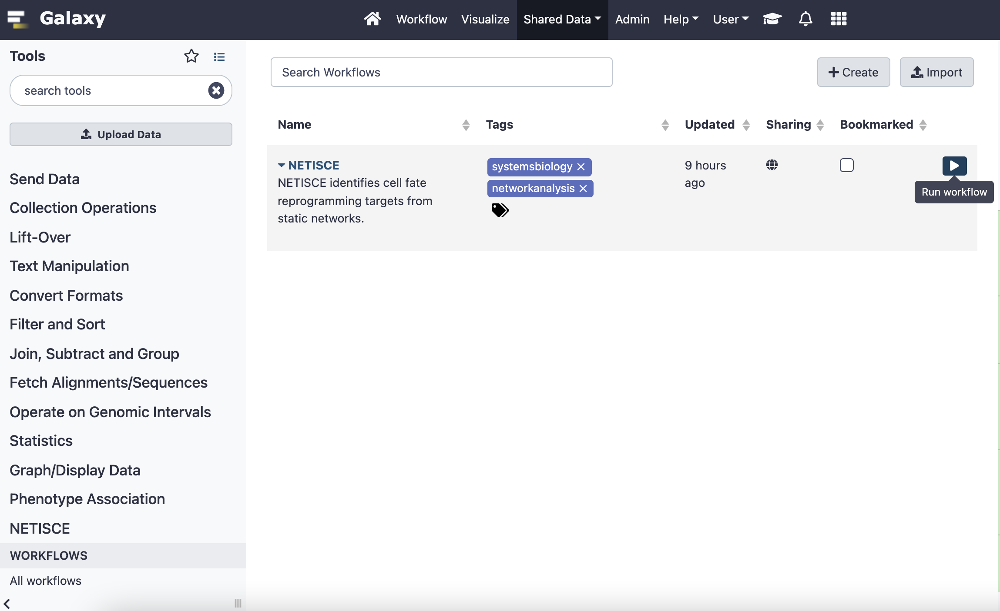
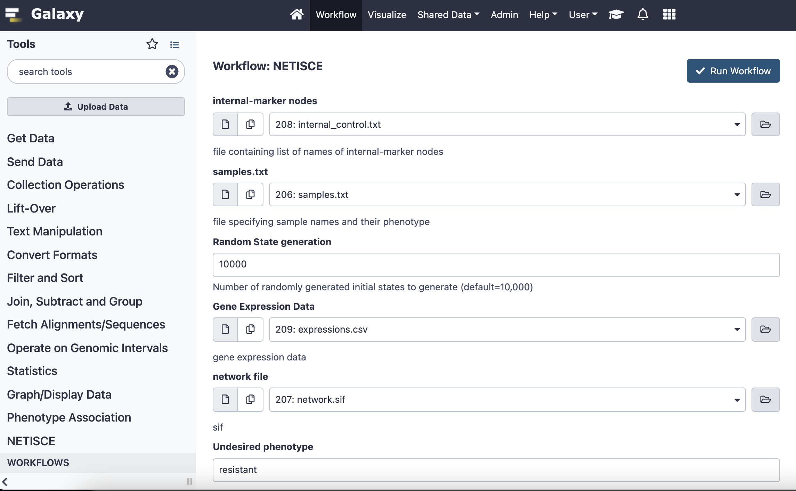

# NETISCE in Galaxy Project

We have implemented NETISCE as a Galaxy Project tool. This allows users to run NETISCE analysis without programming knowledge.  Herein are brief instructions for downloading and installing the Galaxy Project Tool and Workflow.

## Installing Galaxy

Please follow the instructions for installing a local version of Galaxy here: https://galaxyproject.org/admin/get-galaxy/

Follow instructions up to "Install Tools".

## Installing the NETISCE tool from Galaxy Tool Shed.

First launch Galaxy by inputting `sh run.sh` in your terminal and load the GUI (navigate to `http://localhost:8080/` in your browser of choice). Then, after you have established your admin account and are logged in, you will be able to download the NETSICE tool.

Click on the Admin button in the top ribbon:
```{r, out.width='100%', fig.align='center',echo = FALSE}

```


Under Tool Management, select "Install and Uninstall". This will lead you to the search repositories page. You can search for the NETISCE tool by typing "netisce" into the search bar.

Click on "netisce" and select Install. You can choose to Install additional dependencies (this is especially useful if you have installed Galaxy in a conda environment). You can specify the header under which you want to install netisce (we suggest "NETISCE")

```{r, out.width='100%', fig.align='center',echo = FALSE}
knitr::include_graphics("images/galaxy2.png")
```

## Downloading the NETISCE workflow.

The fastest way to download the NETISCE workflow is to direct download it from here: https://github.com/VeraLiconaResearchGroup/Netisce/blob/049aec40e76c6b1d965aa199a041e0651fadd29b/Galaxy-Workflow-NETISCE.ga

Alternatively, you can launch galaxy from https://usegalaxy.org/

In the  upper ribbon, navigate to "Shared Data" -> "Workflows". Here you can search for "netisce"

```{r, out.width='100%', fig.align='center',echo = FALSE}
knitr::include_graphics("images/galaxy3.png")
```

Click the dropdown arrow and select "save as file."

```{r, out.width='100%', fig.align='center',echo = FALSE}

```

Using either downloaded file, in your local Galaxy, navigate to the "Workflow" page. Select import in the right-hand corner. Upload the .ga file. 


Once the Netisce workflow appears, on the righthand side, press the run button
```{r, out.width='100%', fig.align='center',echo = FALSE}

```


This will load the workflow.You will be presented with parameters to fill in (either text or files). You can use the same sample files as are used in the toy example nextflow run. Once you have uploaded your files and filled in other parameters, press "Run Workflow".

```{r, out.width='100%', fig.align='center',echo = FALSE}

```


You can monitor the progress of your run on the right hand side. when all jobs are complete, you can view the report of your workflow, which contains all resutls files.

```{r, out.width='100%', fig.align='center',echo = FALSE}
knitr::include_graphics("images/galaxy7.png")
```