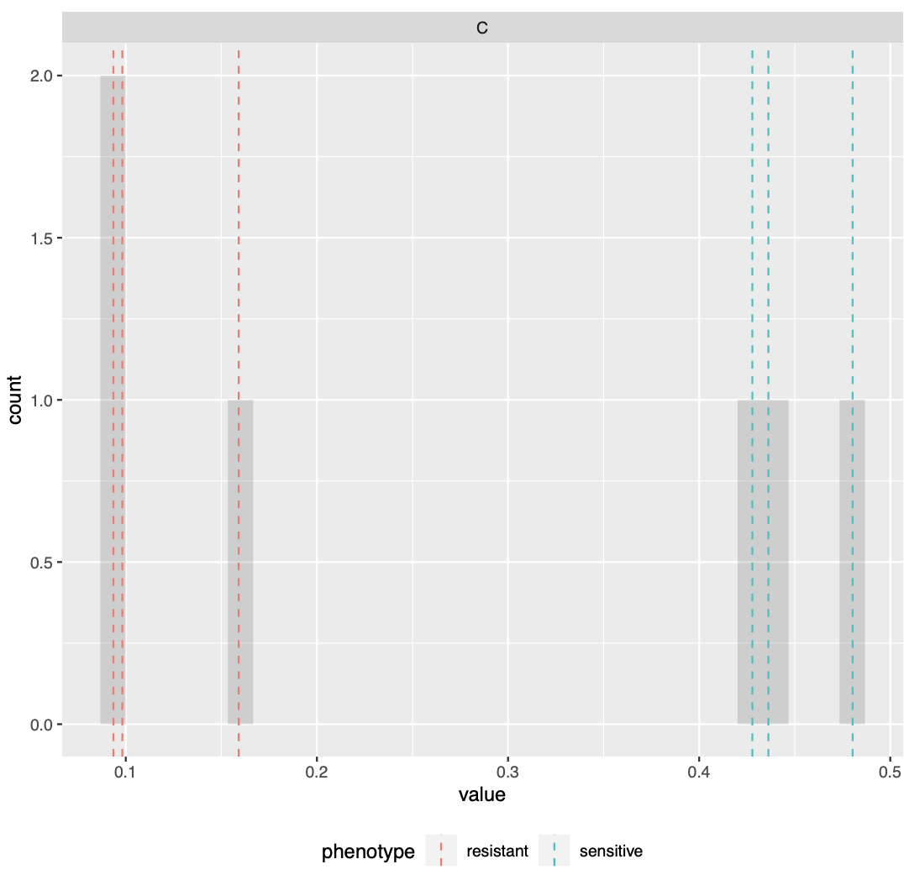

--- 
title: "NETISCE Manual and Tutorials"
  
author: "Lauren Marazzi"
date: "`r Sys.Date()`"
site: bookdown::bookdown_site
documentclass: book
bibliography: [book.bib, packages.bib]
url: https://veraliconaresearchgroup.github.io/Netisce/
cover-image: images/netisce-logo.png
description: |
  Welcome to the NETISCE manual and tutorials. NETISCE is a network-based approach for cellular reprogramming. This manual contains directions for intial setup, as well as tutorials for reproducing NETISCE cell reprogramming results in developmental, stem cell, and cancer biology.
link-citations: yes
github-repo: https://github.com/veraliconaresearchgroup/netisce

---


# About

Welcome to the NETISCE manual and tutorials.

NETISCE is a network-based approach for cellular reprogramming. This manual contains instructions for installing the NETISCE pipeline tool and accessing the Galaxy Project GUI web-based tool. We provide a simple toy example walkthrough tutorial. Lastly, we include instructions for reproducing NETISCE cell reprogramming results in developmental, stem cell, and cancer biology.

NETISCE identifies combinations of perturbations to be applied on a gene regulatory or signaling network to trigger a shift from an undesired to a desired cell fate. The core of the pipeline is the application of structure-based control theory to identify control nodes that drive the system from an initial state that would lead to an attractor associated with an undesired phenotype and towards an attractor associated with the desired phenotype. For more information, please see the accompanying paper: **link here**


```{r include=FALSE}
# automatically create a bib database for R packages
knitr::write_bib(c(
  .packages(), 'bookdown', 'knitr', 'rmarkdown'
), 'packages.bib')
knitr::opts_chunk$set(class.source = "foldable")
```

```{js, echo = FALSE}
title=document.getElementById('header');
title.innerHTML = '' + title.innerHTML
```

<!--chapter:end:index.Rmd-->

# Installation and Usage


## Download NETISCE

NETISCE pipelines can be downloaded from our github repository:  <https://github.com/veraliconaresearchgroup/netisce>

We recommend that you run NETISCE on a high-performance cluster (hpc), as you may generate files that are quite large, or run computations that may take a long time. However, we provide two Nextflow pipelines, one designed for hpcs [(NETISCE_hpc)](https://github.com/VeraLiconaResearchGroup/Netisce/tree/main/NETICSE_hpc), and another for running NETISCE on a local machine [(NETISCE_local)](https://github.com/VeraLiconaResearchGroup/Netisce/tree/main/NETICSE_local).

## Install Nextflow

Nextflow is required to run the NETISCE pipeline. Please follow the instructions from <https://www.nextflow.io/> (see 'Getting Started' steps 1 & 2) to install Nextflow in the appropriate NETSICE folder (_local or _hpc).

## Docker Image

*docker image provided here TBD*

## Prerequisuites

If you are not using the Docker image, the following packages will need to be installed:

- [scipy](https://scipy.org/install/)
- [pandas](https://pandas.pydata.org/getting_started.html)
- [sklearn](https://scikit-learn.org/stable/install.html)
- [yellowbrick](https://www.scikit-yb.org/en/latest/quickstart.html)

## Parameters and Configuration {#params}


Whether on your local machine or hpc, to run NETISCE you must specify the files and parameters within the  `.nf` file

- **params.expressions**: csv file containing normalized expression data for network nodes in different samples
- **params.network**: network file (sif format)
- **params.samples**: text file specifying the phenotype for each sample in params.expressions file (tab delimited)
- **params.internal_control**: text file containing a list of nodes to be used as internal marker nodes
- **params.alpha**: alpha parameter for signal flow analysis (default =0.9)
- **params.undesired**: string of the undesired phenotype (as labeled in the params.samples file)
- **params.desired**: string of the desired phenotype (as labeled in the params.samples file)
- **params.filter**: filtering parameter for criterion 2 ("strict" or "relaxed")
- **params.kmeans_min_val**: minimum k-means value for clustering (default=2)
- **params.kmeans_max_val**:  maximum k-means value for clustering (default=10)
- **params.num_nodes**: number of nodes in network for which normalized expression data exists (within the params.expressions file)
- **params.num_states**: number of randomly generated initial states (default=100000, or 3^n where n is the number of network nodes and 3^n is less than 100000)

Please see the [`input_data`](https://github.com/VeraLiconaResearchGroup/Netisce/tree/main/NETISCE_local/input_data) folder for examples of files to match the formatting. 

### NETISCE_mutations.nf

If you are interested in including mutational information, please use the [`NETISCE_mutations.nf`](https://github.com/VeraLiconaResearchGroup/Netisce/blob/main/NETISCE_local/NETISCE_mutations.nf) pipeline. You must additionally specify `params.mutations`: a csv file containing mutational configuration for network nodes (0 for loss of function, 1 for gain of function). Please see example in [`input_data`](https://github.com/VeraLiconaResearchGroup/Netisce/tree/main/NETISCE_local/input_data)  for formatting.

### nextflow.config

If you are running nextflow on an hpc, please specify your executor, and clusterOptions within the nextflow.config file. Please see <https://www.nextflow.io/docs/latest/config.html> for more information regarding your executor.

## Running NETISCE

Once you have specified the parameters, run NETSICE using the following command: 
``` 
./nextflow run NETISCE.nf -resume ##or NETISCE_mutations.nf if including mutational data

```

We recommend using the -resume flag in the case that you change a file or parameter within your pipeline. This way, nextflow caches results that remain unchanged, preventing pipeline steps from being re-run. 

<!--chapter:end:01-intro.Rmd-->

# NETSICE output 

After the NETISCE computations are complete, the output files will be located in the `results` folder. Please note that we have included in this folder the most relevant output files that you may want to use for further analysis. However, you can explore all outputs by checking within each step of the pipeline's `work` folder that is generated during a NETISCE run. 

The contents of each file are briefly described below. For more details and to see example outputs, please see the [Toy Network Examples](#toy).

#### exp_internalmarkers.txt {-#section-id}
This file contains the resultant steady state values for the internal marker nodes for the provided experimental samples (those specified in samples.txt) from Signal Flow Analysis.

#### experimental_internalmarkers.pdf {-#section-id}
This pdf is a figure of the steady state values for the internal marker nodes for the provided experimental samples. This can be used to verify the validity of the internal marker nodes.

#### elbow.png  {-#section-id}
A graph of the elbow metric for determining the optimal k for k-means.

#### silhouette.png {-#section-id}
A graph of the silhouette metric for determining the optimal k for k-means.

#### fvs.txt  {-#section-id}
This file contains the node names for the FVS used as control nodes for the NETISCE run.

#### crit1perts.txt  {-#section-id}
This file contains a list of IDs for the control node perturbations that passed criterion 1.

#### pert1_internal_markers.txt  {-#section-id}
This file contains a table of the internal marker node steady state  values from control node perturbations whose associated attractors passed the first filtering criterion. 

#### successful_controlnode_perturbations.txt  {-#section-id}
This file contains a table of the control node perturbations that pass both the 1st and 2nd filtering criteria. it also contains the number of upregulation,downregulations, and total number of nodes perturbed for each perturbation set. 

<!--chapter:end:02-output.Rmd-->

# Toy Network Examples {#toy}

Here, we will walk through a brief tutorial of a NETISCE run. The files necessary to complete the tutorial are within the `input data` folder of both [`NETISCE_local`](https://github.com/VeraLiconaResearchGroup/Netisce/tree/main/NETICSE_local) and [`NETISCE_hpc`](https://github.com/VeraLiconaResearchGroup/Netisce/tree/main/NETICSE_hpc).
The results from these Toy examples can be found in the [toy_example_results](https://github.com/VeraLiconaResearchGroup/Netisce/tree/main/toy_example_results) folder of the main github repository.

## Overview

We will use a simple toy network of 6 nodes and 9 edges.
```{r, out.width='50%', fig.align='center',echo = FALSE, fig.cap = 'Simple Toy Network'}
knitr::include_graphics("images/toy_network.png")
```
## Data
You can find the relevant data files in the `input_data` folder.

In this example, we have 2 samples, A and B, with three replicates each (A_1,A_2,A_3, etc).
The normalized expression data is housed in `expressions.csv`, and contains normalized expression values for 4 of the network nodes (in this case, node C was not found to be expressed in the samples).
```{r echo=FALSE, message=FALSE, warning=FALSE}
exp<-read.csv('input_data/expressions.csv')
knitr::kable(exp)
```

The `samples.txt` file specifies that A is associated to a treatment sensitive phenotype, while B is associated to a resistance phenotype. 
```{r echo=FALSE, message=FALSE, warning=FALSE}
samples<-read.delim('input_data/samples.txt')
knitr::kable(samples)
```

Note that you can use any term to describe the phenotypes. Just be sure to be consistent with the `param.desried` and `param.undesired` variables within the Nextflow `.nf` file. 

Lastly, we need to include a list of internal marker nodes. This list is in `internal_marker.txt`. For our small network, the internal-marker node is `C`. 
```{r echo=FALSE, message=FALSE, warning=FALSE}
marker<-read.delim('input_data/internal_marker.txt')
knitr::kable(marker)
```

## NETISCE run configuration

With all your input data files loaded, next we configure the nextflow run in either `NETISCE_local` or `NETSICE_hpc` (**Note: while we do recommend you run NETISCE on a hpc, this example is small enough to run locally**). 

Open up `NETISCE.nf`. Here, you need to specify the parameters for the Nextflow run on lines 3-19. Please refer to [section 2.5](#params) for parameter definitions. 

For this example, your parameters should look like:
```
params.expressions = "$baseDir/input_data/expressions.csv"
params.network = "$baseDir/input_data/network.sif"
params.samples = "$baseDir/input_data/samples.txt"
params.internal_control="$baseDir/input_data/internal_marker.txt"
params.alpha = 0.9
params.undesired = 'resistant'
params.desired = 'sensitive'
params.filter ="strict"


params.kmeans_min_val = 2
params.kmeans_max_val = 10


params.num_nodes = 4 // that have expression data
params.num_states = 100000
```
**Some Notes: ** make sure to include `$baseDir` before pointing to the folder containing your input data. Also, be sure that `params.num_nodes` is the number of nodes where there exists normalized expression data within `expression.csv`. 

## Run NETISCE
In your terminal/command prompt, navigate to the appropriate NETISCE folder (`_hpc` or `local`). To start your run, enter `./nextflow run NETISCE.nf -resume`.
While NETISCE is running, your terminal should look like this, where you can see the progress on each step of the pipeline:
```{r, out.width='50%', fig.align='center',echo = FALSE, fig.cap = 'Terminal when running NETISCE'}
knitr::include_graphics("images/running_shot.png")
```
The first column contains the location (folder and subfolder) that is running that step of NETISCE within the `work` folder.


Once the run has successfully completed, the process will end and the following will be displayed:
```{r, out.width='50%', fig.align='center',echo = FALSE, fig.cap = 'Terminal when running NETISCE'}
knitr::include_graphics("images/completed.png")
```


## NETSICE Results
Let's take a look at the results of our NETISCE run, where the goal was to shift the system from the undesired state B, and towards the desired state A. These results can be found in the toy_example_1 subfolder of the [toy_example_results](https://github.com/VeraLiconaResearchGroup/Netisce/tree/main/toy_example_results) folder of the main github repository.


#### exp_internalmarkers.txt {-#section-id}
Our internal marker node was node C. In this file we see the steady state values of the node in the A and B sample replicates (the output values from SFA).
```{r echo=FALSE, message=FALSE, warning=FALSE}
expmarker<-read.delim('results/exp_internalmarkers.txt',sep=" ")
knitr::kable(expmarker)
```


#### experimental_internalmarkers.pdf {-#section-id}
The above numbers may be a little challenging to read! So, we have included a plot of the values in the`experimental_internalmarkers.pdf`:
```{r, out.width='50%', fig.align='center',echo = FALSE, fig.cap = 'experimental marker node steady state values'}

```
On this histogram, we see bars for each of the samples and their replicates. The A (sensitive) samples are marked by a blue vertical line at their steady state value, while the B (resistant) samples are marked by a red vertical line at their steady state value. Here, we see that the values of node C are well separated between the two phenotypes (all of the A values are greater than all of the B values). We will assume that this also aligns with the biological knowledge of the system.

In this example, since there are only 4 network nodes that have normalized expression values, NETISCE generates the maximum number of random initial states, \(3^4\), or 81.


After estimating attractors for the experimental and randomly generated initial states, the resultant attractors were clustered using k-means clustering. The elbow and silhouette metrics are used to determine the optimal number k.

#### elbow.png  {-#section-id}
```{r, out.width='50%', fig.align='center',echo = FALSE, fig.cap = 'elbow metric for optimal k'}
knitr::include_graphics("results/elbow.png")
```
The elbow metric found the optimal number of k clusters to be k=3.

#### silhouette.png {-#section-id}
```{r,out.width='50%', fig.align='center',echo = FALSE, fig.cap = 'silhouette metric for optimal k'}
knitr::include_graphics("results/silhouette.png")
```
The silhouette metric found the optimal number of k clusters to be k=2.

Since the optimal ks identified by the silhouette metric and the elbow metric do not match, NETISCE chooses the smaller k, as long as the phenotypes remain separate (NETISCE checks to make sure this is true). 

#### kmeans.txt {-#section-id}
The `kmeans.txt` file contains the clustering results for each attractor generated from the experimental data and the randomly generated initial states. The first column contains the sample name, and the second column contains the ID of which cluster it is assigned to. Since k=2 in this case, one cluster is named 
"0" and the other cluster is named "1"
```{r,out.width='50%', fig.align='center',echo = FALSE, fig.cap = 'silhouette metric for optimal k'}
kmeans<-read.delim('results/kmeans.txt',header = T,sep=" ")
knitr::kable(kmeans[1:6,])
```

And we see in the `kmeans.txt` file, that the A samples are clustered in cluster 0, while the B samples are grouped in cluster 1. 


#### fvs.txt  {-#section-id}
This file contains the node names that were identified by the FVS finding algorithm.
```{r echo=FALSE, message=FALSE, warning=FALSE}
fvs<-read.delim('results/fvs.txt')
knitr::kable(fvs)
```
The FVS finding algorithm identified nodes B and D to be the minimal FVS control nodes in the toy network. Since the FVS control node set contained 2 nodes, 9 combinations of perturbations were performed on the control node sets.

#### crit1perts.txt  {-#section-id}
This file contains a list of IDs for the perturbations to FVS control nodes that passed criterion 1.
```{r echo=FALSE, message=FALSE, warning=FALSE}
crit1<-read.delim('results/crit1perts.txt',header = F)
knitr::kable(crit1)
```
8 out of the 9 pertrubations passed the machine learning filtering criterion.


#### pert1_internal_markers.txt  {-#section-id}
This file contains a table of the internal marker node state  values from control node perturbations whose associated attractors passed the first filtering criterion. 
```{r echo=FALSE, message=FALSE, warning=FALSE}
marker<-read.delim('results/pert1_internal_markers.txt',sep=" ")
knitr::kable(marker)
```

#### successful_controlnode_perturbations.txt  {-#section-id}
This file contains a table of the perturbations on FVS control nodes that passed both the 1st and 2nd filtering criteria. it also contains the number of upregulation,downregulations, and total number of nodes perturbed for each perturbation set. 
```{r echo=FALSE, message=FALSE, warning=FALSE}
success<-read.delim('results/successful_controlnode_perturbations.txt',sep=" ")
knitr::kable(success)
```
Here, we see that four perturbations that passed both filtering criteria.

Let's take a quick look at the steady state values for these perturbations, and the attractors generated from the experimental data:
```{r echo=FALSE, message=FALSE, warning=FALSE}
marker<-marker[marker$name %in% rownames(success),]
allmarkers<-rbind(expmarker,marker)
knitr::kable(allmarkers)
```

Indeed, we see that the steady-state expression values of node C in the attractors generated by peturbations to the FVS control nodes are all are greater than the steady-state expression values of node C in the attractors generated from the sensitive A sample. A successful reprogramming from resistant (B) to sensitive (A) cells has occurred!

## Toy Example with mutations
Let's say that in our system, gene A exhibits a loss of function mutation in the sensitive phenotype (A samples). If we want to include this in our simulations, we will use the `NETISCE_mutations.nf` pipeline.

First, we must add to our `input_data` folder a `.csv` file containing the mutational profile. Let's call this file `mutations.csv`:
```{r echo=FALSE, message=FALSE, warning=FALSE}
knitr::kable(read.csv('input_data/mutations.csv'))

```

The loss of function mutation is encoded with 0 (gain-of-function mutations can be encoded with "1").

Next, we make sure that the parameters in `NETISCE_mutations.nf` on lines 3-19 are set correctly for the conditions

For this example, your parameters should look like:
```
params.expressions = "$baseDir/input_data/expressions.csv"
params.network = "$baseDir/input_data/network.sif"
params.samples = "$baseDir/input_data/samples.txt"
params.internal_control="$baseDir/input_data/internal_marker.txt"
params.mutations="$baseDir/input_data/mutations.csv"
params.alpha = 0.9
params.undesired = 'resistant'
params.desired = 'sensitive'
params.filter ="strict"


params.kmeans_min_val = 2
params.kmeans_max_val = 10


params.num_nodes = 4 // that have expression data
params.num_states = 1000
```
Note, the additional parameter `params.mutations` that points to the `mutations.csv.`

As above, to run Netisce, enter `./nextflow run NETISCE.nf -resume`.

#### Results {-#section-id}
By including mutational information, the results of NETISCE have changed.These results can be found in the toy_example_2 subfolder of the [toy_example_results](https://github.com/VeraLiconaResearchGroup/Netisce/tree/main/toy_example_results) folder of the main github repository.
Now, our `successful_controlnode_perturbations.txt` file contains pert_0 instead of pert_8

```{r echo=FALSE, message=FALSE, warning=FALSE}
knitr::kable(read.delim('results/successful_controlnode_perturbations_mutations.txt',sep=" "))

```

Let's take a look at the steady-state expression values of node C in the attractors generated from the successful perturbations and the experimental initial states when mutational information is included.
```{r echo=FALSE, message=FALSE, warning=FALSE}
knitr::kable(read.delim('results/markers_mutations.txt',sep=" "))

```

Though the values are different in this system with mutations, we still see that the steady-state expression values of node C in the attractors generated by peturbations to the FVS control nodes are all are greater than the steady-state expression values of node C in the attractors generated from the sensitive A sample. A successful reprogramming from resistant (B) to sensitive (A) cells has occurred!

<!--chapter:end:03-example.Rmd-->

# Cell Fate Specification in Ascidian Embryo

This section contains instructions to reproduce the results of simulating FVS control node perturbations in a model of ascidian embryo cell specification. You can read the original report here: link

The input data, nextflow pipeline, and results of this simulation can be found in the [ascidian embryo folder](https://github.com/VeraLiconaResearchGroup/Netisce/tree/main/ascidian_embryo) in the github repository

These simulations were run on a high performance cluster that uses a SLURM executor. Although we recommend that you run NETISCE on an hpc, this simulation is small enough that it can be run on a local machine. If you choose to run it locally, then remove the `nextflow.config` file from the directory.

## Input Data
The goal of this simulation was to reproduce the results of experimental perturbations to the FVS nodes of the cell fate specification GRN for ascidian embryos using Signal Flow Analysis. Therefore, we use a modified version of the NETISCE pipeline to simulate these specific perturbations.
We are only interested in performing the 7 perturbations to the 6 FVS control nodes that were experimentally verified to induce cell tissue fates.

`expression.csv` contains the initial activities for the unperturbed state and the 7 FVS control node perturbations. Here, all simulations have Gata.a and Zic-r.a=1, as the activation of these two genes is required for normal embryonic development. 

`perturbations.csv` contains the specified perturbations for each FVS node in the appropriate perturbation simulation. 0 denotes downregulation, wherease 1 encodes upregulation. If no value is set, then there is no fixed perturbation to the FVS node, as in the unperturbed case.

`internal-marker-nodes.txt` contains the 7 internal marker nodes used to verify if the specified cell reprogramming had been successfully simulated.

## Run the simulation
To run the simulation, simply execute the `ascidian-embryo.nf` file using the following command: `./nextflow run ascidian-embryo.nf -resume`

## Results
The nextflow pipeline generates 1 result file `exp_internalmarkers.txt`, which contains the steady state values of the internal-marker nodes for the unperturbed attractor, and the attractors generated from the perturbations on FVS control nodes.
```{r,echo=FALSE, message=FALSE, warning=FALSE}
library(dplyr)
library(kableExtra)

results<-read.delim('ascidian_embryo/results/exp_internalmarkers.txt',sep="\t")
knitr::kable(results) %>%kable_styling(font_size = 8) %>% scroll_box(width = "100%", box_css = "border: 0px;")
```

A perturbation is considered successful if the internal-marker node in the attractor generated from the perturbed FVS control nodes has a larger steady-state value than that in the unperturbed attractor. We determine this by subtracting the steady-state values of the unperturbed simulation from the steady-state values of the perturbations of FVS control nodes.

```{r,echo=FALSE, message=FALSE, warning=FALSE}

DACs<-sweep(as.matrix(results[2:8,2:8]),2,as.matrix(results[1,2:8]))
row.names(DACs)<-results$name[2:8]
DACs<-as.data.frame(DACs) %>%round(3)
where <- rbind(c(1,1), c(2,2), c(3,3))
DACs[1,1]<-cell_spec(DACs[1,1], background = "yellow", format = "html")
DACs[2,2]<-cell_spec(DACs[2,2], background = "yellow", format = "html")
DACs[2,3]<-cell_spec(DACs[2,3], background = "yellow", format = "html")
DACs[4,5]<-cell_spec(DACs[4,5], background = "yellow", format = "html")
DACs[5,4]<-cell_spec(DACs[5,4], background = "yellow", format = "html")
DACs[6,6]<-cell_spec(DACs[6,6], background = "yellow", format = "html")
DACs[7,7]<-cell_spec(DACs[7,7], background = "yellow", format = "html")
knitr::kable(DACs,escape=F) %>% kable_styling(font_size = 9) %>% scroll_box(width = "100%", box_css = "border: 0px;")  
```
Here we see that for 6 out of the 7 perturbations to FVS controlnodes, we were able to upregulate the desired tissue marker when compared to the unperturbed state.

## Visualizing Results
We can use radar plots to visualize the results of the SFA simulations of perturbations to the FVS control nodes. This can help us identify which perturbations successfully induced the appropriate tissue fate. In this context. 

The following code for generating radar plots was adapted from [datanovia.com](https://www.google.com/search?q=create+_beautiful_+radar+chart&oq=create+beautiful+rada&aqs=chrome.1.69i57j0i10i22i30.11973j0j1&sourceid=chrome&ie=UTF-8).

**Note: ** you may need to adjust the formatting of `exp_internalmarkers.txt` so that the strings within quotations are placed into one column.
```{r radar charts, echo=TRUE}
create_beautiful_radarchart <- function(data, color = "#00AFBB", 
                                        vlabels = colnames(data), vlcex = 1,
                                        caxislabels = NULL, title =row.names(data)[4], ...){
  radarchart(
    data, axistype = 1,
    # Customize the polygon
    pcol = color, pfcol = scales::alpha(color, 0.5), plwd = 2, plty = 1,
    # Customize the grid
    cglcol = "grey", cglty = 1, cglwd = 0.8,
    # Customize the axis
    axislabcol = "grey", 
    # Variable labels
    vlcex = vlcex, vlabels = vlabels,
    title = title,
    centerzero = F,
    caxislabels = caxislabels
    
  )
}
```


```{r charts, out.width='50%',echo = TRUE,fig.show='hold'}
library(fmsb)
d1<-read.delim("ascidian_embryo/results/exp_internalmarkers.txt",sep="\t",row.names = 1,check.names = F)

maxcol<-apply(d1, 2, max)
mincol<-apply(d1, 2, min)

d2<-rbind(maxcol,mincol, d1)
rownames(d2)[1:2]<- c("Max", "Min")

par(mar = c(4, 0.1, 4, 0.1))
for (i in 4:nrow(d2)) {
  create_beautiful_radarchart(d2[c(1:3, i), ],color = c("#00AFBB", "#E7B800","#FC4E07"),caxislabels = seq(round(min(d2[c(1:3, i),]),1),round(max(d2[c(1:3, i),]),1),.2));legend(x=0.4, y=1.4, legend =c("unperturbed","FVS perturbation") , bty = "n", pch=20 , col=c("#00AFBB", "#E7B800","#FC4E07") , text.col = "black", cex=1, pt.cex=2)
}
```

<!--chapter:end:04-embryo.Rmd-->

# Pluripotent Stem Cell Example

This section contains instructions to reproduce the results of simulating perturbations on FVS control nodes in a pluripotent stem cell signaling. The goal of these simulations is to identify targets that can reprogram cells from the Epiblast stem cell (EpiSC) fate towards the Embryonic Stem Cell (ESC) fate. You can read the original report here: link

The input data, nextflow pipeline, and results of this simulation can be found in the [ipsc folder](https://github.com/VeraLiconaResearchGroup/Netisce/tree/main/ipsc_validation) in the NETISCE github repository


## Input Data
[`network.sif`](https://github.com/VeraLiconaResearchGroup/Netisce/blob/main/ipsc_validation/input_data/network.sif) contains the network structure for pluripotent stem cell signaling

[`expression.csv`](https://github.com/VeraLiconaResearchGroup/Netisce/blob/main/ipsc_validation/input_data/expression.csv) contains the initial activities for ESC cells (3 replicates), and EpiSC cells (3 replicates)

[`internal-marker-kinoshita.txt`](https://github.com/VeraLiconaResearchGroup/Netisce/blob/main/ipsc_validation/input_data/internal-marker-kinoshita.txt) contains the 4 internal marker nodes that were originally used in Yachie-Kinoshita et al., to evaluate simulations.

[`internal-marker-kinoshita-expanded.txt`](https://github.com/VeraLiconaResearchGroup/Netisce/blob/main/ipsc_validation/input_data/internal-marker-kinoshita-expanded.txt) contains the 4 internal marker nodes that were originally used in Yachie-Kinoshita et al., plus the additional marker ndoes identified from the data used to evaluate simulations.

[`samples.txt`](https://github.com/VeraLiconaResearchGroup/Netisce/blob/main/ipsc_validation/input_data/samples.txt) contains they key for NETISCE to associate certain samples to the phenotypes of Embryonic Stem Cells (ESCs) or Epiblast Stem Cells (EpiSCs)

## Run the simulation

These simulations were run on a high performance cluster that uses a SLURM executor. If your hpc uses a different executor, please update those specifications in the `nextflow.config` file in the directory. Please see <https://www.nextflow.io/docs/latest/config.html> for more information regarding your executor.


For ease of reproduction, we have included all files necessary to reproduce the reported results directly in the [directory](https://github.com/VeraLiconaResearchGroup/Netisce/tree/main/ipsc_validation). We do reccomend you run this simulation on an hpc. We have included the [bash file](https://github.com/VeraLiconaResearchGroup/Netisce/blob/main/ipsc_validation/run.sh) we used on our SLURM executor.

**Note: ** within the [`NETISCE.nf`](https://github.com/VeraLiconaResearchGroup/Netisce/blob/main/ipsc_validation/NETISCE.nf) configuration file, we have included two lines for specifying the internal-marker nodes:

```
#!/usr/bin/env nextflow

params.expressions = "$baseDir/input_data/expression.csv"
params.network = "$baseDir/input_data/network.sif"
params.samples = "$baseDir/input_data/samples.txt"
params.internal_control="$baseDir/input_data/internal-marker-kinoshita.txt"
// params.internal_control="$baseDir/input_data/internal-marker-kinoshita-expanded.txt"
params.alpha = 0.9
params.undesired = 'EpiSC'
params.desired = 'ESC'
params.filter ="strict"
```

As discussed in our paper, we filtered the perturbations using the original 4 internal-marker nodes for pluripotency (Oct4, Sox2, Nanog, EpiTFs), and then again using 3 additional internal-marker nodes. Therefore, to run either analysis, comment/uncomment the internal-marker node file you are interested in. If you want to run NETISCE first with the original internal-marker nodes, make sure to change the results file names for `exp_internalmarkers.txt`,`successful_controlnode_perturubations.txt`, and `original-experimental_internalmarkers.pdf` as to not overwrite them (or move them into a separate folder). Additionally, when you run the nextflow command, **please be sure to use the `-resume` flag so that you use the cached computations that do not need to be re-computed**

You can also run NETISCE directly using the following command: `./nextflow run NETISCE.nf -resume`


## Results
Herein, we will focus on the results that are deposited in the [`results`](https://github.com/VeraLiconaResearchGroup/Netisce/tree/main/ipsc_validation/results) folder by NETISCE. However, each step of the nextflow pipeline produces its coressponding raw results (for example, the entire attractor state for network simulations initialized with experimnetal data). If you are interested in looking at those raw results, they can be found within the [`work`](https://github.com/VeraLiconaResearchGroup/Netisce/tree/main/ipsc_validation/work) folder. We provide [`workfiles.txt`](https://github.com/VeraLiconaResearchGroup/Netisce/blob/main/ipsc_validation/workfiles.txt) which is a guide to which folders/subfolders contain the relevant results of each step. 


### General Results 
First, let's take a look at the results that do not depend on the internal-marker node set. 

#### FVS finding {-#section-id}

The FVS solving algorithm identified one FVS, containing 6 nodes.
```{r echo=FALSE, message=FALSE, warning=FALSE}
fvs<-read.delim('ipsc/results/fvs.txt',sep=" ")
knitr::kable(fvs)
```


#### Attractor landscape estimation via k-means analysis {-#section-id}
Now, let's look at the results of k-means analysis. First, NETISCE determines the optimal number of k clusters by computing the elbow and silhouette metrics. 

```{r, out.width='50%', fig.show="hold",echo = FALSE, fig.cap = 'optimal k as identified by a) the elbow and b) silhouette metrics'}
knitr::include_graphics("ipsc/results/elbow.png")
knitr::include_graphics("ipsc/results/silhouette.png")
```

We see that the optimal k assessed by the elbow metric was k=4, while the optimal k identified by the silhouette metric was k=2. NETISCE automatically chooses the smaller k value, after checking that the attractors generated from the ESC samples and EpiSC samples do not appear in the same cluster.

k=2 was selected for k-means optimal k, and we can see that the attractors generated from the ESC samples and EpiSC samples do not appear in separate clusters.

```{r echo=FALSE, message=FALSE, warning=FALSE}
kmeans<-read.delim('ipsc/results/kmeans.txt',sep=" ",nrows=6)
knitr::kable(kmeans)
```

#### Pertrubations on FVS control nodes that pass criterion 1 {-#section-id}

With 6 FVS control nodes, NETISCE performed 729 simulations of combinations of perturbations on the FVS control nodes. The resulting attractors were classified to the clusters produced from the k-means analysis using Naive Bayes, Support Vector Machine, and Random Forest Machine Learning classification algorithms. Then, the perturbations are filtered by which of their corresponding attractors were classified to the ESC cluster by at least 2 of the 3 methods. These results can be found in [`crit1_perts.txt`](https://github.com/VeraLiconaResearchGroup/Netisce/blob/main/ipsc_validation/results/crit1perts.txt). Here we show the first 10 rows.

```{r echo=FALSE, message=FALSE, warning=FALSE, paged.print=TRUE}
crit1<-read.delim('ipsc/results/crit1perts.txt',sep=" ",header=F)
print(paste0('number of perturbations that pass filtering criteria 1: ',nrow(crit1)))
knitr::kable(crit1[1:10,])
```


### Results using 4 internal-marker nodes
**The relevant files have the prefix 'original' in the github repository**

Our second perturbation filtering criterion identifies perturbations where, in their corresponding attractors, 90% of the steady state values for internal-marker nodes that are within the steady state expression ranges in the attractors generated from the ESC experimental data. 

First, let's take a  look at the steady state values of the internal-marker nodes Oct4, Sox2, and Nanog in the attractors generated from the ESC and EpiSC experimental data. The values can be found in the [`original-exp_internalmarkers.txt`](https://github.com/VeraLiconaResearchGroup/Netisce/blob/main/ipsc_validation/results/original-exp_internalmarkers.txt) and are plotted in [`original-experimental_internalmarkers.pdf`](https://github.com/VeraLiconaResearchGroup/Netisce/blob/main/ipsc_validation/results/original-experimental_internalmarkers.pdf):


```{r, echo = FALSE, message=FALSE, include=TRUE,out.width = '460pt',out.height= '700pt',fig.align='center',fig.cap = "histograms of 4 internal-marker node values",fig.pos='H'}

knitr::include_graphics("ipsc/results/original-experimental_internalmarkers.pdf")

```

We see that the values of the internal-markers for the pluripotent state (Oct4, Sox2, Nanog) are higher in the attractors generated from the experimental data of the ESCs than the  attractors generated from the experimental data of the EpiSCs, and the makrer of the epiblast stem state is higher in the  attractors generated from the experimental data of the EpiSCs than in the attractors generated from the experimental data of the ESC.

Now, we can take a look at the attractors that passed filtering criterion 2. We show the first 10 rows here, but you can view the entire set in [`original-successful_controlnode_perturbations.txt`](https://github.com/VeraLiconaResearchGroup/Netisce/blob/main/ipsc_validation/results/original-successful_controlnode_perturbations.txt)

```{r echo=TRUE, message=FALSE, warning=FALSE}
crit2_4<-read.delim('ipsc/results/original-successful_controlnode_perturbations.txt',sep=" ",as.is = T)
print(paste0('number of perturbations that pass filtering criteria 2: ',nrow(crit2_4)))
knitr::kable(crit2_4[1:10,])  %>% column_spec(8, bold = F, border_left = T) %>% scroll_box(width = "100%", box_css = "border: 0px;") 
```

We can look to see if there are any trends in the orientation of the perturbations on FVS control nodes across the perturbations that passed both filtering criteria.

```{r echo=TRUE, message=FALSE, warning=FALSE, fig.align='center'}
library(data.table)
library(ggplot2)
d3<-crit2_4 [,c(1:6)] %>% transpose() %>% as.matrix()
row.names(d3)<-colnames(crit2_4[1:6])
colnames(d3)<-row.names(crit2_4)
d3r<-reshape2::melt(d3) %>% select(-Var2)

#From Paul Tol: https://personal.sron.nl/~pault/
Tol_muted <- c('#88CCEE', '#44AA99', '#117733', '#332288', '#DDCC77', '#999933','#CC6677', '#882255', '#AA4499', '#DDDDDD')

ggplot(d3r, aes(x=value)) +
  facet_wrap(~Var1,scales = "free_x",shrink=FALSE) +
  geom_bar(aes(y = (..count..)/ncol(d3),fill=value))  + scale_y_continuous(labels=scales::percent) + scale_fill_manual(values=Tol_muted)+ ylab("% of specified perturbation to a control node across all \n combinations of perturbations that passed filtering criteria ") + xlab("node perturbation")
```
Here, we see that in the majority of perturbations, there is overexpression of the FVS nodes Sox2, Nanog and Oct4. This aligns with their role as maintainers of pluripotency. 

The steady-state values of the internal-marker nodes for these perturbations can be found in [`pert1_internal_markers.txt`](https://github.com/VeraLiconaResearchGroup/Netisce/blob/main/ipsc_validation/results/pert1_internal_markers.txt).


A perturbation on the FVS control node, Nanog overexpression (pert_445),  was also identified in Yachie-Kinoshita et al. and experimentally verified to shift cells from the EpiSC state towards the ESC state. We can plot the internal-marker node values using a radar plot.

We can also plot Klf4 overexpression. This was a perturbation identified by Yachie-Kinoshita et al. to shift cells from the EpiSC state towards the ESC state. However, in our analyses, this perturbation (pert_365), did pass filtering criterion 1, but did not pass filtering criterion 2.


```{r ipsc-charts, out.width='50%',echo = TRUE,fig.show='hold',fig.cap = "radar charts of the steady-state values of 4 internal-marker nodes for Nanog overexpression and Klf4 overexpression perturbation"}
library(fmsb)
attr_pert<-read.delim("ipsc/results/pert1_internal_markers.txt",sep=" ",row.names = 1)
attr_pert <-attr_pert[c('pert_445','pert_365'),c('Oct4',"Sox2","Nanog","EpiTFs")]
exp<-read.delim("ipsc/results/original-exp_internalmarkers.txt",sep=" ",row.names = 1)
EpiSC_avg<-colMeans(exp[4:6,])
ESC_avg<-colMeans(exp[1:3,])

d1<-rbind(EpiSC_avg,ESC_avg,attr_pert)
rownames(d1)[1:4]<- c("EpiSC", "ESC","Nanog overexpression","Klf4 overexpression")
maxcol<-apply(d1, 2, max)
mincol<-apply(d1, 2, min)

d2<-rbind(maxcol,mincol, d1)
rownames(d2)[1:2]<- c("Max", "Min")

par(mar = c(4, 0.1, 4, 0.1))


for (i in 5:nrow(d2)) {
  create_beautiful_radarchart(d2[c(1:4, i), ],color = c("#00AFBB", "#E7B800","#FC4E07"),caxislabels = seq(round(min(d2[c(1:4, i),]),1),round(max(d2[c(1:4, i),]),1),.2),title =row.names(d2)[i]);legend(x=0.4, y=1.4, legend =c("average EpiSC","average ESC",row.names(d2)[i]) , bty = "n", pch=20 , col=c("#00AFBB", "#E7B800","#FC4E07") , text.col = "black", cex=1, pt.cex=2)
}

```


We see here, indeed that the values for Oct4, Sox2, Nanog, (when considered these three genes as internal-marker nodes) and EpiTFs are within the expected range for Nanog overexpression, but the values of Oct4, Sox2, Nanog in the attractor generated from Klf4 overexpression do not reach the values of the ESC state.

### Results using 7 internal-marker nodes
*The relevant files have the prefix 'expanded' in the github repository.*

We explored filtering the 132 perturbations that passed the second filtering criterion by adding additional internal-marker nodes associated with pluripotency. We added 3 nodes, Lefty1, Pitx2 (transcription factors active in EpiSCs), and Esrrb (transcription factor active in ESCs) to the 4 previously used internal-marker nodes.

Let's look at the steady state values of the internal-marker nodes  in the attractors generated from the ESC and EpiSC experimental data. The values can be found in the [`expanded-exp_internalmarkers.txt`](https://github.com/VeraLiconaResearchGroup/Netisce/blob/main/ipsc_validation/results/expanded-exp_internalmarkers.txt) and are plotted in [`expanded-experimental_internalmarkers.pdf`](https://github.com/VeraLiconaResearchGroup/Netisce/blob/main/ipsc_validation/results/expanded-experimental_internalmarkers.pdf):

```{r, echo = FALSE, message=FALSE, include=TRUE,out.width = '460pt',out.height= '700pt',fig.align='center',fig.cap = "histograms of 7 internal-marker node values",fig.pos='H'}

knitr::include_graphics("ipsc/results/expanded-experimental_internalmarkers.pdf")

```

Again, the internal-marker nodes have the correct expression patterns within the attractors generated from the ESC and EpiSC states.

Now, we can take a look at the attractors that passed filtering criterion 2. These are in file [`expanded-successful_controlnode_perturbations.txt`](https://github.com/VeraLiconaResearchGroup/Netisce/blob/main/ipsc_validation/results/expanded-successful_controlnode_perturbations.txt)

```{r echo=TRUE, message=FALSE, warning=FALSE}
crit2_7<-read.delim('ipsc/results/expanded-successful_controlnode_perturbations.txt',sep=" ")
print(paste0('number of perturbations that pass filtering criteria 2: ',nrow(crit2_7)))
knitr::kable(crit2_7)  %>% column_spec(8, bold = F, border_left = T) %>% scroll_box(width = "100%", box_css = "border: 0px;")
```

We can plot the trends of the orientation of perturbations for each FVS control node across the 15 perturbations. 

```{r echo=TRUE, message=FALSE, warning=FALSE,fig.align='center'}

d4<-crit2_7 [,c(1:6)] %>% transpose() %>% as.matrix()
row.names(d4)<-colnames(crit2_7[1:6])
colnames(d4)<-row.names(crit2_7)
d4r<-reshape2::melt(d4) %>% select(-Var2)


ggplot(d4r, aes(x=value)) +
  facet_wrap(~Var1,scales = "free_x",shrink=FALSE) +
  geom_bar(aes(y = (..count..)/ncol(d4),fill=value))  + scale_y_continuous(labels=scales::percent) + scale_fill_manual(values=Tol_muted) + ylab("% of specified perturbation to a control node across all \n combinations of perturbations that passed filtering criteria ") + xlab("node perturbation")
```
Interestingly, we see among these 15 perturbations, Nanog overexpression, but no change to Oct4 or Sox2, is indicated. We also see that Klf4 is overexpressed in the majority of these 15 perturbations. 

The steady-state values of the internal-marker nodes for these perturbations can be found in [`pert1_internal_markers.txt`](https://github.com/VeraLiconaResearchGroup/Netisce/blob/main/ipsc_validation/results/pert1_internal_markers.txt).

We can also generate radar plots for these 15 perturbations.

```{r ipsc-charts2, out.width='50%',echo = TRUE,fig.show='hold',fig.cap = "radar charts of the steady-state values of 7 internal-marker nodes perturbation"}
library(fmsb)
attr_pert<-read.delim("ipsc/results/pert1_internal_markers.txt",sep=" ",row.names = 1)
attr_pert <-attr_pert[row.names(crit2_7),]
exp<-read.delim("ipsc/results/original-exp_internalmarkers.txt",sep=" ",row.names = 1)
EpiSC_avg<-colMeans(exp[4:6,])
ESC_avg<-colMeans(exp[1:3,])

d1<-rbind(EpiSC_avg,ESC_avg,attr_pert)
rownames(d1)[1:2]<- c("EpiSC", "ESC")
maxcol<-apply(d1, 2, max)
mincol<-apply(d1, 2, min)

d2<-rbind(maxcol,mincol, d1)
rownames(d2)[1:2]<- c("Max", "Min")

par(mar = c(4, 0.1, 4, 0.1))

for (i in 5:nrow(d2)) {
  create_beautiful_radarchart(d2[c(1:4, i), ],color = c("#00AFBB", "#E7B800","#FC4E07"),caxislabels = seq(round(min(d2[c(1:4, i),]),1),round(max(d2[c(1:4, i),]),1),.2),title =row.names(d2)[i]);legend(x=0.4, y=1.4, legend =c("average EpiSC","average ESC",row.names(d2)[i]) , bty = "n", pch=20 , col=c("#00AFBB", "#E7B800","#FC4E07") , text.col = "black", cex=1, pt.cex=2)
}

```
These radar plots show that for all 15 perturbations on FVS control nodes, the steady-state values of the internal-marker nodes are within the expression range of the attractors generated from the ESC experimental data.  


```{r radar-plots-for-paper, eval=FALSE, fig.cap=, fig.show='hold', include=FALSE, out.width='50%'}


attr_pert<-read.delim("ipsc/results/pert1_internal_markers.txt",sep=" ",row.names = 1)
attr_pert <-attr_pert[c('pert_445','pert_365'),c('Oct4',"Sox2","Nanog","EpiTFs")]
exp<-read.delim("ipsc/results/original-exp_internalmarkers.txt",sep=" ",row.names = 1)
EpiSC_avg<-colMeans(exp[4:6,])
ESC_avg<-colMeans(exp[1:3,])

d1<-rbind(EpiSC_avg,ESC_avg,attr_pert)
rownames(d1)[1:4]<- c("EpiSC", "ESC","Nanog overexpression","Klf4 overexpression")
maxcol<-apply(d1, 2, max)
mincol<-apply(d1, 2, min)

d2<-rbind(maxcol,mincol, d1)
rownames(d2)[1:2]<- c("Max", "Min")

par(mar = c(4, 0.1, 4, 0.1))


for (i in 5:nrow(d2)) {
  create_beautiful_radarchart(d2[c(1:4, i), ],color = c("#00AFBB", "#E7B800","#FC4E07"),caxislabels = seq(round(min(d2[c(1:4, i),]),1),round(max(d2[c(1:4, i),]),1),.2),title =row.names(d2)[i]);legend(x=0.4, y=1.4, legend =c("average EpiSC","average ESC",row.names(d2)[i]) , bty = "n", pch=20 , col=c("#00AFBB", "#E7B800","#FC4E07") , text.col = "black", cex=1, pt.cex=2)
}
```


```{r radar-plots-for-paper2, eval=FALSE, fig.cap=, fig.show='hold', include=FALSE, out.width='33%'}


attr_pert<-read.delim("ipsc/results/pert1_internal_markers.txt",sep=" ",row.names = 1)
attr_pert <-attr_pert[c('pert_445','pert_365','pert_446'),]
exp<-read.delim("ipsc/results/original-exp_internalmarkers.txt",sep=" ",row.names = 1)
EpiSC_avg<-colMeans(exp[4:6,])
ESC_avg<-colMeans(exp[1:3,])

d1<-rbind(EpiSC_avg,ESC_avg,attr_pert)
rownames(d1)[1:5]<- c("EpiSC", "ESC","Nanog overexpression","Klf4 overexpression","Nanog+Klf4 overexpression")
maxcol<-apply(d1, 2, max)
mincol<-apply(d1, 2, min)

d2<-rbind(maxcol,mincol, d1)
rownames(d2)[1:2]<- c("Max", "Min")

par(mar = c(4, 0.1, 4, 0.1))


for (i in 5:nrow(d2)) {
  create_beautiful_radarchart(d2[c(1:4, i), ],color = c("#00AFBB", "#E7B800","#FC4E07"),caxislabels = seq(round(min(d2[c(1:4, i),]),1),round(max(d2[c(1:4, i),]),1),.2),title =row.names(d2)[i]);legend(x=0.4, y=1.4, legend =c("average EpiSC","average ESC",row.names(d2)[i]) , bty = "n", pch=20 , col=c("#00AFBB", "#E7B800","#FC4E07") , text.col = "black", cex=.8, pt.cex=1.8)
}
```

<!--chapter:end:05-ipsc.Rmd-->


# Adaptive Resistance in Colorectal Cancer Example

This section contains instructions to reproduce the results of simulating perturbations on FVS control nodes in a pluripotent stem cell signaling. The goal of these simulations is to identify targets that can reprogram cells from the Epiblast stem cell (EpiSC) fate towards the Embryonic Stem Cell (ESC) fate. You can read the original report here: link

The input data, nextflow pipeline, and results of this simulation can be found in the [ipsc folder](https://github.com/VeraLiconaResearchGroup/Netisce/tree/main/ipsc_validation) in the NETISCE github repository


## Input Data
[`network.sif`](https://github.com/VeraLiconaResearchGroup/Netisce/blob/main/ipsc_validation/input_data/network.sif) contains the network structure for pluripotent stem cell signaling

[`expression.csv`](https://github.com/VeraLiconaResearchGroup/Netisce/blob/main/ipsc_validation/input_data/expression.csv) contains the initial activities for ESC cells (3 replicates), and EpiSC cells (3 replicates)

[`internal-marker-kinoshita.txt`](https://github.com/VeraLiconaResearchGroup/Netisce/blob/main/ipsc_validation/input_data/internal-marker-kinoshita.txt) contains the 4 internal marker nodes that were originally used in Yachie-Kinoshita et al., to evaluate simulations.

[`internal-marker-kinoshita-expanded.txt`](https://github.com/VeraLiconaResearchGroup/Netisce/blob/main/ipsc_validation/input_data/internal-marker-kinoshita-expanded.txt) contains the 4 internal marker nodes that were originally used in Yachie-Kinoshita et al., plus the additional marker ndoes identified from the data used to evaluate simulations.

[`samples.txt`](https://github.com/VeraLiconaResearchGroup/Netisce/blob/main/ipsc_validation/input_data/samples.txt) contains they key for NETISCE to associate certain samples to the phenotypes of Embryonic Stem Cells (ESCs) or Epiblast Stem Cells (EpiSCs)

## Run the simulation

These simulations were run on a high performance cluster that uses a SLURM executor. If your hpc uses a different executor, please update those specifications in the `nextflow.config` file in the directory. Please see <https://www.nextflow.io/docs/latest/config.html> for more information regarding your executor.


For ease of reproduction, we have included all files necessary to reproduce the reported results directly in the [directory](https://github.com/VeraLiconaResearchGroup/Netisce/tree/main/ipsc_validation). We do reccomend you run this simulation on an hpc. We have included the [bash file](https://github.com/VeraLiconaResearchGroup/Netisce/blob/main/ipsc_validation/run.sh) we used on our SLURM executor.

**Note: ** within the [`NETISCE.nf`](https://github.com/VeraLiconaResearchGroup/Netisce/blob/main/ipsc_validation/NETISCE.nf) configuration file, we have included two lines for specifying the internal-marker nodes:

```
#!/usr/bin/env nextflow

params.expressions = "$baseDir/input_data/expression.csv"
params.network = "$baseDir/input_data/network.sif"
params.samples = "$baseDir/input_data/samples.txt"
params.internal_control="$baseDir/input_data/internal-marker-kinoshita.txt"
// params.internal_control="$baseDir/input_data/internal-marker-kinoshita-expanded.txt"
params.alpha = 0.9
params.undesired = 'EpiSC'
params.desired = 'ESC'
params.filter ="strict"
```

As discussed in our paper, we filtered the perturbations using the original 4 internal-marker nodes for pluripotency (Oct4, Sox2, Nanog, EpiTFs), and then again using 3 additional internal-marker nodes. Therefore, to run either analysis, comment/uncomment the internal-marker node file you are interested in. If you want to run NETISCE first with the original internal-marker nodes, make sure to change the results file names for `exp_internalmarkers.txt`,`successful_controlnode_perturubations.txt`, and `original-experimental_internalmarkers.pdf` as to not overwrite them (or move them into a separate folder). Additionally, when you run the nextflow command, **please be sure to use the `-resume` flag so that you use the cached computations that do not need to be re-computed**

You can also run NETISCE directly using the following command: `./nextflow run NETISCE.nf -resume`


## Results
Herein, we will focus on the results that are deposited in the [`results`](https://github.com/VeraLiconaResearchGroup/Netisce/tree/main/ipsc_validation/results) folder by NETISCE. However, each step of the nextflow pipeline produces its coressponding raw results (for example, the entire attractor state for network simulations initialized with experimnetal data). If you are interested in looking at those raw results, they can be found within the [`work`](https://github.com/VeraLiconaResearchGroup/Netisce/tree/main/ipsc_validation/work) folder. We provide [`workfiles.txt`](https://github.com/VeraLiconaResearchGroup/Netisce/blob/main/ipsc_validation/workfiles.txt) which is a guide to which folders/subfolders contain the relevant results of each step. 


### General Results 
First, let's take a look at the results that do not depend on the internal-marker node set. 

#### FVS finding {-#section-id}

The FVS solving algorithm identified one FVS, containing 6 nodes.
```{r echo=FALSE, message=FALSE, warning=FALSE}
fvs<-read.delim('crc/results/fvs.txt',sep=" ")
knitr::kable(fvs)
```


and we remove mutated genes!
```{r echo=FALSE, message=FALSE, warning=FALSE}
fvs_nomut<-read.delim('crc/results/fvs-no-mutated-genes.txt',sep=" ")
knitr::kable(fvs_nomut)
```


#### Attractor landscape estimation via k-means analysis {-#section-id}
Now, let's look at the results of k-means analysis. First, NETISCE determines the optimal number of k clusters by computing the elbow and silhouette metrics. 

```{r, out.width='50%', fig.show="hold",echo = FALSE, fig.cap = 'optimal k as identified by a) the elbow and b) silhouette metrics'}
knitr::include_graphics("crc/results/elbow.png")
knitr::include_graphics("crc/results/silhouette.png")
```

We see that the optimal k assessed by the elbow metric was k=4, while the optimal k identified by the silhouette metric was k=2. NETISCE automatically chooses the smaller k value, after checking that the attractors generated from the ESC samples and EpiSC samples do not appear in the same cluster.

k=2 was selected for k-means optimal k, and we can see that the attractors generated from the ESC samples and EpiSC samples do not appear in separate clusters.

```{r echo=FALSE, message=FALSE, warning=FALSE}
kmeans<-read.delim('crc/results/kmeans.txt',sep=" ",nrows=3)
knitr::kable(kmeans)
```

#### Pertrubations on FVS control nodes that pass criterion 1 {-#section-id}

With 6 FVS control nodes, NETISCE performed 729 simulations of combinations of perturbations on the FVS control nodes. The resulting attractors were classified to the clusters produced from the k-means analysis using Naive Bayes, Support Vector Machine, and Random Forest Machine Learning classification algorithms. Then, the perturbations are filtered by which of their corresponding attractors were classified to the ESC cluster by at least 2 of the 3 methods. These results can be found in [`crit1_perts.txt`](https://github.com/VeraLiconaResearchGroup/Netisce/blob/main/ipsc_validation/results/crit1perts.txt). Here we show the first 10 rows.

```{r echo=FALSE, message=FALSE, warning=FALSE, paged.print=TRUE}
crit1<-read.delim('crc/results/crit1perts.txt',sep=" ",header=F)
print(paste0('number of perturbations that pass filtering criteria 1: ',nrow(crit1)))
knitr::kable(crit1[1:10,])
```


### Results using 3 internal-marker nodes
**The relevant files have the prefix 'original' in the github repository**

Our second perturbation filtering criterion identifies perturbations where, in their corresponding attractors, 90% of the steady state values for internal-marker nodes that are within the steady state expression ranges in the attractors generated from the ESC experimental data. 

First, let's take a  look at the steady state values of the internal-marker nodes Oct4, Sox2, and Nanog in the attractors generated from the ESC and EpiSC experimental data. The values can be found in the [`original-exp_internalmarkers.txt`](https://github.com/VeraLiconaResearchGroup/Netisce/blob/main/ipsc_validation/results/original-exp_internalmarkers.txt) and are plotted in [`original-experimental_internalmarkers.pdf`](https://github.com/VeraLiconaResearchGroup/Netisce/blob/main/ipsc_validation/results/original-experimental_internalmarkers.pdf):


```{r, echo = FALSE, message=FALSE, include=TRUE,out.width = '460pt',out.height= '700pt',fig.align='center',fig.cap = "histograms of 4 internal-marker node values",fig.pos='H'}

knitr::include_graphics("crc/results/3-marker-nodes/experimental_internalmarkers.pdf")

```

We see that the values of the internal-markers for the pluripotent state (Oct4, Sox2, Nanog) are higher in the attractors generated from the experimental data of the ESCs than the  attractors generated from the experimental data of the EpiSCs, and the makrer of the epiblast stem state is higher in the  attractors generated from the experimental data of the EpiSCs than in the attractors generated from the experimental data of the ESC.

Now, we can take a look at the attractors that passed filtering criterion 2. We show the first 10 rows here, but you can view the entire set in [`original-successful_controlnode_perturbations.txt`](https://github.com/VeraLiconaResearchGroup/Netisce/blob/main/ipsc_validation/results/original-successful_controlnode_perturbations.txt)

```{r echo=TRUE, message=FALSE, warning=FALSE}

crit2_3<-read.delim('crc/results/3-marker-nodes/successful_controlnode_perturbations.txt',sep=" ",as.is = T)
print(paste0('number of perturbations that pass filtering criteria 2: ',nrow(crit2_3)))
knitr::kable(crit2_3[1:10,])  %>% column_spec(15, bold = F, border_left = T) %>% scroll_box(width = "100%", box_css = "border: 0px;") 
```

We can look to see if there are any trends in the orientation of the perturbations on FVS control nodes across the perturbations that passed both filtering criteria.

```{r echo=TRUE, message=FALSE, warning=FALSE, fig.align='center',fig.width=12}
library(data.table)
library(ggplot2)
d3<-crit2_3[,c(1:13)] %>% transpose() %>% as.matrix()
row.names(d3)<-colnames(crit2_3[1:13])
colnames(d3)<-row.names(crit2_3)
d3r<-reshape2::melt(d3) %>% select(-Var2)

#From Paul Tol: https://personal.sron.nl/~pault/
Tol_muted <- c('#88CCEE', '#44AA99', '#117733', '#332288', '#DDCC77', '#999933','#CC6677', '#882255', '#AA4499', '#DDDDDD')

ggplot(d3r, aes(x=value)) +
  facet_wrap(~Var1,scales = "free_x",shrink=FALSE) +
  geom_bar(aes(y = (..count..)/ncol(d3),fill=value))  + scale_y_continuous(labels=scales::percent) + scale_fill_manual(values=Tol_muted)+ ylab("% of specified perturbation to a control node across all \n combinations of perturbations that passed filtering criteria ") + xlab("node perturbation")
```
Here, we see that in the majority of perturbations, there is overexpression of the FVS nodes Sox2, Nanog and Oct4. This aligns with their role as maintainers of pluripotency. 

The steady-state values of the internal-marker nodes for these perturbations can be found in [`pert1_internal_markers.txt`](https://github.com/VeraLiconaResearchGroup/Netisce/blob/main/ipsc_validation/results/pert1_internal_markers.txt).


A perturbation on the FVS control node, Nanog overexpression (pert_445),  was also identified in Yachie-Kinoshita et al. and experimentally verified to shift cells from the EpiSC state towards the ESC state. We can plot the internal-marker node values using a radar plot.

We can also plot Klf4 overexpression. This was a perturbation identified by Yachie-Kinoshita et al. to shift cells from the EpiSC state towards the ESC state. However, in our analyses, this perturbation (pert_365), did pass filtering criterion 1, but did not pass filtering criterion 2.


```{r crc-charts, out.width='50%',echo = TRUE,fig.show='hold',fig.cap = "radar charts of the steady-state values of 4 internal-marker nodes for Nanog overexpression and Klf4 overexpression perturbation"}
library(fmsb)
attr_pert<-read.delim("crc/results/3-marker-nodes/pert_internal_markers.txt",sep=" ",row.names = 1)
attr_pert <-attr_pert[c('pert_797158'),]
exp<-read.delim("crc/results/3-marker-nodes/exp_internalmarkers.txt",sep=" ",row.names = 1)
exp<-exp[c(2,3),]

d1<-rbind(exp,attr_pert)
rownames(d1)[3]<- c("HT29_BRAFi+SRCi")
maxcol<-apply(d1, 2, max)
mincol<-apply(d1, 2, min)

d2<-rbind(maxcol,mincol, d1)
rownames(d2)[1:2]<- c("Max", "Min")

par(mar = c(4, 0.1, 4, 0.1))


for (i in 5:nrow(d2)) {
  create_beautiful_radarchart(d2[c(1:4, i), ],color = c("#00AFBB", "#E7B800","#FC4E07"),caxislabels = seq(round(min(d2[c(1:4, i),]),1),round(max(d2[c(1:4, i),]),1),.2),title =row.names(d2)[i]);legend(x=0.4, y=1.4, legend =c(row.names(d2)[3:nrow(d2)]) , bty = "n", pch=20 , col=c("#00AFBB", "#E7B800","#FC4E07") , text.col = "black", cex=1, pt.cex=2)
}

```


We see here, indeed that the values for Oct4, Sox2, Nanog, (when considered these three genes as internal-marker nodes) and EpiTFs are within the expected range for Nanog overexpression, but the values of Oct4, Sox2, Nanog in the attractor generated from Klf4 overexpression do not reach the values of the ESC state.

### Results using apoptosis internal-marker nodes
*The relevant files have the prefix 'expanded' in the github repository.*

We explored filtering the 132 perturbations that passed the second filtering criterion by adding additional internal-marker nodes associated with pluripotency. We added 3 nodes, Lefty1, Pitx2 (transcription factors active in EpiSCs), and Esrrb (transcription factor active in ESCs) to the 4 previously used internal-marker nodes.

Let's look at the steady state values of the internal-marker nodes  in the attractors generated from the ESC and EpiSC experimental data. The values can be found in the [`expanded-exp_internalmarkers.txt`](https://github.com/VeraLiconaResearchGroup/Netisce/blob/main/ipsc_validation/results/expanded-exp_internalmarkers.txt) and are plotted in [`expanded-experimental_internalmarkers.pdf`](https://github.com/VeraLiconaResearchGroup/Netisce/blob/main/ipsc_validation/results/expanded-experimental_internalmarkers.pdf):


Again, the internal-marker nodes have the correct expression patterns within the attractors generated from the ESC and EpiSC states.

Now, we can take a look at the attractors that passed filtering criterion 2. These are in file [`expanded-successful_controlnode_perturbations.txt`](https://github.com/VeraLiconaResearchGroup/Netisce/blob/main/ipsc_validation/results/expanded-successful_controlnode_perturbations.txt)

```{r echo=TRUE, message=FALSE, warning=FALSE}
crit2_apop<-read.delim('crc/results/apoptosis-marker-nodes/successful_controlnode_perturbations.txt',sep=" ")
# print(paste0('number of perturbations that pass filtering criteria 2: ',nrow(crit2_apop)))
# knitr::kable(crit2_apop[1:10,])  %>% column_spec(15, bold = F, border_left = T) %>% scroll_box(width = "100%", box_css = "border: 0px;")
```

Again, the internal-marker nodes have the correct expression patterns within the attractors generated from the ESC and EpiSC states.

Now, we can take a look at the attractors that passed filtering criterion 2. These are in file [`expanded-successful_controlnode_perturbations.txt`](https://github.com/VeraLiconaResearchGroup/Netisce/blob/main/ipsc_validation/results/expanded-successful_controlnode_perturbations.txt)

```{r echo=TRUE, message=FALSE, warning=FALSE}
crit2_prolif<-read.delim('crc/results/proliferation-marker-nodes/successful_controlnode_perturbations.txt',sep=" ")
# print(paste0('number of perturbations that pass filtering criteria 2: ',nrow(crit2_prolif)))
# knitr::kable(crit2_prolif[1:10,])  %>% column_spec(15, bold = F, border_left = T) %>% scroll_box(width = "100%", box_css = "border: 0px;")
```


```{r echo=TRUE, message=FALSE, warning=FALSE}
crit2_mapk<-read.delim('crc/results/mapk-marker-nodes/successful_controlnode_perturbations.txt',sep=" ")
print(paste0('number of perturbations that pass filtering criteria 2: ',nrow(crit2_mapk)))
# knitr::kable(crit2_mapk[1:10,])  %>% column_spec(15, bold = F, border_left = T) %>% scroll_box(width = "100%", box_css = "border: 0px;")
```


```{r all-three}
allthree<-crit2_3[c(Reduce(intersect, list(row.names(crit2_3),row.names(crit2_apop),row.names(crit2_prolif),row.names(crit2_mapk)))),]

d4<-allthree[,c(1:13)] %>% transpose() %>% as.matrix()
row.names(d4)<-colnames(allthree[1:13])
colnames(d4)<-row.names(allthree)
d4r<-reshape2::melt(d4) %>% select(-Var2)


ggplot(d4r, aes(x=value)) +
  facet_wrap(~Var1,scales = "free_x",shrink=FALSE) +
  geom_bar(aes(y = (..count..)/ncol(d4),fill=value))  + scale_y_continuous(labels=scales::percent) + scale_fill_manual(values=Tol_muted) + ylab("% of specified perturbation to a control node across all \n combinations of perturbations that passed filtering criteria ") + xlab("node perturbation")

```


```{r crc-chartsapop, out.width='50%',echo = TRUE,fig.show='hold',fig.cap = "radar charts of the steady-state values of 4 internal-marker nodes for Nanog overexpression and Klf4 overexpression perturbation"}
library(fmsb)
attr_pert<-read.delim("crc/results/apoptosis-marker-nodes/pert_internal_markers.txt",sep=" ",row.names = 1)
attr_pert <-attr_pert[c('pert_797159','pert_790597'),]
exp<-read.delim("crc/results/apoptosis-marker-nodes/exp_internalmarkers.txt",sep=" ",row.names = 1)
exp<-exp[c(2,3),]

d1<-rbind(exp,attr_pert)
rownames(d1)[3:4]<- c("HT29_BRAFi+SRCi+TSCovr","HT29_BRAFi+SRCi+TSCi")
maxcol<-apply(d1, 2, max)
mincol<-apply(d1, 2, min)

d2<-rbind(maxcol,mincol, d1)
rownames(d2)[1:2]<- c("Max", "Min")

par(mar = c(4, 0.1, 4, 0.1))
for (i in 5:nrow(d2)) {
  create_beautiful_radarchart(d2[c(1:4, i), ],color = c("#00AFBB", "#E7B800","#FC4E07"),caxislabels = seq(round(min(d2[c(1:4, i),]),1),round(max(d2[c(1:4, i),]),1),.2),title =row.names(d2)[i]);legend(x=0.4, y=1.4, legend =c(row.names(d2)[c(3,4,i)]) , bty = "n", pch=20 , col=c("#00AFBB", "#E7B800","#FC4E07") , text.col = "black", cex=1, pt.cex=2)
}

```
```{r crc-chartsprolif, out.width='50%',echo = TRUE,fig.show='hold',fig.cap = "radar charts of the steady-state values of 4 internal-marker nodes for Nanog overexpression and Klf4 overexpression perturbation"}
library(fmsb)
attr_pert<-read.delim("crc/results/proliferation-marker-nodes/pert_internal_markers.txt",sep=" ",row.names = 1)
attr_pert <-attr_pert[c('pert_797159','pert_790597'),]
exp<-read.delim("crc/results/proliferation-marker-nodes/exp_internalmarkers.txt",sep=" ",row.names = 1)
exp<-exp[c(2,3),]

d1<-rbind(exp,attr_pert)
rownames(d1)[3:4]<- c("HT29_BRAFi+SRCi+TSCovr","HT29_BRAFi+SRCi+TSCi")
maxcol<-apply(d1, 2, max)
mincol<-apply(d1, 2, min)

d2<-rbind(maxcol,mincol, d1)
rownames(d2)[1:2]<- c("Max", "Min")

par(mar = c(4, 0.1, 4, 0.1))
for (i in 5:nrow(d2)) {
  create_beautiful_radarchart(d2[c(1:4, i), ],color = c("#00AFBB", "#E7B800","#FC4E07"),caxislabels = seq(round(min(d2[c(1:4, i),]),1),round(max(d2[c(1:4, i),]),1),.2),title =row.names(d2)[i]);legend(x=0.4, y=1.4, legend =c(row.names(d2)[c(3,4,i)]) , bty = "n", pch=20 , col=c("#00AFBB", "#E7B800","#FC4E07") , text.col = "black", cex=1, pt.cex=2)
}

```
```{r crc-chartsmapk, out.width='50%',echo = TRUE,fig.show='hold',fig.cap = "radar charts of the steady-state values of 4 internal-marker nodes for Nanog overexpression and Klf4 overexpression perturbation"}
library(fmsb)
attr_pert<-read.delim("crc/results/mapk-marker-nodes/pert_internal_markers.txt",sep=" ",row.names = 1)
attr_pert <-attr_pert[c('pert_797159','pert_790597'),]
exp<-read.delim("crc/results/mapk-marker-nodes/exp_internalmarkers.txt",sep=" ",row.names = 1)
exp<-exp[c(2,3),]

d1<-rbind(exp,attr_pert)
rownames(d1)[3:4]<- c("HT29_BRAFi+SRCi+TSCovr","HT29_BRAFi+SRCi+TSCi")
maxcol<-apply(d1, 2, max)
mincol<-apply(d1, 2, min)

d2<-rbind(maxcol,mincol, d1)
rownames(d2)[1:2]<- c("Max", "Min")

par(mar = c(4, 0.1, 4, 0.1))
for (i in 5:nrow(d2)) {
  create_beautiful_radarchart(d2[c(1:4, i), ],color = c("#00AFBB", "#E7B800","#FC4E07"),caxislabels = seq(round(min(d2[c(1:4, i),]),1),round(max(d2[c(1:4, i),]),1),.2),title =row.names(d2)[i]);legend(x=0.4, y=1.4, legend =c(row.names(d2)[c(3,4,i)]) , bty = "n", pch=20 , col=c("#00AFBB", "#E7B800","#FC4E07") , text.col = "black", cex=1, pt.cex=2)
}

```
<!-- # ```{r radar-plots-for-paper, out.width='50%',echo = TRUE,fig.show='hold',fig.cap = "radar charts of the steady-state values of 7 internal-marker nodes perturbation"} -->
<!-- #  -->
<!-- #  -->
<!-- # attr_pert<-read.delim("ipsc/results/pert1_internal_markers.txt",sep=" ",row.names = 1) -->
<!-- # attr_pert <-attr_pert[c('pert_445','pert_365'),c('Oct4',"Sox2","Nanog","EpiTFs")] -->
<!-- # exp<-read.delim("ipsc/results/original-exp_internalmarkers.txt",sep=" ",row.names = 1) -->
<!-- # EpiSC_avg<-colMeans(exp[4:6,]) -->
<!-- # ESC_avg<-colMeans(exp[1:3,]) -->
<!-- #  -->
<!-- # d1<-rbind(EpiSC_avg,ESC_avg,attr_pert) -->
<!-- # rownames(d1)[1:4]<- c("EpiSC", "ESC","Nanog overexpression","Klf4 overexpression") -->
<!-- # maxcol<-apply(d1, 2, max) -->
<!-- # mincol<-apply(d1, 2, min) -->
<!-- #  -->
<!-- # d2<-rbind(maxcol,mincol, d1) -->
<!-- # rownames(d2)[1:2]<- c("Max", "Min") -->
<!-- #  -->
<!-- # par(mar = c(4, 0.1, 4, 0.1)) -->
<!-- #  -->
<!-- #  -->
<!-- # for (i in 5:nrow(d2)) { -->
<!-- #   create_beautiful_radarchart(d2[c(1:4, i), ],color = c("#00AFBB", "#E7B800","#FC4E07"),caxislabels = seq(round(min(d2[c(1:4, i),]),1),round(max(d2[c(1:4, i),]),1),.2),title =row.names(d2)[i]);legend(x=0.4, y=1.4, legend =c("average EpiSC","average ESC",row.names(d2)[i]) , bty = "n", pch=20 , col=c("#00AFBB", "#E7B800","#FC4E07") , text.col = "black", cex=1, pt.cex=2) -->
<!-- # } -->
<!-- # ``` -->
<!-- #  -->
<!-- #  -->
<!-- # ```{r radar-plots-for-paper2, out.width='33%',echo = TRUE,fig.show='hold',fig.cap = "radar charts of the steady-state values of 7 internal-marker nodes perturbation"} -->
<!-- #  -->
<!-- #  -->
<!-- # attr_pert<-read.delim("ipsc/results/pert1_internal_markers.txt",sep=" ",row.names = 1) -->
<!-- # attr_pert <-attr_pert[c('pert_445','pert_365','pert_446'),] -->
<!-- # exp<-read.delim("ipsc/results/original-exp_internalmarkers.txt",sep=" ",row.names = 1) -->
<!-- # EpiSC_avg<-colMeans(exp[4:6,]) -->
<!-- # ESC_avg<-colMeans(exp[1:3,]) -->
<!-- #  -->
<!-- # d1<-rbind(EpiSC_avg,ESC_avg,attr_pert) -->
<!-- # rownames(d1)[1:5]<- c("EpiSC", "ESC","Nanog overexpression","Klf4 overexpression","Nanog+Klf4 overexpression") -->
<!-- # maxcol<-apply(d1, 2, max) -->
<!-- # mincol<-apply(d1, 2, min) -->
<!-- #  -->
<!-- # d2<-rbind(maxcol,mincol, d1) -->
<!-- # rownames(d2)[1:2]<- c("Max", "Min") -->
<!-- #  -->
<!-- # par(mar = c(4, 0.1, 4, 0.1)) -->
<!-- #  -->
<!-- #  -->
<!-- # for (i in 5:nrow(d2)) { -->
<!-- #   create_beautiful_radarchart(d2[c(1:4, i), ],color = c("#00AFBB", "#E7B800","#FC4E07"),caxislabels = seq(round(min(d2[c(1:4, i),]),1),round(max(d2[c(1:4, i),]),1),.2),title =row.names(d2)[i]);legend(x=0.4, y=1.4, legend =c("average EpiSC","average ESC",row.names(d2)[i]) , bty = "n", pch=20 , col=c("#00AFBB", "#E7B800","#FC4E07") , text.col = "black", cex=.8, pt.cex=1.8) -->
<!-- # } -->
<!-- # ``` -->


<!--chapter:end:06-crc.Rmd-->

# NETISCE in Galaxy Project

<!--chapter:end:07-galaxy.Rmd-->

