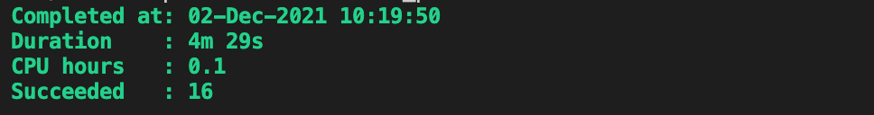
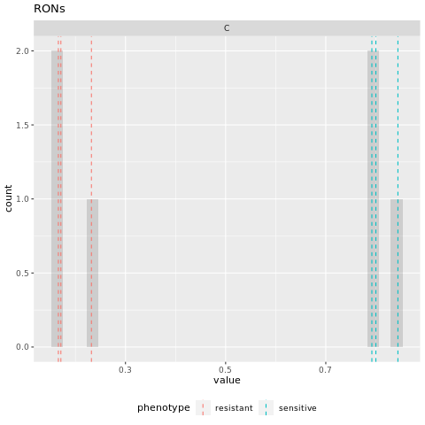
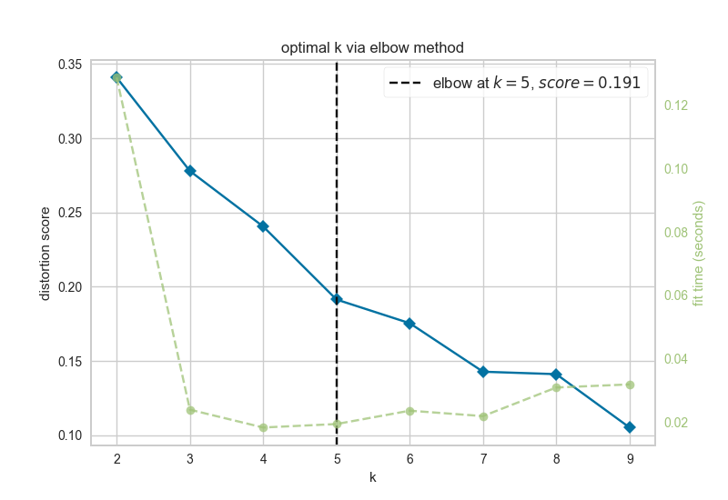
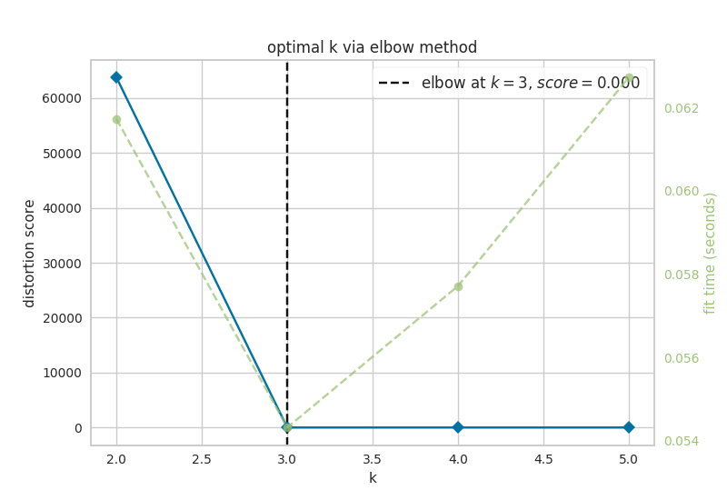
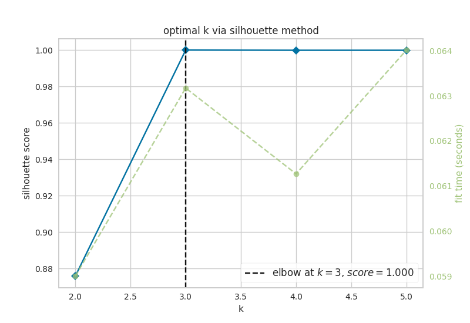
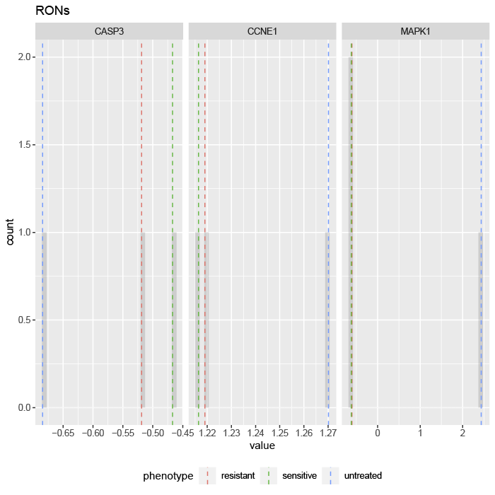
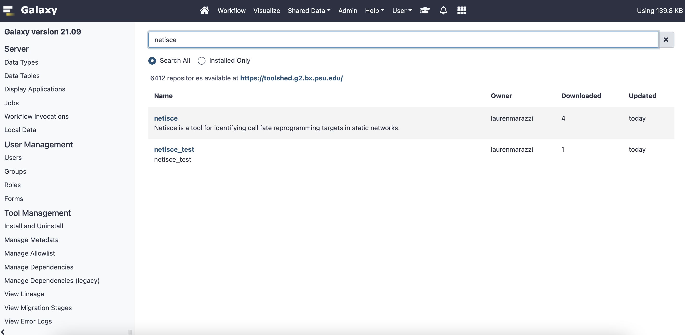
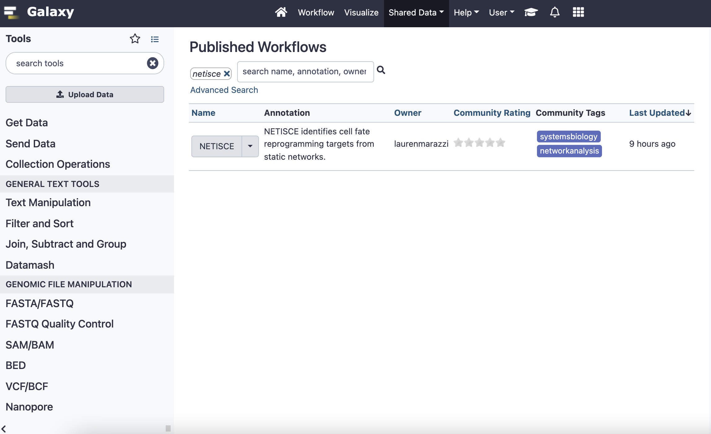
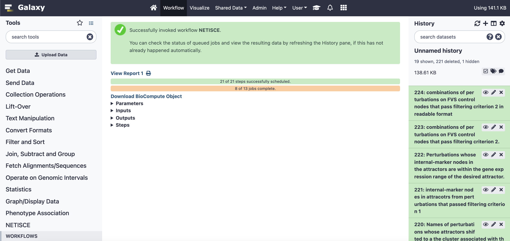

--- 
title: "NETISCE Manual and Tutorials"
  
author: "Lauren Marazzi"
date: "`r Sys.Date()`"
site: bookdown::bookdown_site
documentclass: book
bibliography: [book.bib, packages.bib]
url: https://veraliconaresearchgroup.github.io/Netisce/
cover-image: images/netisce-logo.png
description: |
  Welcome to the NETISCE manual and tutorials. NETISCE is a network-based approach for cellular reprogramming. This manual contains directions for intial setup, as well as tutorials for reproducing NETISCE cell reprogramming results in developmental, stem cell, and cancer biology.
link-citations: yes
github-repo: https://github.com/veraliconaresearchgroup/netisce

---


# About

Welcome to the NETISCE manual and tutorials.

The search for effective therapeutic targets in fields like regenerative medicine and cancer research has generated interest in cell fate reprogramming. This cellular reprogramming paradigm can drive cells to a desired target state from any initial state. However, methods for identifying reprogramming targets remain limited for biological systems that lack large sets of experimental data or a dynamical characterization. We present NETISCE, a novel computational tool for identifying cell fate reprogramming targets in static networks. NETISCE identifies reprogramming targets through the innovative use of control theory within a dynamical systems framework. Through validations in studies of cell fate reprogramming from developmental, stem cell, and cancer biology, we show that NETISCE can predict previously identified cell fate reprogramming targets and identify potentially novel combinations of targets. NETISCE extends cell fate reprogramming studies to larger-scale biological networks without the need for full model parameterization and can be implemented by experimental and computational biologists to identify parts of a biological system that are relevant for the desired reprogramming task.

For more information, please see the accompanying paper: 

Or biorxiv version: <https://www.biorxiv.org/content/10.1101/2021.12.30.474582v1>

This manual contains instructions for installing the NETISCE pipeline tool and accessing the Galaxy Project GUI web-based tool. We provide a simple toy example walkthrough tutorial. Lastly, we include instructions for reproducing NETISCE cell reprogramming results in developmental, stem cell, and cancer biology.


To navigate this site, use the menu on the left-hand side. 


```{r include=FALSE}
# automatically create a bib database for R packages
knitr::write_bib(c(
  .packages(), 'bookdown', 'knitr', 'rmarkdown'
), 'packages.bib')
knitr::opts_chunk$set(class.source = "foldable")
```

```{js, echo = FALSE}
title=document.getElementById('header');
title.innerHTML = '' + title.innerHTML
```

<!--chapter:end:index.Rmd-->

# Installation and Usage


## Download NETISCE

NETISCE pipelines can be downloaded from our github repository:  <https://github.com/veraliconaresearchgroup/netisce>

We recommend that you run NETISCE on a high-performance cluster (hpc), as you may generate files that are quite large, or run computations that may take a long time. However, we provide two Nextflow pipelines, one designed for hpcs [(NETISCE_hpc)](https://github.com/VeraLiconaResearchGroup/Netisce/tree/main/NETISCE_hpc), and another for running NETISCE on a local machine [(NETISCE_local)](https://github.com/VeraLiconaResearchGroup/Netisce/tree/main/NETISCE_local).

## Install Nextflow

Nextflow is required to run the NETISCE pipeline. Please follow the instructions from <https://www.nextflow.io/> (see 'Getting Started' steps 1 & 2) to install Nextflow in the appropriate NETISCE folder (_local or _hpc). Note: if you are on a Windows Machine, you will need to install Windows Subsystem for Linux <https://docs.microsoft.com/en-us/windows/wsl/install>

## Prerequisuites 

Please be sure you have the following Python packages installed:

- [scipy](https://scipy.org/install/) version=1.5.4
- [pandas](https://pandas.pydata.org/getting_started.html) version=1.1.5
- [sklearn](https://scikit-learn.org/stable/install.html) version=0.24.2
- [yellowbrick](https://www.scikit-yb.org/en/latest/quickstart.html) version=1.3.post1

As well as the following R packages:

- dplyr
- ggplot2
- plyr
- reshape2
- readr

which can be installed through [CRAN](https://cran.r-project.org/)

## Docker Image

If you are interested, we additionally provide a Docker container which has all required packages and code loaded to run NETISCE. It can be downloaded [here](https://www.dropbox.com/sh/8ix62io5axlq479/AADf8asm1hfxNZhXHqJoahoGa?dl=0)

After downloading the image, it can be unpacked using ` docker image load -i netisce.tar`. Then, you can run the container with `docker run ubuntu:NETISCE`. (note, depending on your system, you may need to use `sudo` commands)


## Parameters and Configuration {#params}


Whether on your local machine or hpc, to run NETISCE you must specify the files and parameters within the  `.nf` file

- **params.expressions**: csv file containing normalized expression data for network nodes in different samples
- **params.network**: network file (sif format)
- **params.samples**: text file specifying the phenotype for each sample in params.expressions file (tab delimited)
- **params.internal_control**: text file containing a list of nodes to be used as internal marker nodes
- **params.alpha**: alpha parameter for signal flow analysis (default =0.9)
- **params.undesired**: string of the undesired phenotype (as labeled in the params.samples file)
- **params.desired**: string of the desired phenotype (as labeled in the params.samples file)
- **params.filter**: filtering parameter for criterion 2 ("strict" or "relaxed")
- **params.kmeans_min_val**: minimum k-means value for clustering (default=2)
- **params.kmeans_max_val**:  maximum k-means value for clustering (default=10)
- **params.num_nodes**: number of nodes in network for which normalized expression data exists (within the params.expressions file)
- **params.num_states**: number of randomly generated initial states (default=100000, or 3^n where n is the number of network nodes and 3^n is less than 100000)
- **params.randseed**: random seed to generate one FVS of a network

Please see the [`input_data`](https://github.com/VeraLiconaResearchGroup/Netisce/tree/main/NETISCE_local/input_data) folder for examples of files to match the formatting. 

### NETISCE_mutations.nf

If you are interested in including mutational information, please use the [`NETISCE_mutations.nf`](https://github.com/VeraLiconaResearchGroup/Netisce/blob/main/NETISCE_local/NETISCE_mutations.nf) pipeline. You must additionally specify `params.mutations`: a csv file containing mutational configuration for network nodes (0 for loss of function, 1 for gain of function). Please see example in [`input_data`](https://github.com/VeraLiconaResearchGroup/Netisce/tree/main/NETISCE_local/input_data)  for formatting.

### nextflow.config

If you are running nextflow on an hpc, please specify your executor, and clusterOptions within the nextflow.config file. Please see <https://www.nextflow.io/docs/latest/config.html> for more information regarding your executor.

## Running NETISCE

Once you have specified the parameters, run NETISCE using the following command: 
``` 
./nextflow run NETISCE.nf -resume ##or NETISCE_mutations.nf if including mutational data

```

We recommend using the -resume flag in the case that you change a file or parameter within your pipeline. This way, nextflow caches results that remain unchanged, preventing pipeline steps from being re-run. 

<!--chapter:end:01-intro.Rmd-->

# NETISCE output 

After the NETISCE computations are complete, the output files will be located in the `results` folder. Please note that we have included in this folder the most relevant output files that you may want to use for further analysis. However, you can explore all outputs by checking within each step of the pipeline's `work` folder that is generated during a NETISCE run. 

The contents of each file are briefly described below. For more details and to see example outputs, please see the [Toy Network Examples](#toy).

#### exp_internalmarkers.txt {-#section-id}
This file contains the resultant steady state values for the internal marker nodes for the provided experimental samples (those specified in samples.txt) from Signal Flow Analysis.

#### experimental_internalmarkers.png {-#section-id}
This png is a figure of the steady state values for the internal marker nodes for the provided experimental samples. This can be used to verify the validity of the internal marker nodes.

#### elbow.png  {-#section-id}
A graph of the elbow metric for determining the optimal k for k-means.

#### silhouette.png {-#section-id}
A graph of the silhouette metric for determining the optimal k for k-means.

#### fvs.txt  {-#section-id}
This file contains the node names for the FVS used as control nodes for the NETISCE run.

#### crit1perts.txt  {-#section-id}
This file contains a list of IDs for the control node perturbations that passed criterion 1.

#### pert_replicate_i_internal_markers.txt  {-#section-id}
This file contains a table of the internal marker node steady state values from control node perturbations whose initialized from replicate i (1,2,3..,n) associated attractors passed the first filtering criterion.

#### successful_controlnode_perturbations.txt  {-#section-id}
This file contains a table of the control node perturbations that pass both the 1st and 2nd filtering criteria. it also contains the number of upregulation,downregulations, and total number of nodes perturbed for each perturbation set. 

<!--chapter:end:02-output.Rmd-->

# Toy Network Examples {#toy}

Here, we will walk through a brief tutorial of a NETISCE run. The files necessary to complete the tutorial are within the `input data` folder of both [`NETISCE_local`](https://github.com/VeraLiconaResearchGroup/Netisce/tree/main/NETISCE_local) and [`NETISCE_hpc`](https://github.com/VeraLiconaResearchGroup/Netisce/tree/main/NETISCE_hpc).
The results from these Toy examples can be found in the [toy_example_results](https://github.com/VeraLiconaResearchGroup/Netisce/tree/main/toy_example_results) folder of the main github repository.

## Overview

We will use a simple toy network of 6 nodes and 9 edges.
```{r, out.width='50%', fig.align='center',echo = FALSE, fig.cap = 'Simple Toy Network'}
knitr::include_graphics("images/toy_network.png")
```
## Data
You can find the relevant data files in the `input_data` folder.

In this example, we have 2 samples, A and B, with three replicates each (A_1,A_2,A_3, etc).
The normalized expression data is housed in `expressions.csv`, and contains normalized expression values for  the network nodes. Note that the value of F has been initialized to zero. A feature of NETISCE is that it does not require non-zero values for all network nodes, which is useful if the data is unavailable for a node. Such values can either be entered in the `expressions.csv` file as 0s, or the node can be excluded entirely from this file, depending on user preference (in this case, the values will automatically be initialized to 0).
```{r echo=FALSE, message=FALSE, warning=FALSE}
exp<-read.csv('input_data/expressions.csv')
knitr::kable(exp)
```

The `samples.txt` file specifies that A is associated to a treatment sensitive phenotype, while B is associated to a resistance phenotype. 
```{r echo=FALSE, message=FALSE, warning=FALSE}
samples<-read.delim('input_data/samples.txt')
knitr::kable(samples)
```

Note that you can use any term to describe the phenotypes. Just be sure to be consistent with the `param.desried` and `param.undesired` variables within the Nextflow `.nf` file. 

Lastly, we need to include a list of internal marker nodes. This list is in `internal_marker.txt`. For our small network, the internal-marker node is `C`. 
```{r echo=FALSE, message=FALSE, warning=FALSE}
marker<-read.delim('input_data/internal_marker.txt')
knitr::kable(marker)
```

## NETISCE run configuration

With all your input data files loaded, next we configure the nextflow run in either `NETISCE_local` or `NETSICE_hpc` (**Note: while we do recommend you run NETISCE on a hpc, this example is small enough to run locally**). 

Open up `NETISCE.nf`. Here, you need to specify the parameters for the Nextflow run on lines 3-19. Please refer to [section 2.5](#params) for parameter definitions. 

For this example, your parameters should look like:
```
params.expressions = "$baseDir/input_data/expressions.csv"
params.network = "$baseDir/input_data/network.sif"
params.samples = "$baseDir/input_data/samples.txt"
params.internal_control="$baseDir/input_data/internal_marker.txt"
// params.mutations="$baseDir/input_data/mutations.csv"
params.alpha = 0.9
params.undesired = 'resistant'
params.desired = 'sensitive'
params.filter ="strict"


params.kmeans_min_val = 2
params.kmeans_max_val = 10


params.num_nodes = 6 // that have expression data
params.num_states = 100000

params.randseed=4
```
**Some Notes: ** make sure to include `$baseDir` before pointing to the folder containing your input data. Also, be sure that `params.num_nodes` is the number of nodes where there exists data within `expressions.csv`. Finally, by adjusting the `params.randseed` you can identify alternate FVSes within the nextwork.

## Run NETISCE
In your terminal/command prompt, navigate to the appropriate NETISCE folder (`_hpc` or `local`). To start your run, enter `./nextflow run NETISCE.nf -resume`.
While NETISCE is running, your terminal should look like this, where you can see the progress on each step of the pipeline:
```{r, out.width='50%', fig.align='center',echo = FALSE, fig.cap = 'Terminal when running NETISCE'}
knitr::include_graphics("images/running_shot.png")
```
The first column contains the location (folder and subfolder) that is running that step of NETISCE within the `work` folder.


Once the run has successfully completed, the process will end and the following will be displayed:
```{r, out.width='50%', fig.align='center',echo = FALSE, fig.cap = 'Terminal when running NETISCE'}

```


## NETSICE Results
Let's take a look at the results of our NETISCE run, where the goal was to shift the system from the undesired state B, and towards the desired state A. These results can be found in the toy_example_1 subfolder of the [toy_example_results](https://github.com/VeraLiconaResearchGroup/Netisce/tree/main/toy_example_results) folder of the main github repository.

#### exp_internalmarkers.txt {-#section-id}
Our internal marker node was node C. In this file we see the steady state values of node see in the A sample replicates A_1, A_2 and A_3 and B sample replicates B_1, B_2, and B_3 (as computed by SFA).
```{r echo=FALSE, message=FALSE, warning=FALSE}
expmarker<-read.delim('results/exp_internalmarkers.txt',sep=" ")
knitr::kable(expmarker)
```


#### experimental_internalmarkers.pdf {-#section-id}
The above numbers may be a little challenging to read! So, we have included a plot of the values in the`experimental_internalmarkers.pdf`:
```{r, out.width='50%', fig.align='center',echo = FALSE, fig.cap = 'experimental marker node steady state values'}

```
On this histogram, we see bars for each of the samples and their replicates. The A (sensitive) samples are marked by a blue vertical line at their steady state value, while the B (resistant) samples are marked by a red vertical line at their steady state value. The grey bars can be aggregated to show the number of attractors with values for C that are binned together (for example, in the above table we see that the steady state value of C in replicate B_2=0.171 and replicate B_3=0.166. These values are binned together on the histogram to show that two replicates had similar values.)

Here, we see that the values of node C are well separated between the two phenotypes (all of the A values are greater than all of the B values). We will assume that this also aligns with the biological knowledge of the system.

In this example, since there are only 4 network nodes that have normalized expression values, NETISCE generates the maximum number of random initial states, \(3^4\), or 81.


After estimating attractors for the experimental and randomly generated initial states, the resultant attractors were clustered using k-means clustering. The elbow and silhouette metrics are used to determine the optimal number k.

#### elbow.png  {-#section-id}
```{r, out.width='50%', fig.align='center',echo = FALSE, fig.cap = 'elbow metric for optimal k'}

```
The elbow metric found the optimal number of k clusters to be k=3.

#### silhouette.png {-#section-id}
```{r,out.width='50%', fig.align='center',echo = FALSE, fig.cap = 'silhouette metric for optimal k'}
knitr::include_graphics("results/silhouette.png")
```
The silhouette metric found the optimal number of k clusters to be k=2.

Since the optimal ks identified by the silhouette metric and the elbow metric do not match, NETISCE chooses the smaller k, as long as the phenotypes remain separate (NETISCE checks to make sure this is true). 

#### kmeans.txt {-#section-id}
The `kmeans.txt` file contains the clustering results for each attractor generated from the experimental data and the randomly generated initial states. The first column contains the sample name, and the second column contains the ID of which cluster it is assigned to. Since k=2 in this case, one cluster is named 
"0" and the other cluster is named "1"
```{r,out.width='50%', fig.align='center',echo = FALSE, fig.cap = 'silhouette metric for optimal k'}
kmeans<-read.delim('results/kmeans.txt',header = T,sep=" ")
knitr::kable(kmeans[1:6,])
```

And we see in the `kmeans.txt` file, that the A samples are clustered in cluster 0, while the B samples are grouped in cluster 1. 


#### fvs.txt  {-#section-id}
This file contains the node names that were identified by the FVS finding algorithm when the random seed was set to 4 (i.e. FVS4).
```{r echo=FALSE, message=FALSE, warning=FALSE}
fvs<-read.delim('results/fvs.txt')
knitr::kable(fvs)
```
The FVS finding algorithm identified nodes B and E to be a minimal FVS control nodes in the toy network. Since the FVS control node set contained 2 nodes, 9 combinations of perturbations were performed on the control node sets.


**Note: ** this network contains 4 unique minimal Feedback Verex Sets (FVS_1: {D, B}, FVS_2:{D,C}	, FVS_3:{E,C}	, FVS_4: {E,B}).By adjusting the `params.randseed` parameter in the `NETISCE.nf` file, the other FVSes can be identified and perturbations can be computed with them.

#### crit1perts.txt  {-#section-id}
This file contains a list of IDs for the perturbations to FVS control nodes that passed criterion 1.
```{r echo=FALSE, message=FALSE, warning=FALSE}
crit1<-read.delim('results/crit1perts.txt',header = F)
knitr::kable(crit1)
```
3 out of the 9 pertrubations passed the machine learning filtering criterion.


#### pert_replicate_1_internal_markers.txt  {-#section-id}
NETISCE calculated perturbations on FVS control nodes when the system was initialized from the three undesired B replicates (B_1,B_2,B_3). The steady state values of the internal marker node C was extracted from each of these replicate perturbations that passed filtering criterion 1 (i.e., the steady state value of C in pert_3,pert_6, and pert_8). Here we will show the steady state values of C under FVS perturbations when the system was initialized with the normalized expression values of B_1 (contained in the file `pert_replicate_1_internal_markers.txt`; the values of C for the system under perturbations when initialized from B_2 are found in `pert_replicate_2_internal_markers.txt`, the values of C for the system under perturbations when initialized from B_3 are found in `pert_replicate_3_internal_markers.txt` )

```{r echo=FALSE, message=FALSE, warning=FALSE}
marker<-read.delim('results/pert_replicate_1_internal_markers.txt',sep=" ")
knitr::kable(marker)
```

#### successful_controlnode_perturbations.txt  {-#section-id}
This file contains a table of the perturbations on FVS control nodes that passed both the 1st and 2nd filtering criteria. it also contains the number of upregulation,downregulations, and total number of nodes perturbed for each perturbation set. 
```{r echo=FALSE, message=FALSE, warning=FALSE}
success<-read.delim('results/successful_controlnode_perturbations.txt',sep=" ")
knitr::kable(success)
```
Here, we see that four perturbations that passed both filtering criteria.

Let's take a quick look at the steady state values for these perturbations, and the attractors generated from the experimental data:
```{r echo=FALSE, message=FALSE, warning=FALSE}
marker<-marker[marker$name %in% rownames(success),]
allmarkers<-rbind(expmarker,marker)
knitr::kable(allmarkers)
```

Indeed, we see that the steady-state expression values of node C in the attractors generated by peturbations to the FVS control nodes are all are greater than the steady-state expression values of node C in the attractors generated from the sensitive A sample. A successful reprogramming from resistant (B) to sensitive (A) cells has occurred!

## Toy Example with mutations
Let's say that in our system, gene D exhibits a gain of function mutation in the sensitive phenotype (A samples). If we want to include this in our simulations, we will use the `NETISCE_mutations.nf` pipeline.

First, we must add to our `input_data` folder a `.csv` file containing the mutational profile. Let's call this file `mutations.csv`:
```{r echo=FALSE, message=FALSE, warning=FALSE}
knitr::kable(read.csv('input_data/mutations.csv'))

```

The gain of function mutation is encoded with 1 (loss-of-function mutations can be encoded with "0").

Next, we make sure that the parameters in `NETISCE_mutations.nf` on lines 3-19 are set correctly for the conditions

For this example, your parameters should look like:
```
params.expressions = "$baseDir/input_data/expressions.csv"
params.network = "$baseDir/input_data/network.sif"
params.samples = "$baseDir/input_data/samples.txt"
params.internal_control="$baseDir/input_data/internal_marker.txt"
params.mutations="$baseDir/input_data/mutations.csv"
params.alpha = 0.9
params.undesired = 'resistant'
params.desired = 'sensitive'
params.filter ="strict"


params.kmeans_min_val = 2
params.kmeans_max_val = 10


params.num_nodes = 4 // that have expression data
params.num_states = 1000
```
Note, the additional parameter `params.mutations` that points to the `mutations.csv.`

As above, to run Netisce, enter `./nextflow run NETISCE.nf -resume`.

#### Results {-#section-id}
By including mutational information, the results of NETISCE have changed.These results can be found in the toy_example_2 subfolder of the [toy_example_results](https://github.com/VeraLiconaResearchGroup/Netisce/tree/main/toy_example_results) folder of the main github repository.
Now, our `successful_controlnode_perturbations.txt` file contains pert_7 in addition to perturbations pert_3, pert_6, and pert_8

```{r echo=FALSE, message=FALSE, warning=FALSE}
knitr::kable(read.delim('results/successful_controlnode_perturbations_mutations.txt',sep=" "))

```

Let's take a look at the steady-state expression values of node C in the attractors generated from the successful perturbations and the experimental initial states when mutational information is included.
```{r echo=FALSE, message=FALSE, warning=FALSE}
knitr::kable(read.delim('results/markers_mutations.txt',sep=" "))

```

Though the values are different in this system with mutations, we still see that the steady-state expression values of node C in the attractors generated by peturbations to the FVS control nodes are all are greater than the steady-state expression values of node C in the attractors generated from the sensitive A sample. A successful reprogramming from resistant (B) to sensitive (A) cells has occurred!

<!--chapter:end:03-example.Rmd-->

# Cell Fate Specification in Ascidian Embryo


This section contains instructions to reproduce the results of simulating FVS control node perturbations in a model of ascidian embryo cell specification. You can read the original report here: link


The original studies of Cell Fate Specification in the Ascidian Embryo were performed by Kobayashi et al. in "[Using linkage logic theory to control dynamics of a gene regulatory network of a chordate embryo (Sci Rep 11, 4001 (2021))](https://www.nature.com/articles/s41598-021-83045-y)". The network, internal-marker nodes, and FVS was derived from the publication and its supplementary material. 


The input data, nextflow pipeline, and results of this simulation can be found in the [ascidian embryo folder](https://github.com/VeraLiconaResearchGroup/Netisce/tree/main/ascidian_embryo_validation) in the github repository

These simulations were run on a high performance cluster that uses a SLURM executor. Although we recommend that you run NETISCE on an hpc, this simulation is small enough that it can be run on a local machine. If you choose to run it locally, then remove the `nextflow.config` file from the directory.

## Input Data
The goal of this simulation was to reproduce the results of experimental perturbations to the FVS nodes of the cell fate specification GRN for ascidian embryos using Signal Flow Analysis. Therefore, we use a modified version of the NETISCE pipeline to simulate these specific perturbations.
We are only interested in performing the 7 perturbations to the 6 FVS control nodes that were experimentally verified to induce cell tissue fates.

`network.sif`contains the gene regulatory network of ascidian embryonic development. 

`expression.csv` contains the initial activities for the unperturbed state and the 7 FVS control node perturbations. Here, all simulations have Gata.a and Zic-r.a=1, as the activation of these two genes is required for normal embryonic development. 

`perturbations.csv` contains the specified perturbations for each FVS node in the appropriate perturbation simulation. 0 denotes downregulation, wherease 1 encodes upregulation. If no value is set, then there is no fixed perturbation to the FVS node, as in the unperturbed case.

`internal-marker-nodes.txt` contains the 7 internal marker nodes used to verify if the specified cell reprogramming had been successfully simulated.

## Run the simulation
To run the simulation, simply execute the `ascidian-embryo.nf` file using the following command: `./nextflow run ascidian-embryo.nf -resume`

## Results
The nextflow pipeline generates 1 result file `exp_internalmarkers.txt`, which contains the steady state values of the internal-marker nodes for the unperturbed attractor, and the attractors generated from the perturbations on FVS control nodes.
```{r,echo=FALSE, message=FALSE, warning=FALSE}
library(dplyr)
library(kableExtra)
library(fmsb)

results<-read.delim('ascidian_embryo/results/exp_internalmarkers.txt',sep="\t")
knitr::kable(results) %>%kable_styling(font_size = 8) %>% scroll_box(width = "100%", box_css = "border: 0px;")
```

A perturbation is considered successful if the internal-marker node in the attractor generated from the perturbed FVS control nodes has a larger steady-state value than that in the unperturbed attractor. We determine this by subtracting the steady-state values of the unperturbed simulation from the steady-state values of the perturbations of FVS control nodes.

```{r,echo=FALSE, message=FALSE, warning=FALSE}

DACs<-sweep(as.matrix(results[2:8,2:8]),2,as.matrix(results[1,2:8]))
row.names(DACs)<-results$name[2:8]
DACs<-as.data.frame(DACs) %>%round(3)
where <- rbind(c(1,1), c(2,2), c(3,3))
DACs[1,1]<-cell_spec(DACs[1,1], background = "yellow", format = "html")
DACs[2,2]<-cell_spec(DACs[2,2], background = "yellow", format = "html")
DACs[2,3]<-cell_spec(DACs[2,3], background = "yellow", format = "html")
DACs[4,5]<-cell_spec(DACs[4,5], background = "yellow", format = "html")
DACs[5,4]<-cell_spec(DACs[5,4], background = "yellow", format = "html")
DACs[6,6]<-cell_spec(DACs[6,6], background = "yellow", format = "html")
DACs[7,7]<-cell_spec(DACs[7,7], background = "yellow", format = "html")
knitr::kable(DACs,escape=F) %>% kable_styling(font_size = 9) %>% scroll_box(width = "100%", box_css = "border: 0px;")  
```
Here we see that for 6 out of the 7 perturbations to FVS controlnodes, we were able to upregulate the desired tissue marker when compared to the unperturbed state.

## Visualizing Results
We can use radar plots to visualize the results of the SFA simulations of perturbations to the FVS control nodes. This can help us identify which perturbations successfully induced the appropriate tissue fate. 

The following code for generating radar plots was adapted from [datanovia.com](https://www.google.com/search?q=create+_beautiful_+radar+chart&oq=create+beautiful+rada&aqs=chrome.1.69i57j0i10i22i30.11973j0j1&sourceid=chrome&ie=UTF-8).

**Note: ** you may need to adjust the formatting of `exp_internalmarkers.txt` so that the strings within quotations are placed into one column.
```{r radar charts, echo=TRUE}
create_beautiful_radarchart <- function(data, color = "#00AFBB", 
                                        vlabels = colnames(data), vlcex = 1,
                                        caxislabels = NULL, title =row.names(data)[4], ...){
  radarchart(
    data, axistype = 1,
    # Customize the polygon
    pcol = color, pfcol = NULL, plwd = 2, plty = 1,
    # Customize the grid
    cglcol = "grey", cglty = 1, cglwd = 0.8,
    # Customize the axis
    axislabcol = "grey", 
    # Variable labels
    vlcex = vlcex, vlabels = vlabels,
    title = title,
    centerzero = F,
    caxislabels = caxislabels
    
  )
}
```

```{r radar charts2, include=FALSE}
create_beautiful_radarchart2 <- function(data, color = "#00AFBB",
                                        vlabels = colnames(data), vlcex = 1,
                                        caxislabels = NULL, title =NULL, ...){
  radarchart(
    data, axistype = 1,
    # Customize the polygon
    pcol = color, pfcol = NULL, plwd = 2, plty = 1,
    # Customize the grid
    cglcol = "grey", cglty = 1, cglwd = 0.8,
    # Customize the axis
    axislabcol = "grey",
    # Variable labels
    vlcex = vlcex, vlabels = vlabels,
    title = title,
    centerzero = F,
    caxislabels = caxislabels

  )
}
```

We can take the relevant internal-marker for each perturbation to create one "meta" radar chart that summarizes the difference in steady-state expression values between the unperturbed state and the perturbed state

```{r meta-chart, echo=FALSE}
test<-read.delim('ascidian_embryo/results/meta.txt',row.names = 1)
knitr::kable(test) %>%kable_styling(font_size = 8) %>% scroll_box(width = "100%", box_css = "border: 0px;")
```


```{r charts, out.width='50%',echo = TRUE,fig.show='hold'}


maxcol<-apply(test, 2, max)
mincol<-apply(test, 2, min)
d2<-rbind(maxcol,mincol, test)
rownames(d2)[1:2]<- c("Max", "Min")
par(mar = c(1, 0.1, 4, 1))
for (i in 4:nrow(d2)) {
  create_beautiful_radarchart2(d2[c(1:3, i), ],color = c("#00AFBB", "#E7B800"),caxislabels = seq(round(min(d2[c(1:3, i),]),1),round(max(d2[c(1:3, i),]),1),.1), vlabels=c("Alp\n(endoderm)","Bco \n(brain)","Celf3.a \n(pan-neural)","Celf3.a\n (pan-neural)","Epi1 \n(epidermis)","Fli.Erg.a \n(mesenchyme)","Myl \n(muscle)",	"Noto1\n (notochord)"));legend(x=0.4, y=1.3, legend =c("unperturbed","perturbed FVS") , bty = "n", pch=20 , col=c("#00AFBB", "#E7B800","#FC4E07") , text.col = "black", cex=.8, pt.cex=2)
}


```

<!--chapter:end:04-embryo.Rmd-->

# Pluripotent Stem Cell Example

This section contains instructions to reproduce the results of simulating perturbations on FVS control nodes in a pluripotent stem cell signaling. The goal of these simulations is to identify targets that can reprogram cells from the Epiblast stem cell (EpiSC) fate towards the Embryonic Stem Cell (ESC) fate. You can read the original report here: link

The original study of reversion of primed pluripotency in mouse epiblast stem cells was performed by Yachie-Kinoshita et al. in "[Modeling signaling-dependent pluripotency with Boolean logic to predict cell fate transitions (Molecular Systems Biology (2018)14:e7952)](https://www.embopress.org/doi/full/10.15252/msb.20177952)". The network and internal-marker nodes were extracted from the publication and its supplementary material. The normalized expression data used for initial activities in NETISCE can be found at [GSE62155](https://www.ncbi.nlm.nih.gov/geo/query/acc.cgi?acc=GSE62155).

The input data, nextflow pipeline, and results of this simulation can be found in the [ipsc folder](https://github.com/VeraLiconaResearchGroup/Netisce/tree/main/ipsc_validation) in the NETISCE github repository


## Input Data
[`network.sif`](https://github.com/VeraLiconaResearchGroup/Netisce/blob/main/ipsc_validation/input_data/network.sif) contains the network structure for pluripotent stem cell signaling

[`expression.csv`](https://github.com/VeraLiconaResearchGroup/Netisce/blob/main/ipsc_validation/input_data/expression.csv) contains the initial activities for ESC cells (3 replicates), and EpiSC cells (3 replicates)

[`internal-marker-kinoshita.txt`](https://github.com/VeraLiconaResearchGroup/Netisce/blob/main/ipsc_validation/input_data/internal-marker-kinoshita.txt) contains the 4 internal marker nodes that were originally used in Yachie-Kinoshita et al., to evaluate simulations.

[`internal-marker-kinoshita-expanded.txt`](https://github.com/VeraLiconaResearchGroup/Netisce/blob/main/ipsc_validation/input_data/internal-marker-kinoshita-expanded.txt) contains the 4 internal marker nodes that were originally used in Yachie-Kinoshita et al., plus the additional marker ndoes identified from the data used to evaluate simulations.

[`samples.txt`](https://github.com/VeraLiconaResearchGroup/Netisce/blob/main/ipsc_validation/input_data/samples.txt) contains they key for NETISCE to associate certain samples to the phenotypes of Embryonic Stem Cells (ESCs) or Epiblast Stem Cells (EpiSCs)

## Run the simulation

These simulations were run on a high performance cluster that uses a SLURM executor. If your hpc uses a different executor, please update those specifications in the `nextflow.config` file in the directory. Please see <https://www.nextflow.io/docs/latest/config.html> for more information regarding your executor.


For ease of reproduction, we have included all files necessary to reproduce the reported results directly in the [directory](https://github.com/VeraLiconaResearchGroup/Netisce/tree/main/ipsc_validation). We do recommend you run this simulation on an hpc. We have included the [bash file](https://github.com/VeraLiconaResearchGroup/Netisce/blob/main/ipsc_validation/run.sh) we used on our SLURM executor.

**Note: ** within the [`NETISCE.nf`](https://github.com/VeraLiconaResearchGroup/Netisce/blob/main/ipsc_validation/NETISCE.nf) configuration file, we have included two lines for specifying the internal-marker nodes:

```
#!/usr/bin/env nextflow

params.expressions = "$baseDir/input_data/expression.csv"
params.network = "$baseDir/input_data/network.sif"
params.samples = "$baseDir/input_data/samples.txt"
params.internal_control="$baseDir/input_data/internal-marker-kinoshita.txt"
// params.internal_control="$baseDir/input_data/internal-marker-kinoshita-expanded.txt"
params.alpha = 0.9
params.undesired = 'EpiSC'
params.desired = 'ESC'
params.filter ="strict"
```

As discussed in our paper, we filtered the perturbations using the original 4 internal-marker nodes for pluripotency (Oct4, Sox2, Nanog, EpiTFs), and then again using 3 additional internal-marker nodes. Therefore, to run either analysis, comment/uncomment the internal-marker node file you are interested in. If you want to run NETISCE first with the original internal-marker nodes, make sure to change the results file names for `exp_internalmarkers.txt`,`successful_controlnode_perturubations.txt`, and `original-experimental_internalmarkers.pdf` as to not overwrite them (or move them into a separate folder). Additionally, when you run the nextflow command, **please be sure to use the `-resume` flag so that you use the cached computations that do not need to be re-computed**

You can also run NETISCE directly using the following command: `./nextflow run NETISCE.nf -resume`


## Results
Herein, we will focus on the results that are deposited in the [`results`](https://github.com/VeraLiconaResearchGroup/Netisce/tree/main/ipsc_validation/results) folder by NETISCE. However, each step of the nextflow pipeline produces its corresponding raw results (for example, the entire attractor state for network simulations initialized with experimental data). If you are interested in looking at those raw results, they can be found within the [`work`](https://github.com/VeraLiconaResearchGroup/Netisce/tree/main/ipsc_validation/work) folder. We provide [`workfiles.txt`](https://github.com/VeraLiconaResearchGroup/Netisce/blob/main/ipsc_validation/workfiles.txt) which is a guide to which folders/subfolders contain the relevant results of each step. 


### General Results 
First, let's take a look at the results that do not depend on the internal-marker node set. 

#### FVS finding {-#section-id}

The FVS solving algorithm identified one FVS, containing 6 nodes.
```{r echo=FALSE, message=FALSE, warning=FALSE}
fvs<-read.delim('ipsc/results/fvs.txt',sep=" ")
knitr::kable(fvs)
```


#### Attractor landscape estimation via k-means analysis {-#section-id}
Now, let's look at the results of k-means analysis. First, NETISCE determines the optimal number of k clusters by computing the elbow and silhouette metrics. 

```{r, out.width='50%', fig.show="hold",echo = FALSE, fig.cap = 'optimal k as identified by a) the elbow and b) silhouette metrics'}
knitr::include_graphics("ipsc/results/elbow.png")
knitr::include_graphics("ipsc/results/silhouette.png")
```

We see that the optimal k assessed by the elbow metric was k=4, while the optimal k identified by the silhouette metric was k=2. NETISCE automatically chooses the smaller k value, after checking that the attractors generated from the ESC samples and EpiSC samples do not appear in the same cluster.

k=2 was selected for k-means optimal k, and we can see that the attractors generated from the ESC samples and EpiSC samples do not appear in separate clusters.

```{r echo=FALSE, message=FALSE, warning=FALSE}
kmeans<-read.delim('ipsc/results/kmeans.txt',sep=" ",nrows=6)
knitr::kable(kmeans)
```

#### Pertrubations on FVS control nodes that pass criterion 1 {-#section-id}

With 6 FVS control nodes, NETISCE performed 729 simulations of combinations of perturbations on the FVS control nodes. The resulting attractors were classified to the clusters produced from the k-means analysis using Naive Bayes, Support Vector Machine, and Random Forest Machine Learning classification algorithms. Then, the perturbations are filtered by which of their corresponding attractors were classified to the ESC cluster by at least 2 of the 3 methods. These results can be found in [`crit1_perts.txt`](https://github.com/VeraLiconaResearchGroup/Netisce/blob/main/ipsc_validation/results/crit1perts.txt). Here we show the first 10 rows.

```{r echo=FALSE, message=FALSE, warning=FALSE, paged.print=TRUE}
crit1<-read.delim('ipsc/results/crit1perts.txt',sep=" ",header=F)
print(paste0('number of perturbations that pass filtering criteria 1: ',nrow(crit1)))
knitr::kable(crit1[1:10,])
```


### Results using 4 internal-marker nodes
**The relevant files have the prefix 'original' in the github repository**

Our second perturbation filtering criterion identifies perturbations where, in their corresponding attractors, 90% of the steady state values for internal-marker nodes that are within the steady state expression ranges in the attractors generated from the ESC experimental data. 

First, let's take a  look at the steady state values of the internal-marker nodes Oct4, Sox2, and Nanog in the attractors generated from the ESC and EpiSC experimental data. The values can be found in the [`original-exp_internalmarkers.txt`](https://github.com/VeraLiconaResearchGroup/Netisce/blob/main/ipsc_validation/results/original-exp_internalmarkers.txt) and are plotted in [`original-experimental_internalmarkers.pdf`](https://github.com/VeraLiconaResearchGroup/Netisce/blob/main/ipsc_validation/results/original-experimental_internalmarkers.pdf):


```{r, echo = FALSE, message=FALSE, include=TRUE,out.width = '460pt',out.height= '700pt',fig.align='center',fig.cap = "histograms of 4 internal-marker node values",fig.pos='H'}

knitr::include_graphics("ipsc/results/original-experimental_internalmarkers.pdf")

```

We see that the values of the internal-markers for the pluripotent state (Oct4, Sox2, Nanog) are higher in the attractors generated from the experimental data of the ESCs than the  attractors generated from the experimental data of the EpiSCs, and the makrer of the epiblast stem state is higher in the  attractors generated from the experimental data of the EpiSCs than in the attractors generated from the experimental data of the ESC.

Now, we can take a look at the attractors that passed filtering criterion 2. We show the first 10 rows here, but you can view the entire set in [`original-successful_controlnode_perturbations.txt`](https://github.com/VeraLiconaResearchGroup/Netisce/blob/main/ipsc_validation/results/original-successful_controlnode_perturbations.txt)

```{r echo=TRUE, message=FALSE, warning=FALSE}
crit2_4<-read.delim('ipsc/results/original-successful_controlnode_perturbations.txt',sep=" ",as.is = T)
print(paste0('number of perturbations that pass filtering criteria 2: ',nrow(crit2_4)))
knitr::kable(crit2_4[1:10,])  %>% column_spec(8, bold = F, border_left = T) %>% scroll_box(width = "100%", box_css = "border: 0px;") 
```

We can look to see if there are any trends in the orientation of the perturbations on FVS control nodes across the perturbations that passed both filtering criteria.

```{r echo=TRUE, message=FALSE, warning=FALSE, fig.align='center'}
library(data.table)
library(ggplot2)
d3<-crit2_4 [,c(1:6)] %>% transpose() %>% as.matrix()
row.names(d3)<-colnames(crit2_4[1:6])
colnames(d3)<-row.names(crit2_4)
d3r<-reshape2::melt(d3) %>% select(-Var2)

#From Paul Tol: https://personal.sron.nl/~pault/
Tol_muted <- c('#88CCEE', '#44AA99', '#117733', '#332288', '#DDCC77', '#999933','#CC6677', '#882255', '#AA4499', '#DDDDDD')

ggplot(d3r, aes(x=value)) +
  facet_wrap(~Var1,scales = "free_x",shrink=FALSE) +
  geom_bar(aes(y = (..count..)/ncol(d3),fill=value))  + scale_y_continuous(labels=scales::percent) + scale_fill_manual(values=Tol_muted)+ ylab("% of specified perturbation to an FVS control node across all \n combinations of perturbations that passed filtering criteria ") + xlab("node perturbation")
```
Here, we see that in the majority of perturbations, there is overexpression of the FVS nodes Sox2, Nanog and Oct4. This aligns with their role as maintainers of pluripotency. 

The steady-state values of the internal-marker nodes for these perturbations can be found in [`pert1_internal_markers.txt`](https://github.com/VeraLiconaResearchGroup/Netisce/blob/main/ipsc_validation/results/pert1_internal_markers.txt).


A perturbation on the FVS control node, Nanog overexpression (pert_445),  was also identified in Yachie-Kinoshita et al. and experimentally verified to shift cells from the EpiSC state towards the ESC state. We can plot the internal-marker node values using a radar plot.

We can also plot Klf4 overexpression. This was a perturbation identified by Yachie-Kinoshita et al. to shift cells from the EpiSC state towards the ESC state. However, in our analyses, this perturbation (pert_365), did pass filtering criterion 1, but did not pass filtering criterion 2.


```{r ipsc-charts, out.width='50%',echo = TRUE,fig.show='hold',fig.cap = "radar charts of the steady-state values of 4 internal-marker nodes for Nanog overexpression and Klf4 overexpression perturbation"}
library(fmsb)
attr_pert<-read.delim("ipsc/results/pert1_internal_markers.txt",sep=" ",row.names = 1)
attr_pert <-attr_pert[c('pert_445','pert_365'),c('Oct4',"Sox2","Nanog","EpiTFs")]
exp<-read.delim("ipsc/results/original-exp_internalmarkers.txt",sep=" ",row.names = 1)
EpiSC_avg<-colMeans(exp[4:6,])
ESC_avg<-colMeans(exp[1:3,])

d1<-rbind(EpiSC_avg,ESC_avg,attr_pert)
rownames(d1)[1:4]<- c("EpiSC", "ESC","Nanog overexpression","Klf4 overexpression")
maxcol<-apply(d1, 2, max)
mincol<-apply(d1, 2, min)

d2<-rbind(maxcol,mincol, d1)
rownames(d2)[1:2]<- c("Max", "Min")

par(mar = c(4, 0.1, 4, 0.1))


for (i in 5:nrow(d2)) {
  create_beautiful_radarchart(d2[c(1:4, i), ],color = c("#00AFBB", "#E7B800","#FC4E07"),caxislabels = seq(round(min(d2[c(1:4, i),]),1),round(max(d2[c(1:4, i),]),1),.2),title =row.names(d2)[i]);legend(x=0.4, y=1.4, legend =c("average EpiSC","average ESC",row.names(d2)[i]) , bty = "n", pch=20 , col=c("#00AFBB", "#E7B800","#FC4E07") , text.col = "black", cex=1, pt.cex=2)
}

```


We see here, indeed that the values for Oct4, Sox2, Nanog, (when considered these three genes as internal-marker nodes) and EpiTFs are within the expected range for Nanog overexpression, but the values of Oct4, Sox2, Nanog in the attractor generated from Klf4 overexpression do not reach the values of the ESC state.

### Results using 7 internal-marker nodes
*The relevant files have the prefix 'expanded' in the github repository.*

We explored filtering the 132 perturbations that passed the second filtering criterion by adding additional internal-marker nodes associated with pluripotency. We added 3 nodes, Lefty1, Pitx2 (transcription factors active in EpiSCs), and Esrrb (transcription factor active in ESCs) to the 4 previously used internal-marker nodes.

Let's look at the steady state values of the internal-marker nodes  in the attractors generated from the ESC and EpiSC experimental data. The values can be found in the [`expanded-exp_internalmarkers.txt`](https://github.com/VeraLiconaResearchGroup/Netisce/blob/main/ipsc_validation/results/expanded-exp_internalmarkers.txt) and are plotted in [`expanded-experimental_internalmarkers.pdf`](https://github.com/VeraLiconaResearchGroup/Netisce/blob/main/ipsc_validation/results/expanded-experimental_internalmarkers.pdf):

```{r, echo = FALSE, message=FALSE, include=TRUE,out.width = '460pt',out.height= '700pt',fig.align='center',fig.cap = "histograms of 7 internal-marker node values",fig.pos='H'}

knitr::include_graphics("ipsc/results/expanded-experimental_internalmarkers.pdf")

```

Again, the internal-marker nodes have the correct expression patterns within the attractors generated from the ESC and EpiSC states.

Now, we can take a look at the attractors that passed filtering criterion 2. These are in file [`expanded-successful_controlnode_perturbations.txt`](https://github.com/VeraLiconaResearchGroup/Netisce/blob/main/ipsc_validation/results/expanded-successful_controlnode_perturbations.txt)

```{r echo=TRUE, message=FALSE, warning=FALSE}
crit2_7<-read.delim('ipsc/results/expanded-successful_controlnode_perturbations.txt',sep=" ")
print(paste0('number of perturbations that pass filtering criteria 2: ',nrow(crit2_7)))
knitr::kable(crit2_7)  %>% column_spec(8, bold = F, border_left = T) %>% scroll_box(width = "100%", box_css = "border: 0px;")
```

We can plot the trends of the orientation of perturbations for each FVS control node across the 15 perturbations. 

```{r echo=TRUE, message=FALSE, warning=FALSE,fig.align='center'}

d4<-crit2_7 [,c(1:6)] %>% transpose() %>% as.matrix()
row.names(d4)<-colnames(crit2_7[1:6])
colnames(d4)<-row.names(crit2_7)
d4r<-reshape2::melt(d4) %>% select(-Var2)


ggplot(d4r, aes(x=value)) +
  facet_wrap(~Var1,scales = "free_x",shrink=FALSE) +
  geom_bar(aes(y = (..count..)/ncol(d4),fill=value))  + scale_y_continuous(labels=scales::percent) + scale_fill_manual(values=Tol_muted) + ylab("% of specified perturbation to an FVS control node across all \n combinations of perturbations that passed filtering criteria ") + xlab("node perturbation")
```
Interestingly, we see among these 15 perturbations, Nanog overexpression, but no change to Oct4 or Sox2, is indicated. We also see that Klf4 is overexpressed in the majority of these 15 perturbations. 

The steady-state values of the internal-marker nodes for these perturbations can be found in [`pert1_internal_markers.txt`](https://github.com/VeraLiconaResearchGroup/Netisce/blob/main/ipsc_validation/results/pert1_internal_markers.txt).

We can also generate radar plots for these 15 perturbations.

```{r ipsc-charts2, out.width='50%',echo = TRUE,fig.show='hold',fig.cap = "radar charts of the steady-state values of 7 internal-marker nodes perturbation"}
library(fmsb)
attr_pert<-read.delim("ipsc/results/pert1_internal_markers.txt",sep=" ",row.names = 1)
attr_pert <-attr_pert[row.names(crit2_7),]
exp<-read.delim("ipsc/results/expanded-exp_internalmarkers.txt",sep=" ",row.names = 1)
EpiSC_avg<-colMeans(exp[4:6,])
ESC_avg<-colMeans(exp[1:3,])

d1<-rbind(EpiSC_avg,ESC_avg,attr_pert)
rownames(d1)[1:2]<- c("EpiSC", "ESC")
maxcol<-apply(d1, 2, max)
mincol<-apply(d1, 2, min)

d2<-rbind(maxcol,mincol, d1)
rownames(d2)[1:2]<- c("Max", "Min")

par(mar = c(4, 0.1, 4, 0.1))

for (i in 5:nrow(d2)) {
  create_beautiful_radarchart(d2[c(1:4, i), ],color = c("#00AFBB", "#E7B800","#FC4E07"),caxislabels = seq(round(min(d2[c(1:4, i),]),1),round(max(d2[c(1:4, i),]),1),.2),title =row.names(d2)[i]);legend(x=0.4, y=1.4, legend =c("average EpiSC","average ESC",row.names(d2)[i]) , bty = "n", pch=20 , col=c("#00AFBB", "#E7B800","#FC4E07") , text.col = "black", cex=1, pt.cex=2)
}

```
These radar plots show that for all 15 perturbations on FVS control nodes, the steady-state values of the internal-marker nodes are within the expression range of the attractors generated from the ESC experimental data.  


<!-- ```{r radar-plots-for-paper, echo=FALSE,  fig.show='hold', out.width='50%'} -->


<!-- attr_pert<-read.delim("ipsc/results/pert1_internal_markers.txt",sep=" ",row.names = 1) -->
<!-- attr_pert <-attr_pert[c('pert_445','pert_365'),c('Oct4',"Sox2","Nanog","EpiTFs")] -->
<!-- exp<-read.delim("ipsc/results/original-exp_internalmarkers.txt",sep=" ",row.names = 1) -->
<!-- EpiSC_avg<-colMeans(exp[4:6,]) -->
<!-- ESC_avg<-colMeans(exp[1:3,]) -->

<!-- d1<-rbind(EpiSC_avg,ESC_avg,attr_pert) -->
<!-- rownames(d1)[1:4]<- c("EpiSC", "ESC","Nanog overexpression","Klf4 overexpression") -->
<!-- maxcol<-apply(d1, 2, max) -->
<!-- mincol<-apply(d1, 2, min) -->

<!-- d2<-rbind(maxcol,mincol, d1) -->
<!-- rownames(d2)[1:2]<- c("Max", "Min") -->

<!-- par(mar = c(4, 0.1, 4, 0.1)) -->


<!-- for (i in 5:nrow(d2)) { -->
<!--   create_beautiful_radarchart(d2[c(1:4, i), ],color = c("#00AFBB", "#E7B800","#FC4E07"),caxislabels = seq(round(min(d2[c(1:4, i),]),1),round(max(d2[c(1:4, i),]),1),.2),title =row.names(d2)[i]);legend(x=0.4, y=1.4, legend =c("average EpiSC","average ESC",row.names(d2)[i]) , bty = "n", pch=20 , col=c("#00AFBB", "#E7B800","#FC4E07") , text.col = "black", cex=1, pt.cex=2) -->
<!-- } -->
<!-- ``` -->


<!-- ```{r radar-plots-for-paper2, echo=FALSE,  fig.show='hold', out.width='33%'} -->


<!-- attr_pert<-read.delim("ipsc/results/pert1_internal_markers.txt",sep=" ",row.names = 1) -->
<!-- attr_pert <-attr_pert[c('pert_445','pert_365','pert_446'),] -->
<!-- exp<-read.delim("ipsc/results/expanded-exp_internalmarkers.txt",sep=" ",row.names = 1) -->
<!-- EpiSC_avg<-colMeans(exp[4:6,]) -->
<!-- ESC_avg<-colMeans(exp[1:3,]) -->

<!-- d1<-rbind(EpiSC_avg,ESC_avg,attr_pert) -->
<!-- rownames(d1)[1:5]<- c("EpiSC", "ESC","Nanog overexpression","Klf4 overexpression","Nanog+Klf4 overexpression") -->
<!-- maxcol<-apply(d1, 2, max) -->
<!-- mincol<-apply(d1, 2, min) -->

<!-- d2<-rbind(maxcol,mincol, d1) -->
<!-- rownames(d2)[1:2]<- c("Max", "Min") -->

<!-- par(mar = c(4, 0.1, 4, 0.1)) -->


<!-- for (i in 5:nrow(d2)) { -->
<!--   create_beautiful_radarchart(d2[c(1:4, i), ],color = c("#00AFBB", "#E7B800","#FC4E07"),caxislabels = seq(round(min(d2[c(1:4, i),]),1),round(max(d2[c(1:4, i),]),1),.2),title =row.names(d2)[i]);legend(x=0.4, y=1.4, legend =c("average EpiSC","average ESC",row.names(d2)[i]) , bty = "n", pch=20 , col=c("#00AFBB", "#E7B800","#FC4E07") , text.col = "black", cex=.8, pt.cex=1.8) -->
<!-- } -->
<!-- ``` -->

<!--chapter:end:05-ipsc.Rmd-->


# Adaptive Resistance in Colorectal Cancer Example

This section contains instructions to reproduce the results of simulating perturbations on FVS control nodes in a network of colorectal cancer (CRC) signaling pathways. The goal of these simulations is to identify targets that can reprogram cells from a MAPK inhibitor therapy resistant phenotype to the MAPK inhibitor therapy sensitive fate. You can read the original report here: link

The original study of reversion of resistance to MAPKi therapy was performed by Park et al. in "[Feedback analysis identifies a combination target for overcoming adaptive resistance to targeted cancer therapy (Oncogene volume 39, pages38033820 (2020))](https://www.nature.com/articles/s41388-020-1255-y)". The network and internal-marker nodes were extracted from the publication and its supplementary material. The normalized expression data  and mutational profiles used for initial activities in NETISCE was downloaded from the Cancer Cell Line Encyclopedia from[ The Cancer Dependency Map](https://depmap.org/portal/cell_line/ACH-000552?tab=mutation).


The input data, nextflow pipeline, and results of this simulation can be found in the [colorectal_cancer_validation folder](https://github.com/VeraLiconaResearchGroup/Netisce/tree/main/colorectal_cancer_validation) in the NETISCE github repository


## Input Data
[`network.sif`](https://github.com/VeraLiconaResearchGroup/Netisce/blob/main/colorectal_cancer_validation/input_data/network.sif) contains the network structure for CRC signaling

[`expression.csv`](https://github.com/VeraLiconaResearchGroup/Netisce/blob/main/colorectal_cancer_validation/input_data/expression.csv) contains the initial activities for HT29 untreated cells. The columns for H29_BRAFi (MAPK inhibitor therapy resistant state) and H29_BRAFi+EGRFi (MAPK inhibitor therapy sensitive state) are copies of the HT29 column 

[`internal-marker-1.txt`](https://github.com/VeraLiconaResearchGroup/Netisce/blob/main/colorectal_cancer_validation/input_data/internal-marker-1.txt) contains the 3 internal marker nodes that were originally used in Park et al., to evaluate simulations.

[`internal-marker-apoptosis.txt`](https://github.com/VeraLiconaResearchGroup/Netisce/blob/main/colorectal_cancer_validation/input_data/internal-marker-apoptosis.txt) contains the internal marker nodes related to apoptosis used to evaluate simulations.

[`internal-marker-mapk.txt`](https://github.com/VeraLiconaResearchGroup/Netisce/blob/main/colorectal_cancer_validation/input_data/internal-marker-mapk.txt) contains the internal marker nodes related to mapk used to evaluate simulations.


[`internal-marker-proliferation.txt`](https://github.com/VeraLiconaResearchGroup/Netisce/blob/main/colorectal_cancer_validation/input_data/internal-marker-proliferation.txt) contains the internal marker nodes related to proliferation used to evaluate simulations.

[`samples.txt`](https://github.com/VeraLiconaResearchGroup/Netisce/blob/main/colorectal_cancer_validation/input_data/samples.txt) contains they key for NETISCE to associate certain samples to the phenotypes of untreated (HT29), resistant (HT29_BRAFi), and sensitive (HT29_BRAFiEGFRi)

[`mutations.csv`](https://github.com/VeraLiconaResearchGroup/Netisce/blob/main/colorectal_cancer_validation/input_data/mutations.csv) mutational profile of HT29 cells, as well as the overrides for simulating BRAFi and EGRFi.

## Run the simulation

These simulations were run on a high performance cluster that uses a SLURM executor. If your hpc uses a different executor, please update those specifications in the `nextflow.config` file in the directory. Please see <https://www.nextflow.io/docs/latest/config.html> for more information regarding your executor.


For ease of reproduction, we have included all files necessary to reproduce the reported results directly in the [directory](https://github.com/VeraLiconaResearchGroup/Netisce/tree/main/colorectal_cancer_validation). We highly recommend you run this simulation on an hpc, as you will be generating files of 3Gb+. We have included the [bash file](https://github.com/VeraLiconaResearchGroup/Netisce/blob/main/colorectal_cancer_validation/run.sh) we used on our SLURM executor.

**Note: ** within the [`NETISCE_mutations.nf`](https://github.com/VeraLiconaResearchGroup/Netisce/blob/main/colorectal_cancer_validation/NETISCE_mutations.nf) configuration file, you will want to change the params.internal_control line if you want to use a different set of internal-marker nodes. 

```
#!/usr/bin/env nextflow

params.expressions = "$baseDir/input_data/expression.csv"
params.network = "$baseDir/input_data/network.sif"
params.samples = "$baseDir/input_data/samples.txt"
params.internal_control="$baseDir/input_data/internal-marker-1.txt"
params.mutations="$baseDir/input_data/mutations.csv"
params.alpha = 0.9
params.undesired = 'resistant'
params.desired = 'sensitive'
params.filter ="strict"

```

As discussed in our paper, we filtered the perturbations using the original 3 internal-marker nodes for apoptosis, proliferation, and MAPK signaling. We further filtered perturbations on the FVS control nodes using 17 addition internal-marker nodes, related to the phenotypes of apoptosis, proliferation, and MAPK signaling. Therefore, to use a set of internal-marker nodes, please point to the correct input-data file. We created folders within the `results` folder to house the relevant internal-marker node files for each set. You may  want to do the same as to not overwrite them (or move them into a separate folder). Additionally, when you run the nextflow command, **please be sure to use the `-resume` flag so that you use the cached computations that do not need to be re-computed**

You can run NETISCE directly from this folder using the following command: `./nextflow run NETISC_mutations.nf -resume`


## Results
Herein, we will focus on the results that are deposited in the [`results`](https://github.com/VeraLiconaResearchGroup/Netisce/tree/main/colorectal_cancer_validation/results) folder by NETISCE. However, each step of the nextflow pipeline produces its corresponding raw results (for example, the entire attractor state for network simulations initialized with experimental data). If you are interested in looking at those raw results, they can be found within the [`work`](https://github.com/VeraLiconaResearchGroup/Netisce/tree/main/colorectal_cancer_validation/work) folder. We provide [`workfiles.txt`](https://github.com/VeraLiconaResearchGroup/Netisce/blob/main/colorectal_cancer_validation/work/workfiles.txt) which is a guide to which folders/subfolders contain the relevant results of each step. 


### General Results 
First, let's take a look at the results that do not depend on the internal-marker node set. 

#### FVS finding {-#section-id}

Here we focus on one of the FVSes in the network, which we call, Set 1.
```{r echo=FALSE, message=FALSE, warning=FALSE}
fvs<-read.delim('crc/results/fvs.txt',sep=" ")
knitr::kable(fvs)
```


Set 1 contains 14 nodes. Notice that TP53 is included in the FVS. This is a mutant gene in HT29 cells. NETISCE_mutations automatically filters out mutated genes, and places the FVS without mutated genes in the `fvs-no-mutated-genes.txt` file.

and we remove mutated genes!
```{r echo=FALSE, message=FALSE, warning=FALSE}
fvs_nomut<-read.delim('crc/results/fvs-no-mutated-genes.txt',sep=" ")
knitr::kable(fvs_nomut)
```


#### Attractor landscape estimation via k-means analysis {-#section-id}
Now, let's look at the results of k-means analysis. First, NETISCE determines the optimal number of k clusters by computing the elbow and silhouette metrics. 

```{r, out.width='50%', fig.show="hold",echo = FALSE, fig.cap = 'optimal k as identified by a) the elbow and b) silhouette metrics'}


```

We see that the optimal k assessed by both the elbow metric and silhouette metric was k=3. NETISCE checkes to make sure that the untreated, MAPK inihibitor therapy resistant, and MAPK inhibitor therapy sensitive attractors are all separate. 

We can look at those results in the `kmeans.txt` file. 

```{r echo=FALSE, message=FALSE, warning=FALSE}
kmeans<-read.delim('crc/results/kmeans.txt',sep=" ",nrows=3)
knitr::kable(kmeans)
```

#### Pertrubations on FVS control nodes that pass criterion 1 {-#section-id}

With 13 FVS control nodes, NETISCE performed 1,594,323 simulations of combinations of perturbations on the FVS control nodes. The resulting attractors were classified to the clusters produced from the k-means analysis using Naive Bayes, Support Vector Machine, and Random Forest Machine Learning classification algorithms. Then, the perturbations are filtered by which of their corresponding attractors were classified to the  MAPK inhibitor therapy sensitive cluster by at least 2 of the 3 methods. These results can be found in [`crit1_perts.txt`](https://github.com/VeraLiconaResearchGroup/Netisce/blob/main/colorectal_cancer_validation/results/crit1perts.txt). Here we show the first 10 rows.

```{r echo=FALSE, message=FALSE, warning=FALSE, paged.print=TRUE}
crit1<-read.delim('crc/results/crit1perts.txt',sep=" ",header=F)
print(paste0('number of perturbations that pass filtering criteria 1: ',nrow(crit1)))
knitr::kable(crit1[1:10,])
```


### Results using 3 internal-marker nodes
**The relevant files have the prefix 'original' in the github repository**

Our second perturbation filtering criterion identifies perturbations where, in their corresponding attractors, 90% of the steady state values for internal-marker nodes that are within the steady state expression ranges in the attractor representing MAPK inhibitor therapy sensitivity. 

First, let's take a  look at the steady state values of the internal-marker nodes CASP3, CCNE1, and MAPK1 in the attractors generated from the untreated HT29 with simulated BRAFi (resistant) and BRAFi+EGFRi (sensitive). The values can be found in the [`exp_internalmarkers.txt`](https://github.com/VeraLiconaResearchGroup/Netisce/blob/main/colorectal_cancer_validation/results/3-marker-nodes/exp_internalmarkers.txt) and are plotted in [`-experimental_internalmarkers.pdf`](https://github.com/VeraLiconaResearchGroup/Netisce/blob/main/colorectal_cancer_validation/results/3-marker-nodes/experimental_internalmarkers.pdf):


```{r, echo = FALSE, message=FALSE, include=TRUE, fig.align='center',fig.cap = "histograms of 3 internal-marker node values",fig.pos='H'}



```

We see that the value of the internal-marker for the apoptosis (CASP3) is higher and the steady-state values of the internal-marker nodes for proliferation (CCNE1) and MAPK signaling (MAPK1) are lower in the MAPK inhibitor therapy sensitive associated attractor than the MAPK inhibitor therapy resistance and untreated associated attractors. 

Now, we can take a look at the attractors that passed filtering criterion 2. We show the first 10 rows here, but you can view the entire set in [`successful_controlnode_perturbations.txt`](https://github.com/VeraLiconaResearchGroup/Netisce/blob/main/colorectal_cancer_validation/results/3-marker-nodes/successful_controlnode_perturbations.txt)

```{r echo=TRUE, message=FALSE, warning=FALSE}

crit2_3<-read.delim('crc/results/3-marker-nodes/successful_controlnode_perturbations.txt',sep=" ",as.is = T)
print(paste0('number of perturbations that pass filtering criteria 2: ',nrow(crit2_3)))
knitr::kable(crit2_3[1:10,])  %>% column_spec(15, bold = F, border_left = T) %>% scroll_box(width = "100%", box_css = "border: 0px;") 
```

We can look to see if there are any trends in the orientation of the perturbations on FVS control nodes across the perturbations that passed both filtering criteria.

```{r echo=TRUE, message=FALSE, warning=FALSE, fig.align='center',fig.width=12, fig.cap="the precentage of specific perturbations on FVS control nodes in the perturbations that passed the filtering criteria"}
library(data.table)
library(ggplot2)
d3<-crit2_3[,c(1:13)] %>% transpose() %>% as.matrix()
row.names(d3)<-colnames(crit2_3[1:13])
colnames(d3)<-row.names(crit2_3)
d3r<-reshape2::melt(d3) %>% select(-Var2)

#From Paul Tol: https://personal.sron.nl/~pault/
Tol_muted <- c('#88CCEE', '#44AA99', '#117733', '#332288', '#DDCC77', '#999933','#CC6677', '#882255', '#AA4499', '#DDDDDD')

ggplot(d3r, aes(x=value)) +
  facet_wrap(~Var1,scales = "free_x",shrink=FALSE) +
  geom_bar(aes(y = (..count..)/ncol(d3),fill=value))  + scale_y_continuous(labels=scales::percent) + scale_fill_manual(values=Tol_muted)+ ylab("% of specified perturbation to an FVS control node across all \n combinations of perturbations that passed filtering criteria ") + xlab("node perturbation")
```
Here, we see that in the majority of perturbations, SRC is knocked-out.

The steady-state values of the internal-marker nodes for these perturbations can be found in [`pert1_internal_markers.txt`](https://github.com/VeraLiconaResearchGroup/Netisce/blob/main/colorectal_cancer_validation/results/3-marker-nodes/pert_internal_markers.txt).

The combination BRAFi+SRCi treatment was identified and experimentally validated by Park et al., to overcome adaptive resistance to MAPK inhibitor therapy in HT29 cells. This perturbation, pert_797158, passed both of our filtering criteria. We can plot the  steady-state values of the internal-marker nodes for HT29_BRAFi, H29_BRAFi+EGFRi, and HT29_BRAFi+SRCi using a radar plot.

```{r crc-charts, out.width='50%',echo = TRUE,fig.show='hold',fig.cap = "radar charts of the steady-state values of 3 internal-marker nodes for HT29_BRAFi+SRCi"}
library(fmsb)
attr_pert<-read.delim("crc/results/3-marker-nodes/pert_internal_markers.txt",sep=" ",row.names = 1) %>% mutate(across(where(is.numeric), ~ round(., digits = 3)))
attr_pert <-attr_pert[c('pert_797158'),]
exp<-read.delim("crc/results/3-marker-nodes/exp_internalmarkers.txt",sep=" ",row.names = 1) %>% mutate(across(where(is.numeric), ~ round(., digits = 3)))
exp<-exp[c(2,3),]

d1<-rbind(exp,attr_pert) 

maxcol<-apply(exp, 2, max)
mincol<-apply(exp, 2, min)
d2<-rbind(maxcol,mincol, exp)
rownames(d2)[1:2]<- c("Max", "Min")
create_beautiful_radarchart(d2,color = c("#00AFBB", "#E7B800","#FC4E07"),caxislabels = seq(min(d2),max(d2),.4),title ="resistant and sensitive attractors");legend(x=0.4, y=1.4, legend =c(row.names(d2)[3:nrow(d2)]) , bty = "n", pch=20 , col=c("#00AFBB", "#E7B800","#FC4E07") , text.col = "black", cex=1, pt.cex=2)

# library(NMF)
# annot<-c("sensitive","resistant","perturbation")
# aheatmap(t(d1),scale="none",Rowv = NA,color = colorRampPalette(c("navy", "white", "firebrick3"))(80), annCol=annot,cellwidth = 30)

rownames(d1)[3]<- c("HT29_BRAFi+SRCi")
maxcol<-apply(d1, 2, max)
mincol<-apply(d1, 2, min)

d2<-rbind(maxcol,mincol, d1)
rownames(d2)[1:2]<- c("Max", "Min")


par(mar = c(4, 0.1, 4, 0.1))
for (i in 5:nrow(d2)) {
  create_beautiful_radarchart(d2[c(1:4, i), ],color = c("#00AFBB", "#E7B800","#FC4E07"),caxislabels = seq(round(min(d2[c(1:4, i),]),1),round(max(d2[c(1:4, i),]),1),.2),title =row.names(d2)[i]);legend(x=0.4, y=1.4, legend =c(row.names(d2)[3:nrow(d2)]) , bty = "n", pch=20 , col=c("#00AFBB", "#E7B800","#FC4E07") , text.col = "black", cex=1, pt.cex=2)
}

```


We see here that the steady state value of CASP3 in the attractor produced from the HT29_BRAFi+SRCi perturbation is within the range of attractor produced from the HT29_BRAFi+EGFRi perturbation. 

### Results using apoptosis, proliferation, and MAPK signaling internal-marker nodes

We filtered the 52,703 perturbations using an additional 17 internal-marker nodes for the phenotypes of apoptosis, proliferation, and mapk signaling. 

The individual results for all three sets can be found in their respective folders on github:
[`apoptosis-marker-nodes`](https://github.com/VeraLiconaResearchGroup/Netisce/tree/main/colorectal_cancer_validation/results/apoptosis-marker-nodes)
[`mapk-marker-nodes`](https://github.com/VeraLiconaResearchGroup/Netisce/tree/main/colorectal_cancer_validation/results/mapk-marker-nodes)
[`proliferation-marker-nodes`](https://github.com/VeraLiconaResearchGroup/Netisce/tree/main/colorectal_cancer_validation/results/proliferation-marker-nodes)

```{r message=FALSE, warning=FALSE, include=FALSE}
crit2_apop<-read.delim('crc/results/apoptosis-marker-nodes/successful_controlnode_perturbations.txt',sep=" ")

crit2_prolif<-read.delim('crc/results/proliferation-marker-nodes/successful_controlnode_perturbations.txt',sep=" ")

crit2_mapk<-read.delim('crc/results/mapk-marker-nodes/successful_controlnode_perturbations.txt',sep=" ")
print(paste0('number of perturbations that pass filtering criteria 2: ',nrow(crit2_mapk)))
# knitr::kable(crit2_mapk[1:10,])  %>% column_spec(15, bold = F, border_left = T) %>% scroll_box(width = "100%", box_css = "border: 0px;")
```

We are interested in perturbations on FVS control nodes that pass the filtering criterion for each of the three phenotypes (i.e., the 90% threshold for steady-state values is met separately for each of the sets of apoptosis, MAPK signaling, and proliferation nodes). We can plot the node perturbation trends for these perturbations.
```{r all-three,fig.cap="the precentage of specific perturbations on FVS control nodes in the perturbations that passed the filtering criteria"}
allthree<-crit2_3[c(Reduce(intersect, list(row.names(crit2_3),row.names(crit2_apop),row.names(crit2_prolif),row.names(crit2_mapk)))),]
print(paste0('number of perturbations that pass filtering criteria 2: ',nrow(allthree)))
d4<-allthree[,c(1:13)] %>% transpose() %>% as.matrix()
row.names(d4)<-colnames(allthree[1:13])
colnames(d4)<-row.names(allthree)
d4r<-reshape2::melt(d4) %>% select(-Var2)


ggplot(d4r, aes(x=value)) +
  facet_wrap(~Var1,scales = "free_x",shrink=FALSE) +
  geom_bar(aes(y = (..count..)/ncol(d4),fill=value))  + scale_y_continuous(labels=scales::percent)+
  theme(panel.spacing.x = unit(4, "mm")) + scale_fill_manual(values=Tol_muted) + ylab("% of specified perturbation to an FVS control node across all \n combinations of perturbations that passed filtering criteria ") + xlab("node perturbation")

```

For perturbations that pass the 2nd filtering criterion using internal-marker nodes for apoptosis, MAPK sigaling and proliferation, we see that in 100% of the perturbations SRC is downregulated. In the majority of of perturbations, TSC1 is upregulated, and GRB2 is downregulated.


The two smallest sets of perturbations that passed the filtering criteria were BRAFi+SRCi+TSC1overexpression (pert_797159) and BRAFi+SRCi+GRB2i (pert_790597). We can make radar charts for each phenotype's internal marker nodes to show that the steady-state values for the internal marker-nodes produced from these perturbations are within the gene expression range of the MAPK inhibitor therapy sensitivty assocaited attractor (HT29_BRAFi+EGFRi).


```{r crc-chartsapop, out.width='50%',echo = TRUE,fig.show='hold',fig.cap = "radar charts of the steady-state values of apoptosis internal-marker nodes for HT29_BRAFi+SRCi_TSCovr and HT29_BRAFi+SRCi_GRB2i"}

attr_pert<-read.delim("crc/results/apoptosis-marker-nodes/pert_internal_markers.txt",sep=" ",row.names = 1)
attr_pert <-attr_pert[c('pert_797159','pert_790597'),]
exp<-read.delim("crc/results/apoptosis-marker-nodes/exp_internalmarkers.txt",sep=" ",row.names = 1)
exp<-exp[c(2,3),]

d1<-rbind(exp,attr_pert)

rownames(d1)[3:4]<- c("HT29_BRAFi+SRCi+TSCovr","HT29_BRAFi+SRCi+GRB2i")
maxcol<-apply(d1, 2, max)
mincol<-apply(d1, 2, min)

d2<-rbind(maxcol,mincol, d1)
rownames(d2)[1:2]<- c("Max", "Min")

par(mar = c(4, 0.1, 4, 0.1))
for (i in 5:nrow(d2)) {
  create_beautiful_radarchart(d2[c(1:4, i), ],color = c("#00AFBB", "#E7B800","#FC4E07"),caxislabels = seq(round(min(d2[c(1:4, i),]),1),round(max(d2[c(1:4, i),]),1),.2),title =row.names(d2)[i]);legend(x=0.4, y=1.4, legend =c(row.names(d2)[c(3,4,i)]) , bty = "n", pch=20 , col=c("#00AFBB", "#E7B800","#FC4E07") , text.col = "black", cex=1, pt.cex=2)
}

```


```{r crc-chartsmapk, out.width='50%',echo = TRUE,fig.show='hold',fig.cap = "radar charts of the steady-state values of MAPK signaling internal-marker nodes for HT29_BRAFi+SRCi_TSCovr and HT29_BRAFi+SRCi_GRB2i"}

attr_pert<-read.delim("crc/results/mapk-marker-nodes/pert_internal_markers.txt",sep=" ",row.names = 1)
attr_pert <-attr_pert[c('pert_797159','pert_790597'),]
exp<-read.delim("crc/results/mapk-marker-nodes/exp_internalmarkers.txt",sep=" ",row.names = 1)
exp<-exp[c(2,3),]

d1<-rbind(exp,attr_pert)

rownames(d1)[3:4]<- c("HT29_BRAFi+SRCi+TSCovr","HT29_BRAFi+SRCi+GRB2i")
maxcol<-apply(d1, 2, max)
mincol<-apply(d1, 2, min)

d2<-rbind(maxcol,mincol, d1)
rownames(d2)[1:2]<- c("Max", "Min")

par(mar = c(4, 0.1, 4, 0.1))
for (i in 5:nrow(d2)) {
  create_beautiful_radarchart(d2[c(1:4, i), ],color = c("#00AFBB", "#E7B800","#FC4E07"),caxislabels = seq(round(min(d2[c(1:4, i),]),1),round(max(d2[c(1:4, i),]),1),.2),title =row.names(d2)[i]);#legend(x=0.4, y=1.4, legend =c(row.names(d2)[c(3,4,i)]) , bty = "n", pch=20 , col=c("#00AFBB", "#E7B800","#FC4E07") , text.col = "black", cex=1, pt.cex=2)
}

```


<!-- # ```{r radar-plots-for-paper, out.width='50%',echo = TRUE,fig.show='hold',fig.cap = "radar charts of the steady-state values of 7 internal-marker nodes perturbation"} -->
<!-- #  -->
<!-- #  -->
<!-- # attr_pert<-read.delim("ipsc/results/pert1_internal_markers.txt",sep=" ",row.names = 1) -->
<!-- # attr_pert <-attr_pert[c('pert_445','pert_365'),c('Oct4',"Sox2","Nanog","EpiTFs")] -->
<!-- # exp<-read.delim("ipsc/results/original-exp_internalmarkers.txt",sep=" ",row.names = 1) -->
<!-- # EpiSC_avg<-colMeans(exp[4:6,]) -->
<!-- # ESC_avg<-colMeans(exp[1:3,]) -->
<!-- #  -->
<!-- # d1<-rbind(EpiSC_avg,ESC_avg,attr_pert) -->
<!-- # rownames(d1)[1:4]<- c("EpiSC", "ESC","Nanog overexpression","Klf4 overexpression") -->
<!-- # maxcol<-apply(d1, 2, max) -->
<!-- # mincol<-apply(d1, 2, min) -->
<!-- #  -->
<!-- # d2<-rbind(maxcol,mincol, d1) -->
<!-- # rownames(d2)[1:2]<- c("Max", "Min") -->
<!-- #  -->
<!-- # par(mar = c(4, 0.1, 4, 0.1)) -->
<!-- #  -->
<!-- #  -->
<!-- # for (i in 5:nrow(d2)) { -->
<!-- #   create_beautiful_radarchart(d2[c(1:4, i), ],color = c("#00AFBB", "#E7B800","#FC4E07"),caxislabels = seq(round(min(d2[c(1:4, i),]),1),round(max(d2[c(1:4, i),]),1),.2),title =row.names(d2)[i]);legend(x=0.4, y=1.4, legend =c("average EpiSC","average ESC",row.names(d2)[i]) , bty = "n", pch=20 , col=c("#00AFBB", "#E7B800","#FC4E07") , text.col = "black", cex=1, pt.cex=2) -->
<!-- # } -->
<!-- # ``` -->
<!-- #  -->
<!-- #  -->
<!-- # ```{r radar-plots-for-paper2, out.width='33%',echo = TRUE,fig.show='hold',fig.cap = "radar charts of the steady-state values of 7 internal-marker nodes perturbation"} -->
<!-- #  -->
<!-- #  -->
<!-- # attr_pert<-read.delim("ipsc/results/pert1_internal_markers.txt",sep=" ",row.names = 1) -->
<!-- # attr_pert <-attr_pert[c('pert_445','pert_365','pert_446'),] -->
<!-- # exp<-read.delim("ipsc/results/original-exp_internalmarkers.txt",sep=" ",row.names = 1) -->
<!-- # EpiSC_avg<-colMeans(exp[4:6,]) -->
<!-- # ESC_avg<-colMeans(exp[1:3,]) -->
<!-- #  -->
<!-- # d1<-rbind(EpiSC_avg,ESC_avg,attr_pert) -->
<!-- # rownames(d1)[1:5]<- c("EpiSC", "ESC","Nanog overexpression","Klf4 overexpression","Nanog+Klf4 overexpression") -->
<!-- # maxcol<-apply(d1, 2, max) -->
<!-- # mincol<-apply(d1, 2, min) -->
<!-- #  -->
<!-- # d2<-rbind(maxcol,mincol, d1) -->
<!-- # rownames(d2)[1:2]<- c("Max", "Min") -->
<!-- #  -->
<!-- # par(mar = c(4, 0.1, 4, 0.1)) -->
<!-- #  -->
<!-- #  -->
<!-- # for (i in 5:nrow(d2)) { -->
<!-- #   create_beautiful_radarchart(d2[c(1:4, i), ],color = c("#00AFBB", "#E7B800","#FC4E07"),caxislabels = seq(round(min(d2[c(1:4, i),]),1),round(max(d2[c(1:4, i),]),1),.2),title =row.names(d2)[i]);legend(x=0.4, y=1.4, legend =c("average EpiSC","average ESC",row.names(d2)[i]) , bty = "n", pch=20 , col=c("#00AFBB", "#E7B800","#FC4E07") , text.col = "black", cex=.8, pt.cex=1.8) -->
<!-- # } -->
<!-- # ``` -->


<!--chapter:end:06-crc.Rmd-->


# Evaluating the Robustness to Noise of NETISCE

This section contains the results of evaluating NETISCE's robustness to noisy initial states data. We evaluated this metric in the von Dassow ODE model of Drosophila Segment Polarity Genes and the Zhou model of pancreatic cell fate differentiation.

The original study of controlling Drosophila development using the FVS Control theory was performed by Zanudo et al. in[Structure-based control of complex networks with nonlinear dynamics](https://www.pnas.org/doi/10.1073/pnas.1617387114) using the von Dassow Segment Polarity genes ODE model, originally published in [ The segment polarity network is a robust developmental module.](https://www.nature.com/articles/35018085). The ODE model was obtained form xyz, and the initial states were extracted from the supplementary material of [Zanudo et al.](link). The study of pancreatic cell fate differentiation was performed by Zhou et al. in "[Predicting Pancreas Cell Fate Decisions and Reprogramming with a Hierarchical Multi-Attractor Model](https://journals.plos.org/plosone/article?id=10.1371/journal.pone.0014752)". The model and parameters were extracted from Zhou et al.

The input data, COPASI files, nextflow pipeline, and results of this simulation can be found in the [noise_studies](https://github.com/VeraLiconaResearchGroup/Netisce/tree/main/noise_studies) folder in the NETISCE github repository.

Our approach to these noise studies  uses COPASI to simulate two differential equation models of cell reprogramming and add different noise levels into some initial states. We use these generated initial states to simulate 1,000 triplicates of the desired and undesired phenotype normalized gene expression data per noise level varying from 0% to 50% 

## COPASI simualtions of mathematical models
In COPASI, we simulated the Differential Equation (DE) DE models using the Time Course function for the undesired and desired phenotypes. We additionally simulate the time course for the undesired initial condition when a perturbation on FVS nodes is applied to ensure the system still arrives at the desired attractor. We injected seven levels of noise (1%, 5%, 10%, 20%, 30%, 40%, 50%) in the undesired and desired initial conditions using the Random Distribution item in the COPASIs Parameter Scan function. For each node with a nonzero initial concentration, the noisy initial condition was generated using a normal distribution, where the mean was the initial state of the node, and the standard deviation was .1, .5, .10, .20, .30, .40, or .50, to simulate 1%, 5%, 10%, 20%, 30%, 40%, or 50% noise, respectively. We generated 1,000 initial states for each noise level for the desired initial and undesired initial states.

### von Dassows Drosophila Segment Polarity Gene model 
In COPASI, von Dassows Drosophila Segment Polarity Gene model simulations were computed using the deterministic LSODA Solver for 500 seconds when a steady-state was reached. The COPASI file containing the model, parameters, and Time Course functions for both the wild type and unpatterned initial states can be found in [https://github.com/VeraLiconaResearchGroup/Netisce/tree/main/noise_studies/drosophila/copasi](https://github.com/VeraLiconaResearchGroup/Netisce/tree/main/noise_studies/drosophila/copasi).

### Zhou Cell Fate Specification model 
The SDE model was extracted from Zhou et al. and simulated using the SDE solver. To implement the time-delay perturbations of MafA, Pdx1, Ngn3, Pax4 overexpression, and Ptf1a knockout in exocrine cells, we used the Event function to increase the production or degradation rates as performed in Zhou et al. he COPASI file containing the model, parameters, and Time Course functions can be found in [https://github.com/VeraLiconaResearchGroup/Netisce/tree/main/noise_studies/pancreas/copasi](https://github.com/VeraLiconaResearchGroup/Netisce/tree/main/noise_studies/pancreas/copasi).


## Noisy initial states files
The above COPASI files automatically export the initial states of the network nodes with noise to a csv file (found in [https://github.com/VeraLiconaResearchGroup/Netisce/tree/main/noise_studies/drosophila/noise-initial-states](https://github.com/VeraLiconaResearchGroup/Netisce/tree/main/noise_studies/drosophila/noise-initial-states) or [https://github.com/VeraLiconaResearchGroup/Netisce/blob/main/noise_studies/pancreas/noise-initial-states/expressions-10percent.csv](https://github.com/VeraLiconaResearchGroup/Netisce/blob/main/noise_studies/pancreas/noise-initial-states/expressions-10percent.csv)). The `generate_triplicates.py` script can split the generated initial states into separate files, each containing 3 undesired and 3 desired initial states. You can find examples in the [pancreas](https://github.com/VeraLiconaResearchGroup/Netisce/tree/main/noise_studies/pancreas/NETISCE/10percent/input_data/noise) and (drosophila)[https://github.com/VeraLiconaResearchGroup/Netisce/tree/main/noise_studies/drosophila/NETISCE/40-percentnoise/input_data/noise] subfolders.

## Running the NETISCE simulations
Due to space constraints on github, we have provided the entire folder for one level of noise for the Drosophila and Pancreas examples. 

### Drosophila noise studies at 40% noise in initial states
The relevant input files and nextflorw pipeline can be found in [https://github.com/VeraLiconaResearchGroup/Netisce/tree/main/noise_studies/drosophila/NETISCE/40-percentnoise](https://github.com/VeraLiconaResearchGroup/Netisce/tree/main/noise_studies/drosophila/NETISCE/40-percentnoise).
We provide the [shell script](https://github.com/VeraLiconaResearchGroup/Netisce/blob/main/noise_studies/drosophila/NETISCE/40-percentnoise/run.sh) which will loop through all initial states files to run NETISCE for each set of wild type and unpatterened initial states.

If you are interested in running this analysis with a different noise level, you can use the `generate_triplicates.py` to create triplicates of initial states from the appropriate noisy initial states. Then, in the `run.sh` shell script, set the `--expressions` flag to the directory that contains your noisy initial states. 

### Pancreas cell fate specification at 10% noise in initial states
The relevant input files and nextflorw pipeline can be found in [https://github.com/VeraLiconaResearchGroup/Netisce/tree/main/noise_studies/pancreas/NETISCE/10percent/input_data](https://github.com/VeraLiconaResearchGroup/Netisce/tree/main/noise_studies/pancreas/NETISCE/10percent/input_data).
We provide the [shell script](https://github.com/VeraLiconaResearchGroup/Netisce/blob/main/noise_studies/pancreas/NETISCE/10percent/run10.sh) which will loop through all initial states files to run NETISCE for each set of exocrine and beta cell initial states.

If you are interested in running this analysis with a different noise level, you can use the `generate_triplicates.py` to create triplicates of initial states from the appropriate noisy initial states. Then, in the `run.sh` shell script, set the `--expressions` flag to the directory that contains your noisy initial states. 


<!-- ## Input Data -->
<!-- [`network.sif`](https://github.com/VeraLiconaResearchGroup/Netisce/blob/main/colorectal_cancer_validation/input_data/network.sif) contains the network structure for CRC signaling -->

<!-- [`expression.csv`](https://github.com/VeraLiconaResearchGroup/Netisce/blob/main/colorectal_cancer_validation/input_data/expression.csv) contains the initial activities for HT29 untreated cells. The columns for H29_BRAFi (MAPK inhibitor therapy resistant state) and H29_BRAFi+EGRFi (MAPK inhibitor therapy sensitive state) are copies of the HT29 column  -->

<!-- [`internal-marker-1.txt`](https://github.com/VeraLiconaResearchGroup/Netisce/blob/main/colorectal_cancer_validation/input_data/internal-marker-1.txt) contains the 3 internal marker nodes that were originally used in Park et al., to evaluate simulations. -->

<!-- [`internal-marker-apoptosis.txt`](https://github.com/VeraLiconaResearchGroup/Netisce/blob/main/colorectal_cancer_validation/input_data/internal-marker-apoptosis.txt) contains the internal marker nodes related to apoptosis used to evaluate simulations. -->

<!-- [`internal-marker-mapk.txt`](https://github.com/VeraLiconaResearchGroup/Netisce/blob/main/colorectal_cancer_validation/input_data/internal-marker-mapk.txt) contains the internal marker nodes related to mapk used to evaluate simulations. -->


<!-- [`internal-marker-proliferation.txt`](https://github.com/VeraLiconaResearchGroup/Netisce/blob/main/colorectal_cancer_validation/input_data/internal-marker-proliferation.txt) contains the internal marker nodes related to proliferation used to evaluate simulations. -->

<!-- [`samples.txt`](https://github.com/VeraLiconaResearchGroup/Netisce/blob/main/colorectal_cancer_validation/input_data/samples.txt) contains they key for NETISCE to associate certain samples to the phenotypes of untreated (HT29), resistant (HT29_BRAFi), and sensitive (HT29_BRAFiEGFRi) -->

<!-- [`mutations.csv`](https://github.com/VeraLiconaResearchGroup/Netisce/blob/main/colorectal_cancer_validation/input_data/mutations.csv) mutational profile of HT29 cells, as well as the overrides for simulating BRAFi and EGRFi. -->

<!-- ## Run the simulation -->

<!-- These simulations were run on a high performance cluster that uses a SLURM executor. If your hpc uses a different executor, please update those specifications in the `nextflow.config` file in the directory. Please see <https://www.nextflow.io/docs/latest/config.html> for more information regarding your executor. -->


<!-- For ease of reproduction, we have included all files necessary to reproduce the reported results directly in the [directory](https://github.com/VeraLiconaResearchGroup/Netisce/tree/main/colorectal_cancer_validation). We highly recommend you run this simulation on an hpc, as you will be generating files of 3Gb+. We have included the [bash file](https://github.com/VeraLiconaResearchGroup/Netisce/blob/main/colorectal_cancer_validation/run.sh) we used on our SLURM executor. -->

<!-- **Note: ** within the [`NETISCE_mutations.nf`](https://github.com/VeraLiconaResearchGroup/Netisce/blob/main/colorectal_cancer_validation/NETISCE_mutations.nf) configuration file, you will want to change the params.internal_control line if you want to use a different set of internal-marker nodes.  -->

<!-- ``` -->
<!-- #!/usr/bin/env nextflow -->

<!-- params.expressions = "$baseDir/input_data/expression.csv" -->
<!-- params.network = "$baseDir/input_data/network.sif" -->
<!-- params.samples = "$baseDir/input_data/samples.txt" -->
<!-- params.internal_control="$baseDir/input_data/internal-marker-1.txt" -->
<!-- params.mutations="$baseDir/input_data/mutations.csv" -->
<!-- params.alpha = 0.9 -->
<!-- params.undesired = 'resistant' -->
<!-- params.desired = 'sensitive' -->
<!-- params.filter ="strict" -->

<!-- ``` -->

<!-- As discussed in our paper, we filtered the perturbations using the original 3 internal-marker nodes for apoptosis, proliferation, and MAPK signaling. We further filtered perturbations on the FVS control nodes using 17 addition internal-marker nodes, related to the phenotypes of apoptosis, proliferation, and MAPK signaling. Therefore, to use a set of internal-marker nodes, please point to the correct input-data file. We created folders within the `results` folder to house the relevant internal-marker node files for each set. You may  want to do the same as to not overwrite them (or move them into a separate folder). Additionally, when you run the nextflow command, **please be sure to use the `-resume` flag so that you use the cached computations that do not need to be re-computed** -->

<!-- You can run NETISCE directly from this folder using the following command: `./nextflow run NETISC_mutations.nf -resume` -->


<!-- ## Results -->
<!-- Herein, we will focus on the results that are deposited in the [`results`](https://github.com/VeraLiconaResearchGroup/Netisce/tree/main/colorectal_cancer_validation/results) folder by NETISCE. However, each step of the nextflow pipeline produces its corresponding raw results (for example, the entire attractor state for network simulations initialized with experimental data). If you are interested in looking at those raw results, they can be found within the [`work`](https://github.com/VeraLiconaResearchGroup/Netisce/tree/main/colorectal_cancer_validation/work) folder. We provide [`workfiles.txt`](https://github.com/VeraLiconaResearchGroup/Netisce/blob/main/colorectal_cancer_validation/work/workfiles.txt) which is a guide to which folders/subfolders contain the relevant results of each step.  -->


<!-- ### General Results  -->
<!-- First, let's take a look at the results that do not depend on the internal-marker node set.  -->

<!-- #### FVS finding {-#section-id} -->

<!-- Here we focus on one of the FVSes in the network, which we call, Set 1. -->
<!-- ```{r echo=FALSE, message=FALSE, warning=FALSE} -->
<!-- fvs<-read.delim('crc/results/fvs.txt',sep=" ") -->
<!-- knitr::kable(fvs) -->
<!-- ``` -->


<!-- Set 1 contains 14 nodes. Notice that TP53 is included in the FVS. This is a mutant gene in HT29 cells. NETISCE_mutations automatically filters out mutated genes, and places the FVS without mutated genes in the `fvs-no-mutated-genes.txt` file. -->

<!-- and we remove mutated genes! -->
<!-- ```{r echo=FALSE, message=FALSE, warning=FALSE} -->
<!-- fvs_nomut<-read.delim('crc/results/fvs-no-mutated-genes.txt',sep=" ") -->
<!-- knitr::kable(fvs_nomut) -->
<!-- ``` -->


<!-- #### Attractor landscape estimation via k-means analysis {-#section-id} -->
<!-- Now, let's look at the results of k-means analysis. First, NETISCE determines the optimal number of k clusters by computing the elbow and silhouette metrics.  -->

<!-- ```{r, out.width='50%', fig.show="hold",echo = FALSE, fig.cap = 'optimal k as identified by a) the elbow and b) silhouette metrics'} -->
<!--  -->
<!--  -->
<!-- ``` -->

<!-- We see that the optimal k assessed by both the elbow metric and silhouette metric was k=3. NETISCE checkes to make sure that the untreated, MAPK inihibitor therapy resistant, and MAPK inhibitor therapy sensitive attractors are all separate.  -->

<!-- We can look at those results in the `kmeans.txt` file.  -->

<!-- ```{r echo=FALSE, message=FALSE, warning=FALSE} -->
<!-- kmeans<-read.delim('crc/results/kmeans.txt',sep=" ",nrows=3) -->
<!-- knitr::kable(kmeans) -->
<!-- ``` -->

<!-- #### Pertrubations on FVS control nodes that pass criterion 1 {-#section-id} -->

<!-- With 13 FVS control nodes, NETISCE performed 1,594,323 simulations of combinations of perturbations on the FVS control nodes. The resulting attractors were classified to the clusters produced from the k-means analysis using Naive Bayes, Support Vector Machine, and Random Forest Machine Learning classification algorithms. Then, the perturbations are filtered by which of their corresponding attractors were classified to the  MAPK inhibitor therapy sensitive cluster by at least 2 of the 3 methods. These results can be found in [`crit1_perts.txt`](https://github.com/VeraLiconaResearchGroup/Netisce/blob/main/colorectal_cancer_validation/results/crit1perts.txt). Here we show the first 10 rows. -->

<!-- ```{r echo=FALSE, message=FALSE, warning=FALSE, paged.print=TRUE} -->
<!-- crit1<-read.delim('crc/results/crit1perts.txt',sep=" ",header=F) -->
<!-- print(paste0('number of perturbations that pass filtering criteria 1: ',nrow(crit1))) -->
<!-- knitr::kable(crit1[1:10,]) -->
<!-- ``` -->


<!-- ### Results using 3 internal-marker nodes -->
<!-- **The relevant files have the prefix 'original' in the github repository** -->

<!-- Our second perturbation filtering criterion identifies perturbations where, in their corresponding attractors, 90% of the steady state values for internal-marker nodes that are within the steady state expression ranges in the attractor representing MAPK inhibitor therapy sensitivity.  -->

<!-- First, let's take a  look at the steady state values of the internal-marker nodes CASP3, CCNE1, and MAPK1 in the attractors generated from the untreated HT29 with simulated BRAFi (resistant) and BRAFi+EGFRi (sensitive). The values can be found in the [`exp_internalmarkers.txt`](https://github.com/VeraLiconaResearchGroup/Netisce/blob/main/colorectal_cancer_validation/results/3-marker-nodes/exp_internalmarkers.txt) and are plotted in [`-experimental_internalmarkers.pdf`](https://github.com/VeraLiconaResearchGroup/Netisce/blob/main/colorectal_cancer_validation/results/3-marker-nodes/experimental_internalmarkers.pdf): -->


<!-- ```{r, echo = FALSE, message=FALSE, include=TRUE, fig.align='center',fig.cap = "histograms of 3 internal-marker node values",fig.pos='H'} -->

<!--  -->

<!-- ``` -->

<!-- We see that the value of the internal-marker for the apoptosis (CASP3) is higher and the steady-state values of the internal-marker nodes for proliferation (CCNE1) and MAPK signaling (MAPK1) are lower in the MAPK inhibitor therapy sensitive associated attractor than the MAPK inhibitor therapy resistance and untreated associated attractors.  -->

<!-- Now, we can take a look at the attractors that passed filtering criterion 2. We show the first 10 rows here, but you can view the entire set in [`successful_controlnode_perturbations.txt`](https://github.com/VeraLiconaResearchGroup/Netisce/blob/main/colorectal_cancer_validation/results/3-marker-nodes/successful_controlnode_perturbations.txt) -->

<!-- ```{r echo=TRUE, message=FALSE, warning=FALSE} -->

<!-- crit2_3<-read.delim('crc/results/3-marker-nodes/successful_controlnode_perturbations.txt',sep=" ",as.is = T) -->
<!-- print(paste0('number of perturbations that pass filtering criteria 2: ',nrow(crit2_3))) -->
<!-- knitr::kable(crit2_3[1:10,])  %>% column_spec(15, bold = F, border_left = T) %>% scroll_box(width = "100%", box_css = "border: 0px;")  -->
<!-- ``` -->

<!-- We can look to see if there are any trends in the orientation of the perturbations on FVS control nodes across the perturbations that passed both filtering criteria. -->

<!-- ```{r echo=TRUE, message=FALSE, warning=FALSE, fig.align='center',fig.width=12, fig.cap="the precentage of specific perturbations on FVS control nodes in the perturbations that passed the filtering criteria"} -->
<!-- library(data.table) -->
<!-- library(ggplot2) -->
<!-- d3<-crit2_3[,c(1:13)] %>% transpose() %>% as.matrix() -->
<!-- row.names(d3)<-colnames(crit2_3[1:13]) -->
<!-- colnames(d3)<-row.names(crit2_3) -->
<!-- d3r<-reshape2::melt(d3) %>% select(-Var2) -->

<!-- #From Paul Tol: https://personal.sron.nl/~pault/ -->
<!-- Tol_muted <- c('#88CCEE', '#44AA99', '#117733', '#332288', '#DDCC77', '#999933','#CC6677', '#882255', '#AA4499', '#DDDDDD') -->

<!-- ggplot(d3r, aes(x=value)) + -->
<!--   facet_wrap(~Var1,scales = "free_x",shrink=FALSE) + -->
<!--   geom_bar(aes(y = (..count..)/ncol(d3),fill=value))  + scale_y_continuous(labels=scales::percent) + scale_fill_manual(values=Tol_muted)+ ylab("% of specified perturbation to an FVS control node across all \n combinations of perturbations that passed filtering criteria ") + xlab("node perturbation") -->
<!-- ``` -->
<!-- Here, we see that in the majority of perturbations, SRC is knocked-out. -->

<!-- The steady-state values of the internal-marker nodes for these perturbations can be found in [`pert1_internal_markers.txt`](https://github.com/VeraLiconaResearchGroup/Netisce/blob/main/colorectal_cancer_validation/results/3-marker-nodes/pert_internal_markers.txt). -->

<!-- The combination BRAFi+SRCi treatment was identified and experimentally validated by Park et al., to overcome adaptive resistance to MAPK inhibitor therapy in HT29 cells. This perturbation, pert_797158, passed both of our filtering criteria. We can plot the  steady-state values of the internal-marker nodes for HT29_BRAFi, H29_BRAFi+EGFRi, and HT29_BRAFi+SRCi using a radar plot. -->

<!-- ```{r crc-charts, out.width='50%',echo = TRUE,fig.show='hold',fig.cap = "radar charts of the steady-state values of 3 internal-marker nodes for HT29_BRAFi+SRCi"} -->
<!-- library(fmsb) -->
<!-- attr_pert<-read.delim("crc/results/3-marker-nodes/pert_internal_markers.txt",sep=" ",row.names = 1) %>% mutate(across(where(is.numeric), ~ round(., digits = 3))) -->
<!-- attr_pert <-attr_pert[c('pert_797158'),] -->
<!-- exp<-read.delim("crc/results/3-marker-nodes/exp_internalmarkers.txt",sep=" ",row.names = 1) %>% mutate(across(where(is.numeric), ~ round(., digits = 3))) -->
<!-- exp<-exp[c(2,3),] -->

<!-- d1<-rbind(exp,attr_pert)  -->

<!-- maxcol<-apply(exp, 2, max) -->
<!-- mincol<-apply(exp, 2, min) -->
<!-- d2<-rbind(maxcol,mincol, exp) -->
<!-- rownames(d2)[1:2]<- c("Max", "Min") -->
<!-- create_beautiful_radarchart(d2,color = c("#00AFBB", "#E7B800","#FC4E07"),caxislabels = seq(min(d2),max(d2),.4),title ="resistant and sensitive attractors");legend(x=0.4, y=1.4, legend =c(row.names(d2)[3:nrow(d2)]) , bty = "n", pch=20 , col=c("#00AFBB", "#E7B800","#FC4E07") , text.col = "black", cex=1, pt.cex=2) -->

<!-- # library(NMF) -->
<!-- # annot<-c("sensitive","resistant","perturbation") -->
<!-- # aheatmap(t(d1),scale="none",Rowv = NA,color = colorRampPalette(c("navy", "white", "firebrick3"))(80), annCol=annot,cellwidth = 30) -->

<!-- rownames(d1)[3]<- c("HT29_BRAFi+SRCi") -->
<!-- maxcol<-apply(d1, 2, max) -->
<!-- mincol<-apply(d1, 2, min) -->

<!-- d2<-rbind(maxcol,mincol, d1) -->
<!-- rownames(d2)[1:2]<- c("Max", "Min") -->


<!-- par(mar = c(4, 0.1, 4, 0.1)) -->
<!-- for (i in 5:nrow(d2)) { -->
<!--   create_beautiful_radarchart(d2[c(1:4, i), ],color = c("#00AFBB", "#E7B800","#FC4E07"),caxislabels = seq(round(min(d2[c(1:4, i),]),1),round(max(d2[c(1:4, i),]),1),.2),title =row.names(d2)[i]);legend(x=0.4, y=1.4, legend =c(row.names(d2)[3:nrow(d2)]) , bty = "n", pch=20 , col=c("#00AFBB", "#E7B800","#FC4E07") , text.col = "black", cex=1, pt.cex=2) -->
<!-- } -->

<!-- ``` -->


<!-- We see here that the steady state value of CASP3 in the attractor produced from the HT29_BRAFi+SRCi perturbation is within the range of attractor produced from the HT29_BRAFi+EGFRi perturbation.  -->

<!-- ### Results using apoptosis, proliferation, and MAPK signaling internal-marker nodes -->

<!-- We filtered the 52,703 perturbations using an additional 17 internal-marker nodes for the phenotypes of apoptosis, proliferation, and mapk signaling.  -->

<!-- The individual results for all three sets can be found in their respective folders on github: -->
<!-- [`apoptosis-marker-nodes`](https://github.com/VeraLiconaResearchGroup/Netisce/tree/main/colorectal_cancer_validation/results/apoptosis-marker-nodes) -->
<!-- [`mapk-marker-nodes`](https://github.com/VeraLiconaResearchGroup/Netisce/tree/main/colorectal_cancer_validation/results/mapk-marker-nodes) -->
<!-- [`proliferation-marker-nodes`](https://github.com/VeraLiconaResearchGroup/Netisce/tree/main/colorectal_cancer_validation/results/proliferation-marker-nodes) -->

<!-- ```{r message=FALSE, warning=FALSE, include=FALSE} -->
<!-- crit2_apop<-read.delim('crc/results/apoptosis-marker-nodes/successful_controlnode_perturbations.txt',sep=" ") -->

<!-- crit2_prolif<-read.delim('crc/results/proliferation-marker-nodes/successful_controlnode_perturbations.txt',sep=" ") -->

<!-- crit2_mapk<-read.delim('crc/results/mapk-marker-nodes/successful_controlnode_perturbations.txt',sep=" ") -->
<!-- print(paste0('number of perturbations that pass filtering criteria 2: ',nrow(crit2_mapk))) -->
<!-- # knitr::kable(crit2_mapk[1:10,])  %>% column_spec(15, bold = F, border_left = T) %>% scroll_box(width = "100%", box_css = "border: 0px;") -->
<!-- ``` -->

<!-- We are interested in perturbations on FVS control nodes that pass the filtering criterion for each of the three phenotypes (i.e., the 90% threshold for steady-state values is met separately for each of the sets of apoptosis, MAPK signaling, and proliferation nodes). We can plot the node perturbation trends for these perturbations. -->
<!-- ```{r all-three,fig.cap="the precentage of specific perturbations on FVS control nodes in the perturbations that passed the filtering criteria"} -->
<!-- allthree<-crit2_3[c(Reduce(intersect, list(row.names(crit2_3),row.names(crit2_apop),row.names(crit2_prolif),row.names(crit2_mapk)))),] -->
<!-- print(paste0('number of perturbations that pass filtering criteria 2: ',nrow(allthree))) -->
<!-- d4<-allthree[,c(1:13)] %>% transpose() %>% as.matrix() -->
<!-- row.names(d4)<-colnames(allthree[1:13]) -->
<!-- colnames(d4)<-row.names(allthree) -->
<!-- d4r<-reshape2::melt(d4) %>% select(-Var2) -->


<!-- ggplot(d4r, aes(x=value)) + -->
<!--   facet_wrap(~Var1,scales = "free_x",shrink=FALSE) + -->
<!--   geom_bar(aes(y = (..count..)/ncol(d4),fill=value))  + scale_y_continuous(labels=scales::percent)+ -->
<!--   theme(panel.spacing.x = unit(4, "mm")) + scale_fill_manual(values=Tol_muted) + ylab("% of specified perturbation to an FVS control node across all \n combinations of perturbations that passed filtering criteria ") + xlab("node perturbation") -->

<!-- ``` -->

<!-- For perturbations that pass the 2nd filtering criterion using internal-marker nodes for apoptosis, MAPK sigaling and proliferation, we see that in 100% of the perturbations SRC is downregulated. In the majority of of perturbations, TSC1 is upregulated, and GRB2 is downregulated. -->


<!-- The two smallest sets of perturbations that passed the filtering criteria were BRAFi+SRCi+TSC1overexpression (pert_797159) and BRAFi+SRCi+GRB2i (pert_790597). We can make radar charts for each phenotype's internal marker nodes to show that the steady-state values for the internal marker-nodes produced from these perturbations are within the gene expression range of the MAPK inhibitor therapy sensitivty assocaited attractor (HT29_BRAFi+EGFRi). -->


<!-- ```{r crc-chartsapop, out.width='50%',echo = TRUE,fig.show='hold',fig.cap = "radar charts of the steady-state values of apoptosis internal-marker nodes for HT29_BRAFi+SRCi_TSCovr and HT29_BRAFi+SRCi_GRB2i"} -->

<!-- attr_pert<-read.delim("crc/results/apoptosis-marker-nodes/pert_internal_markers.txt",sep=" ",row.names = 1) -->
<!-- attr_pert <-attr_pert[c('pert_797159','pert_790597'),] -->
<!-- exp<-read.delim("crc/results/apoptosis-marker-nodes/exp_internalmarkers.txt",sep=" ",row.names = 1) -->
<!-- exp<-exp[c(2,3),] -->

<!-- d1<-rbind(exp,attr_pert) -->
<!-- annot<-c("sensitive","resistant","perturbation","perturbation") -->
<!-- aheatmap(t(d1),scale="row",Rowv = NA,color = colorRampPalette(c("navy", "white", "firebrick3"))(80), annCol=annot,cellwidth = 30,main="apoptosis marker nodes") -->

<!-- rownames(d1)[3:4]<- c("HT29_BRAFi+SRCi+TSCovr","HT29_BRAFi+SRCi+GRB2i") -->
<!-- maxcol<-apply(d1, 2, max) -->
<!-- mincol<-apply(d1, 2, min) -->

<!-- d2<-rbind(maxcol,mincol, d1) -->
<!-- rownames(d2)[1:2]<- c("Max", "Min") -->

<!-- par(mar = c(4, 0.1, 4, 0.1)) -->
<!-- for (i in 5:nrow(d2)) { -->
<!--   create_beautiful_radarchart(d2[c(1:4, i), ],color = c("#00AFBB", "#E7B800","#FC4E07"),caxislabels = seq(round(min(d2[c(1:4, i),]),1),round(max(d2[c(1:4, i),]),1),.2),title =row.names(d2)[i]);legend(x=0.4, y=1.4, legend =c(row.names(d2)[c(3,4,i)]) , bty = "n", pch=20 , col=c("#00AFBB", "#E7B800","#FC4E07") , text.col = "black", cex=1, pt.cex=2) -->
<!-- } -->

<!-- ``` -->

<!-- ```{r crc-chartsprolif, out.width='50%',echo = TRUE,fig.show='hold',fig.cap = "radar charts of the steady-state values of proliferation internal-marker nodes for HT29_BRAFi+SRCi_TSCovr and HT29_BRAFi+SRCi_GRB2i"} -->
<!-- attr_pert<-read.delim("crc/results/proliferation-marker-nodes/pert_internal_markers.txt",sep=" ",row.names = 1) -->
<!-- attr_pert <-attr_pert[c('pert_797159','pert_790597'),] -->
<!-- exp<-read.delim("crc/results/proliferation-marker-nodes/exp_internalmarkers.txt",sep=" ",row.names = 1) -->
<!-- exp<-exp[c(2,3),] -->

<!-- d1<-rbind(exp,attr_pert) -->
<!-- annot<-c("sensitive","resistant","perturbation","perturbation") -->
<!-- aheatmap(t(d1),scale="row",Rowv = NA,color = colorRampPalette(c("navy", "white", "firebrick3"))(80), cellwidth = 30,main="proliferation marker nodes") -->

<!-- rownames(d1)[3:4]<- c("HT29_BRAFi+SRCi+TSCovr","HT29_BRAFi+SRCi+GRB2i") -->
<!-- maxcol<-apply(d1, 2, max) -->
<!-- mincol<-apply(d1, 2, min) -->

<!-- d2<-rbind(maxcol,mincol, d1) -->
<!-- rownames(d2)[1:2]<- c("Max", "Min") -->

<!-- par(mar = c(4, 0.1, 4, 0.1)) -->
<!-- for (i in 5:nrow(d2)) { -->
<!--   create_beautiful_radarchart(d2[c(1:4, i), ],color = c("#00AFBB", "#E7B800","#FC4E07"),caxislabels = seq(round(min(d2[c(1:4, i),]),1),round(max(d2[c(1:4, i),]),1),.2),title =row.names(d2)[i]);#legend(x=0.4, y=1.4, legend =c(row.names(d2)[c(3,4,i)]) , bty = "n", pch=20 , col=c("#00AFBB", "#E7B800","#FC4E07") , text.col = "black", cex=1, pt.cex=2) -->
<!-- } -->

<!-- ``` -->

<!-- ```{r crc-chartsmapk, out.width='50%',echo = TRUE,fig.show='hold',fig.cap = "radar charts of the steady-state values of MAPK signaling internal-marker nodes for HT29_BRAFi+SRCi_TSCovr and HT29_BRAFi+SRCi_GRB2i"} -->

<!-- attr_pert<-read.delim("crc/results/mapk-marker-nodes/pert_internal_markers.txt",sep=" ",row.names = 1) -->
<!-- attr_pert <-attr_pert[c('pert_797159','pert_790597'),] -->
<!-- exp<-read.delim("crc/results/mapk-marker-nodes/exp_internalmarkers.txt",sep=" ",row.names = 1) -->
<!-- exp<-exp[c(2,3),] -->

<!-- d1<-rbind(exp,attr_pert) -->
<!-- annot<-c("sensitive","resistant","perturbation","perturbation") -->
<!-- aheatmap(t(d1),scale="row",Rowv = NA,color = colorRampPalette(c("navy", "white", "firebrick3"))(80), cellwidth = 30,main="proliferation marker nodes") -->
<!-- rownames(d1)[3:4]<- c("HT29_BRAFi+SRCi+TSCovr","HT29_BRAFi+SRCi+GRB2i") -->
<!-- maxcol<-apply(d1, 2, max) -->
<!-- mincol<-apply(d1, 2, min) -->

<!-- d2<-rbind(maxcol,mincol, d1) -->
<!-- rownames(d2)[1:2]<- c("Max", "Min") -->

<!-- par(mar = c(4, 0.1, 4, 0.1)) -->
<!-- for (i in 5:nrow(d2)) { -->
<!--   create_beautiful_radarchart(d2[c(1:4, i), ],color = c("#00AFBB", "#E7B800","#FC4E07"),caxislabels = seq(round(min(d2[c(1:4, i),]),1),round(max(d2[c(1:4, i),]),1),.2),title =row.names(d2)[i]);#legend(x=0.4, y=1.4, legend =c(row.names(d2)[c(3,4,i)]) , bty = "n", pch=20 , col=c("#00AFBB", "#E7B800","#FC4E07") , text.col = "black", cex=1, pt.cex=2) -->
<!-- } -->

<!-- ``` -->


<!-- ```{r test} -->
<!-- exp<-read.delim("crc-lpm/exp_internalmarkers.txt",sep=" ",row.names = 1) -->
<!-- attr_pert<-read.delim("crc-lpm/pert_internal_markers.txt",sep=" ",row.names =1) -->
<!-- # exp<-exp[c(2,3),] -->
<!-- attr_pert <-attr_pert[c('pert_797158','pert_797159','pert_790597'),] -->
<!-- d1<-rbind(exp,attr_pert) -->
<!-- annot<-c("sensitive","resistant","perturbation","perturbation","perturbation") -->
<!-- aheatmap(t(d1),scale="row",color = colorRampPalette(c("navy", "white", "firebrick3"))(80), cellwidth = 30,main="all marker nodes -scale",file="allmaker-withunpert-scale.pdf") -->


<!-- exp<-read.delim("crc-lpm/exp_internalmarkers.txt",sep=" ",row.names = 1) -->
<!-- aheatmap(t(d1),scale="row",Rowv = NA,color = colorRampPalette(c("navy", "white", "firebrick3"))(80), cellwidth = 30,main="all marker nodes scaled",file="allmarkers-scale.pdf") -->
<!-- ``` -->
<!-- # ```{r radar-plots-for-paper, out.width='50%',echo = TRUE,fig.show='hold',fig.cap = "radar charts of the steady-state values of 7 internal-marker nodes perturbation"} -->
<!-- #  -->
<!-- #  -->
<!-- # attr_pert<-read.delim("ipsc/results/pert1_internal_markers.txt",sep=" ",row.names = 1) -->
<!-- # attr_pert <-attr_pert[c('pert_445','pert_365'),c('Oct4',"Sox2","Nanog","EpiTFs")] -->
<!-- # exp<-read.delim("ipsc/results/original-exp_internalmarkers.txt",sep=" ",row.names = 1) -->
<!-- # EpiSC_avg<-colMeans(exp[4:6,]) -->
<!-- # ESC_avg<-colMeans(exp[1:3,]) -->
<!-- #  -->
<!-- # d1<-rbind(EpiSC_avg,ESC_avg,attr_pert) -->
<!-- # rownames(d1)[1:4]<- c("EpiSC", "ESC","Nanog overexpression","Klf4 overexpression") -->
<!-- # maxcol<-apply(d1, 2, max) -->
<!-- # mincol<-apply(d1, 2, min) -->
<!-- #  -->
<!-- # d2<-rbind(maxcol,mincol, d1) -->
<!-- # rownames(d2)[1:2]<- c("Max", "Min") -->
<!-- #  -->
<!-- # par(mar = c(4, 0.1, 4, 0.1)) -->
<!-- #  -->
<!-- #  -->
<!-- # for (i in 5:nrow(d2)) { -->
<!-- #   create_beautiful_radarchart(d2[c(1:4, i), ],color = c("#00AFBB", "#E7B800","#FC4E07"),caxislabels = seq(round(min(d2[c(1:4, i),]),1),round(max(d2[c(1:4, i),]),1),.2),title =row.names(d2)[i]);legend(x=0.4, y=1.4, legend =c("average EpiSC","average ESC",row.names(d2)[i]) , bty = "n", pch=20 , col=c("#00AFBB", "#E7B800","#FC4E07") , text.col = "black", cex=1, pt.cex=2) -->
<!-- # } -->
<!-- # ``` -->
<!-- #  -->
<!-- #  -->
<!-- # ```{r radar-plots-for-paper2, out.width='33%',echo = TRUE,fig.show='hold',fig.cap = "radar charts of the steady-state values of 7 internal-marker nodes perturbation"} -->
<!-- #  -->
<!-- #  -->
<!-- # attr_pert<-read.delim("ipsc/results/pert1_internal_markers.txt",sep=" ",row.names = 1) -->
<!-- # attr_pert <-attr_pert[c('pert_445','pert_365','pert_446'),] -->
<!-- # exp<-read.delim("ipsc/results/original-exp_internalmarkers.txt",sep=" ",row.names = 1) -->
<!-- # EpiSC_avg<-colMeans(exp[4:6,]) -->
<!-- # ESC_avg<-colMeans(exp[1:3,]) -->
<!-- #  -->
<!-- # d1<-rbind(EpiSC_avg,ESC_avg,attr_pert) -->
<!-- # rownames(d1)[1:5]<- c("EpiSC", "ESC","Nanog overexpression","Klf4 overexpression","Nanog+Klf4 overexpression") -->
<!-- # maxcol<-apply(d1, 2, max) -->
<!-- # mincol<-apply(d1, 2, min) -->
<!-- #  -->
<!-- # d2<-rbind(maxcol,mincol, d1) -->
<!-- # rownames(d2)[1:2]<- c("Max", "Min") -->
<!-- #  -->
<!-- # par(mar = c(4, 0.1, 4, 0.1)) -->
<!-- #  -->
<!-- #  -->
<!-- # for (i in 5:nrow(d2)) { -->
<!-- #   create_beautiful_radarchart(d2[c(1:4, i), ],color = c("#00AFBB", "#E7B800","#FC4E07"),caxislabels = seq(round(min(d2[c(1:4, i),]),1),round(max(d2[c(1:4, i),]),1),.2),title =row.names(d2)[i]);legend(x=0.4, y=1.4, legend =c("average EpiSC","average ESC",row.names(d2)[i]) , bty = "n", pch=20 , col=c("#00AFBB", "#E7B800","#FC4E07") , text.col = "black", cex=.8, pt.cex=1.8) -->
<!-- # } -->
<!-- # ``` -->


<!--chapter:end:07-noise.Rmd-->

# NETISCE in Galaxy Project

We have implemented NETISCE as a Galaxy Project tool. This allows users to run NETISCE analysis without programming knowledge.  Herein are brief instructions for downloading and installing the Galaxy Project Tool and Workflow.

## Installing Galaxy

Please follow the instructions for installing a local version of Galaxy here: https://galaxyproject.org/admin/get-galaxy/

Follow instructions up to "Install Tools".

## Installing the NETISCE tool from Galaxy Tool Shed.

First launch Galaxy by inputting `sh run.sh` in your terminal and load the GUI (navigate to `http://localhost:8080/` in your browser of choice). Then, after you have established your admin account and are logged in, you will be able to download the NETSICE tool.

Click on the Admin button in the top ribbon:
```{r, out.width='100%', fig.align='center',echo = FALSE}
knitr::include_graphics("images/galaxy1.png")
```


Under Tool Management, select "Install and Uninstall". This will lead you to the search repositories page. You can search for the NETISCE tool by typing "netisce" into the search bar.

Click on "netisce" and select Install. You can choose to Install additional dependencies (this is especially useful if you have installed Galaxy in a conda environment). You can specify the header under which you want to install netisce (we suggest "NETISCE")

```{r, out.width='100%', fig.align='center',echo = FALSE}

```

## Downloading the NETISCE workflow.

The fastest way to download the NETISCE workflow is to direct download it from here: https://github.com/VeraLiconaResearchGroup/Netisce/blob/049aec40e76c6b1d965aa199a041e0651fadd29b/Galaxy-Workflow-NETISCE.ga

Alternatively, you can launch galaxy from https://usegalaxy.org/

In the  upper ribbon, navigate to "Shared Data" -> "Workflows". Here you can search for "netisce"

```{r, out.width='100%', fig.align='center',echo = FALSE}

```

Click the dropdown arrow and select "save as file."

```{r, out.width='100%', fig.align='center',echo = FALSE}
knitr::include_graphics("images/galaxy4.png")
```

Using either downloaded file, in your local Galaxy, navigate to the "Workflow" page. Select import in the right-hand corner. Upload the .ga file. 


Once the Netisce workflow appears, on the righthand side, press the run button
```{r, out.width='100%', fig.align='center',echo = FALSE}
knitr::include_graphics("images/galaxy5.png")
```


This will load the workflow.You will be presented with parameters to fill in (either text or files). You can use the same sample files as are used in the toy example nextflow run. Once you have uploaded your files and filled in other parameters, press "Run Workflow".

```{r, out.width='100%', fig.align='center',echo = FALSE}
knitr::include_graphics("images/galaxy6.png")
```


You can monitor the progress of your run on the right hand side. when all jobs are complete, you can view the report of your workflow, which contains all resutls files.

```{r, out.width='100%', fig.align='center',echo = FALSE}

```

<!--chapter:end:08-galaxy.Rmd-->

