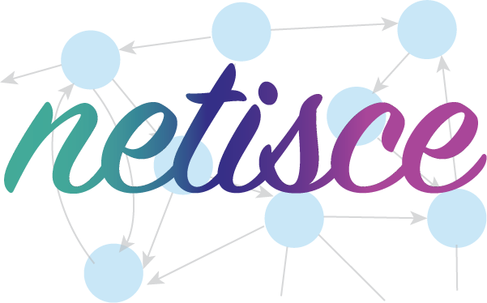

--- 
title: "NETISCE Manual and Tutorials"
  
author: "Lauren Marazzi"
date: "`r Sys.Date()`"
site: bookdown::bookdown_site
documentclass: book
bibliography: [book.bib, packages.bib]
url: https://veraliconaresearchgroup.github.io/Netisce/
cover-image: images/netisce-logo.png
description: |
  Welcome to the NETISCE manual and tutorials. NETISCE is a network-based approach for cellular reprogramming. This manual contains directions for intial setup, as well as tutorials for reproducing NETISCE cell reprogramming results in developmental, stem cell, and cancer biology.
link-citations: yes
github-repo: https://github.com/veraliconaresearchgroup/netisce

---


# About

Welcome to the NETISCE manual and tutorials.

The search for effective therapeutic targets in fields like regenerative medicine and cancer research has generated interest in cell fate reprogramming. This cellular reprogramming paradigm can drive cells to a desired target state from any initial state. However, methods for identifying reprogramming targets remain limited for biological systems that lack large sets of experimental data or a dynamical characterization. We present NETISCE, a novel computational tool for identifying cell fate reprogramming targets in static networks. NETISCE identifies reprogramming targets through the innovative use of control theory within a dynamical systems framework. Through validations in studies of cell fate reprogramming from developmental, stem cell, and cancer biology, we show that NETISCE can predict previously identified cell fate reprogramming targets and identify potentially novel combinations of targets. NETISCE extends cell fate reprogramming studies to larger-scale biological networks without the need for full model parameterization and can be implemented by experimental and computational biologists to identify parts of a biological system that are relevant for the desired reprogramming task.

For more information, please see the accompanying paper: 

Or biorxiv version: <https://www.biorxiv.org/content/10.1101/2021.12.30.474582v1>

This manual contains instructions for installing the NETISCE pipeline tool and accessing the Galaxy Project GUI web-based tool. We provide a simple toy example walkthrough tutorial. Lastly, we include instructions for reproducing NETISCE cell reprogramming results in developmental, stem cell, and cancer biology.


To navigate this site, use the menu on the left-hand side. 


```{r include=FALSE}
# automatically create a bib database for R packages
knitr::write_bib(c(
  .packages(), 'bookdown', 'knitr', 'rmarkdown'
), 'packages.bib')
knitr::opts_chunk$set(class.source = "foldable")
```

```{js, echo = FALSE}
title=document.getElementById('header');
title.innerHTML = '' + title.innerHTML
```
